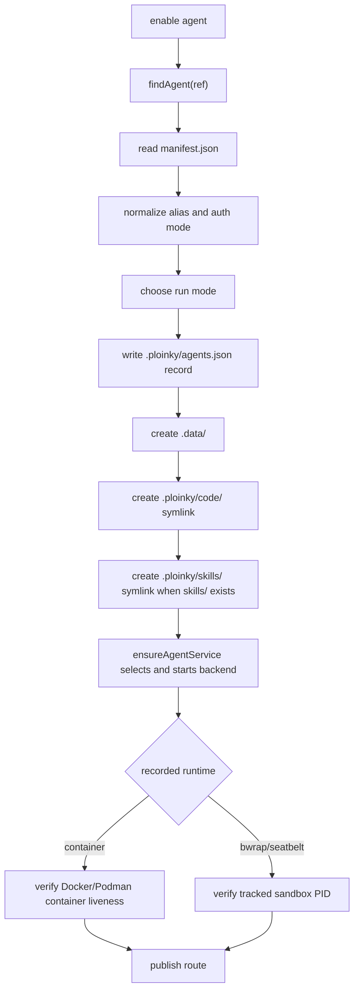
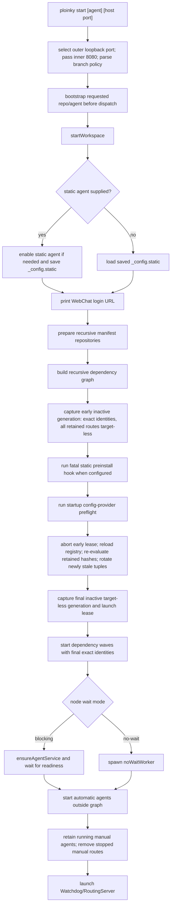
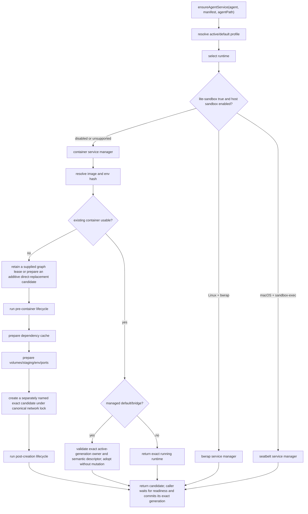
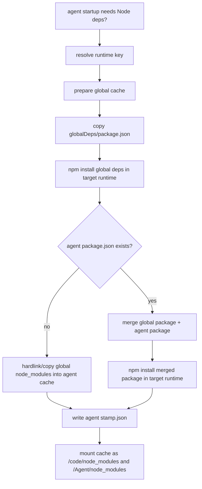

# Ploinky Agent Lifecycle and Runtime Treatment

This document is derived from implementation code only. Existing Ploinky docs and specs were not used as source material. The main code paths consulted are the CLI entrypoints in `bin/` and `cli/`, the runtime managers under `cli/services/`, the router under `cli/server/`, and the default in-container agent server under `Agent/server/`.

All relative paths below are relative to the workspace directory where `ploinky` is run, because `cli/services/config.js` sets `PLOINKY_WORKSPACE_ROOT` to the resolved workspace path.

## Source Map

| Area | Primary source files |
| --- | --- |
| Executable entrypoint | `bin/ploinky`, `bin/p-cli`, `bin/ploinky-shell`, `bin/psh`, `ploinky-box/bin/ploinky-box.mjs`, `cli/index.js`, `cli/shell.js` |
| Command dispatch | `cli/commands/cli.js`, `cli/services/commandRegistry.js`, `cli/services/help.js` |
| Workspace paths | `cli/services/config.js`, `cli/services/workspace.js`, `cli/services/workspaceStructure.js` |
| Repo discovery and install | `cli/services/repos.js`, `cli/commands/repoAgentCommands.js`, `cli/services/utils.js`, `cli/services/status.js` |
| Agent enable/disable state | `cli/services/agents.js` |
| Start/restart/runtime orchestration | `cli/services/workspaceUtil.js`, `cli/services/workspaceDependencyGraph.js`, `cli/services/bootstrapManifest.js`, `cli/services/routingFile.js`, `cli/services/edgeGeneration.js`, `cli/services/startupConfigProviders.js`, `cli/services/noWaitWorker.js` |
| Container runtime | `cli/services/docker/common.js`, `cli/services/docker/agentServiceManager.js`, `cli/services/docker/containerFleet.js` |
| Host sandbox runtime | `cli/services/sandboxRuntime.js`, `cli/services/bwrap/bwrapServiceManager.js`, `cli/services/seatbelt/seatbeltServiceManager.js`, `cli/services/seatbelt/seatbeltProfile.js` |
| Dependency cache | `cli/services/dependencyCache.js`, `cli/services/dependencyRuntimeKey.js`, `cli/services/dependencyInstaller.js`, `globalDeps/package.json`, `cli/commands/depsCommands.js` |
| Manifest env, profiles, lifecycle hooks | `cli/services/secretVars.js`, `cli/services/profileService.js`, `cli/services/lifecycleHooks.js`, `cli/services/manifestVolumePolicy.js`, `cli/services/runtimeResourcePlanner.js` |
| Router/watchdog | `cli/server/Watchdog.js`, `cli/server/RoutingServer.js`, `cli/server/containerMonitor.js`, `cli/server/probeWorker.js`, `cli/server/httpServiceRoutes.js` |
| Startup and health checks | `cli/services/startupReadiness.js`, `cli/server/utils/agentReadiness.js`, `cli/services/docker/healthProbes.js`, `cli/services/bwrap/bwrapHealthProbes.js` |
| Default agent server | `Agent/server/AgentServer.mjs`, `Agent/server/AgentServer.sh` |

## Workspace State

`initEnvironment()` creates the local Ploinky workspace. Controller-owned state lives under `.ploinky`; agent-owned persisted data lives under `.data`.

| Path | Purpose |
| --- | --- |
| `.ploinky/agents.json` | Enabled-agent registry plus `_config` values such as static start config and sandbox setting. |
| `.ploinky/repo_sources.json` | Remembered repo URLs, branches, and repository kind for later update/reinstall and Marketplace categorization. |
| `.ploinky/repos/<repo>` | Cloned agent repositories. Agent manifests are found below this tree. |
| `.data/<agent-or-alias>` | Per-instance persistent agent home. Containers and Linux bwrap mount it at `/root` in every run mode. Disable preserves it. |
| `.ploinky/code/<agent>` | Symlink to the agent's `code/` directory when present, otherwise to the agent root. |
| `.ploinky/skills/<agent>` | Symlink to the agent's `skills/` directory when present. |
| `.data/shared` | Shared writable agent-data directory mounted as `/shared` in containers and host sandboxes. |
| `.ploinky/deps/global/<runtimeKey>` | Runtime-specific global Node dependency cache. |
| `.ploinky/deps/agents/<repo>/<agent>/<runtimeKey>` | Runtime-specific merged agent dependency cache. |
| `.ploinky/deps/bwrap-runtime/<agent-or-alias>` | Regenerated Bubblewrap Agent runtime copies with a pre-created nested dependency mount point. |
| `.ploinky/logs` | Router, watchdog, no-wait worker, and other logs. |
| `.ploinky/running` | PID/status files, including router PID and no-wait worker status. |
| `.ploinky/routing.json` | Router route table written during start/restart. |
| `.ploinky/.secrets` | Encrypted secret store used by `var`, authentication configuration, and manifest env. |
| `.ploinky/profile` | Active profile name, defaulting to `default`. |
| `.data/<key>` | Mandatory host location for `runtime.resources.persistentStorage`; the key must be one safe path segment. |
| `.ploinky/container-runtime/<container>` | Podman staging directory used when symlink-heavy code needs a real mounted tree. |
| `.ploinky/seatbelt-runtime/<agent>` | macOS seatbelt staging area for copied `Agent/` runtime files. |

## CLI Entrypoints

`bin/ploinky` resolves the source checkout and distinguishes host execution from execution already inside the managed outer runtime. On the host it delegates to `ploinky-box/bin/ploinky-box.mjs`. Inside the outer runtime it sets `PLOINKY_ROOT`, applies the dependency gate, and executes Ploinky core. This is the recursion boundary for the single public entrypoint. `bin/p-cli` is an alias to `bin/ploinky`; `bin/psh` is an alias to `ploinky sh`.

| Invocation | Documented effect |
| --- | --- |
| `ploinky` or `p-cli` | Reconcile/start outer runtime; open Ploinky REPL |
| `ploinky cli` | Reconcile/start outer runtime; open `/bin/bash` as `podman` in `/workspace` |
| `ploinky cli <agent>` | Reconcile/start outer runtime; attach to that agent's manifest CLI |
| `ploinky start ...` | Reconcile/start outer runtime; start the graph behind the fixed boundary |
| `ploinky status` | Inspect outer contract/publishes/health and running core status without mutation |
| `ploinky stop` | Stop core services, then stop outer runtime; retain the Box and workspace-backed caches |
| `ploinky destroy` | Stop nested agents and remove the exact outer container; retain workspace-backed caches |
| `ploinky destroy --delete-cache` | Remove the outer container, then delete only the dependency and image cache directories |
| REPL `status`/`stop`/`destroy` | Core workspace/router/agent scope; outer runtime remains |

`cli/index.js` initializes the core environment and dispatches a command inside the outer runtime. With no command arguments, it starts the interactive shell backed by `.ploinky/ploinky_history`. Commands entered there stay at core workspace/router/agent scope; they do not control the containing outer runtime. Before a core `start` command is handled, `cli/index.js` parses static-agent, port, profile, and branch policy flags and bootstraps the requested agent.

### Outer runtime configuration

The default release channel is the mutable `docker.io/assistos/ploinky-box:latest` reference. The source-owned image must satisfy the complete outer runtime configuration checked by `ploinky-box/contract/image.mjs`, including an empty image-label set, the exact `assistos/ploinky-box` marker, user `podman`, workdir `/workspace`, the box entrypoint, its allowlisted environment, and no image command or declared volumes.

Every non-help host invocation canonicalizes the current directory and derives `ploinky-box-<sanitized-basename>-<12-character-SHA256-path-hash>`. No public name or engine selector participates. The supervisor finds each Podman or Docker executable on `PATH`, requires the selected rootless Podman engine to answer, inventories the exact Box container, and rejects Docker exact-name conflicts. Duplicate containers, foreign labels, or an unknown engine probe fail closed. The outer Box owns no engine volume.

The outer storage boundary has four durable host binds and one transient `/tmp` tmpfs:

| Host source or type | Box destination | Contract |
| --- | --- | --- |
| Ploinky repository root | `/opt/ploinky` | Read-only bind |
| Canonical workspace root | `/workspace` | Read-write bind |
| `<workspace>/.ploinky/box/dependencies` | `/opt/ploinky/node_modules` | Read-write bind |
| `<workspace>/.ploinky/box/images` | `/home/podman/.local/share/ploinky-images` | Read-write bind |
| tmpfs | `/tmp` | `rw,exec,nosuid,nodev,mode=1777,notmpcopyup`; empty each outer boot |

The image contains the dependency-lock-selected MCP SDK as a sealed,
content-hashed tree at `/usr/local/lib/ploinky/mcp-sdk`. Entrypoint preparation
validates and transactionally copies those local bytes into the dependency
bind. No Box startup path fetches or installs MCP SDK content from the network.

A missing box causes an unconditional pull and full configuration validation. The supervisor creates the box from the validated image ID, closing a mutable-tag race. A stopped compatible box starts on the same immutable container ID and a running compatible box is reused without pulling. Before every start, the supervisor captures cumulative stdout and stderr. Only appended current-boot bytes can contain the exact `PLOINKY_BOX_READY` line, and the same poll plus final rediscovery must prove the container is running.

Here, compatible means an exact normalized creation-configuration match. Changing the requested image or physical ports performs a validated transactional replacement and restores the previous immutable container if the candidate fails. Other creation drift is reported as recreate-required before registry or container mutation and requires an explicit `ploinky destroy`.

Every incompatible, malformed, or identity-incompatible Box is blocked before pulling, cache preparation, restart, upgrade, or replacement. It requires explicit `ploinky destroy`; the supervisor never reads it as compatible state or migrates, cleans, relabels, or adopts it. The next permitted create retains and remounts the image and dependency cache directories. No old basename-only container or volume is copied, adopted, mapped, or discovered by the path-hashed identity.

Direct/core users must invoke the old checkout's core entry before a legacy cutover:

```sh
node cli/index.js destroy
node cli/index.js network prune
```

They must not use the public `ploinky` wrapper for this step because, outside a box, it controls the outer runtime. After inspecting or resolving any foreign resources and confirming no container references them, one-time cleanup may remove only `.ploinky/run/router.sock`, `.ploinky/run/managed-hosts`, and the cached exact image `docker.io/assistos/ploinky-network-gateway:1@sha256:68c47ce93d16ea1a2d03944f7b50ce82e6f2f9a26b183d2c9c7fbabcc828fb7e`. Operators must also revoke retired publication connector/API tokens and delete its plaintext state before activation; the current runtime has no migration or cleanup reader. No broad container, image, volume, or network prune is part of this cutover.

An older basename-only Box is outside current discovery. Identify its exact owning engine and container, remove that container first, back up any data that exists only in its workspace volume, and then remove only its exact old `-containers` and `-workspace` volumes. Broad pruning is not a recovery path.

`status` bypasses reconciliation and is read-only. `stop` and `destroy` also bypass reconciliation: host stop attempts core shutdown before stopping the outer runtime, while host destroy stops nested agents before stopping and removing the exact outer container. The two workspace-backed cache directories remain available for the next permitted recreation. An absent Box is an idempotent destroy success, not a cache-deletion request. Ordinary agent images intentionally contain neither Podman nor Docker; nested container control exists only in the outer runtime.

## Commands

The command surface is split between the registry in `cli/services/commandRegistry.js` and explicit switch cases in `cli/commands/cli.js`. The registry is used for known-command checks; dispatcher-only cases such as `webchat`, `sso`, and `deps` still run because `handleCommand()` has direct cases for them.

| Command | Main behavior |
| --- | --- |
| `help` | Prints generated help from `cli/services/help.js`. |
| `install [repo] <url> [name] [branch]` / `add [repo] <url> [name] [branch]` | Clones a repo under `.ploinky/repos/<name>`, deriving the name from the URL when omitted, and stores source metadata. |
| `uninstall [repo] <name-or-url>` / `remove [repo] <name-or-url>` | Disables enabled agents from that repo by container key, removes their runtime containers, removes `.ploinky/repos/<name>`, and preserves source metadata for reinstall. |
| `update repo <name>` | Updates one installed repo with `git pull --rebase --autostash` or reclones a non-git repo when source metadata exists, then refreshes `AchillesCopilotBasicSkills` there when eligible. |
| `update repos` | Updates installed Ploinky repos, refreshes runtime Achilles dependencies, and refreshes `AchillesCopilotBasicSkills` in eligible managed repos. |
| `update all [folder]` | Updates Ploinky only when its checkout is in the selected folder (or contains the launch folder), then updates AgentLib, installed repos, managed-repo default skills, discovered workspace git repos, and default skills for discovered repos. |
| `reinstall [agent]` / `reinstall agent <agent>` | Removes the running service for an enabled agent, recreates it with `ensureAgentService`, updates routing, and starts the router if needed. |
| `enable agent <agent> [global|devel <repo>]` | Resolves an agent manifest, writes an enabled-agent record, creates work dirs/symlinks, starts the selected runtime, verifies backend-specific liveness and readiness, and publishes its route through coordinated apply. |
| `enable sandbox` | Outside a Ploinky box, allows host sandbox runtimes for manifests with `lite-sandbox: true`; inside a box, fails because nested Podman is forced. |
| `disable agent <agent>` | Removes the enabled-agent record and route in an inactive generation, stops/removes the selected container or sandbox process from a captured record snapshot, commits route removal, removes symlinks, and preserves the work dir. |
| `disable agents-all` | Removes all selected enabled-agent records and routes in one inactive generation, then tears down their runtime instances from captured record snapshots. |
| `disable sandbox` | Disables host sandbox runtimes, causing `lite-sandbox` agents to fall back to containers; this is already the forced box state. |
| `sandbox status|enable|disable` | Reads or changes the host-sandbox toggle outside a box; inside a box, status reports forced nested Podman and enable cannot persist an override. |
| `start [agent] [8080] [branch flags]` | Ensures repos/agents/dependencies, starts dependency graph services, writes routing, and launches the fixed inner Router watchdog. The public wrapper consumes any selected physical-host port and forwards inner `8080`. |
| `restart` | Restarts the saved static workspace: kills router, stops configured agents, and calls `startWorkspace`. |
| `restart router` | Restarts only the router for the saved static workspace. |
| `restart <agent>` | Recreates or restarts one enabled agent and refreshes its route. |
| `stop` | Kills router and stops configured agents without removing containers. |
| `shutdown` | Kills router and destroys workspace containers for enabled agents. |
| `destroy` | Kills router, destroys all workspace containers, removes `.ploinky/deps`, and preserves `.data/<agent-or-alias>`. |
| `clean` | Destroys all workspace containers. It does not explicitly kill the router in the command implementation. |
| `status` | Prints SSO status, router status, repo status, and enabled/running agent state. |
| `list agents` | Lists manifest-bearing agent directories in active repos. |
| `list repos` | Lists predefined, installed, and remembered source repos. |
| `list routes` | Prints `.ploinky/routing.json`. |
| `shell <agent>` | Ensures the agent service is running, then attaches an interactive shell. |
| `cli <agent> [args]` | Ensures the agent service is running, then attaches the manifest CLI command or default CLI script. |
| `webchat` | Prints the `/webchat` URL for the router login flow. Positional config arguments are rejected as removed. |
| `client status|list|tool` | Talks to the local router MCP endpoint. `call`, `methods`, `task`, and `task-status` are old forms that print migration guidance. |
| `/settings` / `settings` | Opens the settings menu and refreshes the LLM suggestion cache when env changes. |
| `set` | Legacy spelling; prints that the command was renamed to `/settings`. |
| `logs tail [router\|agent] [--startup]` | Follows `.ploinky/logs/router.log` by default, or one exact enabled agent. Linux `/proc` argv or macOS `KERN_PROCARGS2` must prove the exact no-wait worker invocation. While that worker starts, agent `tail` follows `.ploinky/logs/no-wait/<container>.<runId>.log`, then opens/proves the runtime source and rechecks the marker, registry generation, and source identity before the one handoff. A followed failure returns 1 without falling back. `--startup` applies only to agents and follows only startup output. |
| `logs last [<N>] [router\|agent] [--startup]` | Prints the last N lines (default 200, maximum 10000) from `.ploinky/logs/router.log` by default or one agent. For agents, a proved runtime is selected before no-wait state is consulted. `--startup` applies only to agents. Output is capped at 16 MiB. |
| `logs` target resolution | Targets resolve against a read-only `agents.json` snapshot by exact registry key, unique alias, `repo/agent`, then unique bare agent name. Completion offers one round-trip-proved reference per enabled record. |
| `logs` mutation boundary | Observational only. Bypasses dependency assertion, `initEnvironment()`, and repository bootstrap; requires an already running, initialized, owned Box at the host boundary; never creates, adopts, repairs, starts, stops, or removes a runtime, and never writes registry, no-wait, or routing state. |
| `logs` data and cleanup boundary | Docker/Podman sources use immutable container IDs. Bubblewrap/Seatbelt sources are immutable process-specific files; a pre-cut process requires one restart and no legacy name is probed. Application bytes pass through intentionally unredacted, while control diagnostics are bounded and redact credentials. Cancellation waits for bounded TERM/KILL cleanup. |
| `var`, `vars`, `echo` | Manage/read encrypted `.ploinky/.secrets` values and resolved env aliases. |
| `expose <name> [value] [agent]` | Edits the source manifest by adding/updating `manifest.expose`. |
| `profile [name|list|show|validate]` | Reads or changes `.ploinky/profile` and validates profile definitions. |
| `default-skills <repo>` | Copies repo skills into workspace `.agents/skills` and manages `.claude` alias symlinks. |
| `sso enable|disable|status` | Binds/unbinds an SSO provider and reports SSO state. |
| `deps prepare|status|clean` | Prepares, reports, or removes dependency caches. |
| `delete` | Legacy path that shows help. |
| `cloud` | Dispatcher path that prints that cloud commands are unavailable in this build. |

`cloud` help text exists, but this build's dispatcher reports cloud commands as unavailable/unsupported.

## Agent Discovery

An agent is discovered by a `manifest.json` file below `.ploinky/repos/<repo>/<agent>/manifest.json`.

`findAgent()` accepts qualified refs (`repo/agent` or `repo:agent`) and unqualified refs. Qualified refs map directly to that repo/agent path. Unqualified refs search all installed repos and fail if no match or multiple matches exist.

`list agents` skips skills-only repos and lists directories that contain `manifest.json`.

## Enabled-Agent Records

`enable agent` records intent, creates workspace structure, starts the selected backend, verifies that backend's liveness, and only then publishes routing state.



The registry key is the generated container name from `getAgentContainerName(aliasOrAgent, repo)`: `ploinky_<repo>_<agentOrAlias>_<workspaceBasename>_<workspaceHash>`.

The enabled record includes:

| Field | Value |
| --- | --- |
| `agentName` | Short agent directory name from the manifest path. |
| `repoName` | Repo directory name from the manifest path. |
| `containerImage` | `manifest.container`, then `manifest.image`, then `node:18-alpine`. |
| `projectPath` | Depends on run mode. |
| `runMode` | `isolated`, `global`, or `devel`. |
| `type` | Always `agent` for agent records. |
| `config.binds` | Descriptive runtime binds: per-instance home to `/root`, non-isolated project path to itself, the selected staged Agent runtime to `/Agent`, agent source to `/code`, and prepared dependencies to both Node resolution targets. Runtime startup recomputes actual binds. |
| `config.ports` | Descriptive enable-time port metadata from `parseManifestPorts(manifest)` or fallback `{containerPort: 7000}`. Runtime startup recomputes profile ports and does not turn this fallback into an implicit port-7000 publish for a start-only service. |
| `auth` | `{mode}` plus local auth metadata when local password auth is enabled. |
| `alias` | Optional route/record alias. |
| `profile` | Optional profile requested by dependency directive or CLI auth options. |

Run modes:

| Mode | Project path |
| --- | --- |
| default / isolated | `.data/<agent-or-alias>`. Legacy isolated `projectPath` values are ignored and recomputed from the current data layout. |
| `global` | Workspace root. |
| `devel <repo>` | `.ploinky/repos/<repo>`, which must already exist. |

Disable removes the registry entry before stopping the runtime so the watchdog cannot restart an intentionally disabled agent. It passes the removed record as an in-memory snapshot to the fleet remover; otherwise the generic instance key would lose its `runtime` discriminator and a Bubblewrap or Seatbelt process could be mistaken for a Docker/Podman container. It also clears matching static config, removes symlinks, and leaves `.data/<agent-or-alias>` intact.

## Manifest Fields

Ploinky does not load a central manifest schema in the observed paths. Individual services read the fields they need. The table below describes code-observed behavior.

| Field | Required? | Behavior and fallback |
| --- | --- | --- |
| `manifest.json` file | Yes | Agent discovery requires the file at `.ploinky/repos/<repo>/<agent>/manifest.json`. |
| `container` | No | Preferred container image field. Used before `image`. Supports `${VAR}` interpolation during startup. |
| `image` | No | Secondary image field. Fallback is `node:18-alpine`. Supports `${VAR}` interpolation during startup. |
| `runtime` | No | Must be an object when used for resources. A string `runtime` selector is explicitly rejected as legacy/unsupported. |
| `runtime.resources.persistentStorage` | No | A declaration requires a one-segment `key` and non-empty `containerPath`, then creates/mounts `.data/<key>`. Environment-based host-path overrides are not accepted. |
| `runtime.resources.env` | No | Adds env vars with templates such as `{{PLOINKY_WORKSPACE_ROOT}}`, `{{STORAGE_CONTAINER_PATH}}`, `{{STORAGE_HOST_PATH}}`, `{{secret:NAME}}`, `{{generatedSecret:NAME}}`, and `{{var:NAME}}`. |
| `lite-sandbox` | No | If true and host sandbox is enabled, selects bwrap on Linux or seatbelt on macOS. If host sandbox is disabled, it falls back to container runtime. |
| `profiles` | No | If present, `profiles.default` is required. Active profile comes from record profile or `.ploinky/profile`; non-default profiles are merged over default. |
| `profiles.<name>.openPorts` | No | Private inner-runtime mappings read by `parseManifestPorts`; they never alter physical-host publications. TCP overlaps with Router `8080`/`8081` and UDP overlap with reserved `7882` are rejected. Without an entry, execution modes that include AgentServer receive an engine-assigned private mapping to container port 7000; start-only services do not. |
| `profiles.<name>.env` | No | Overrides top-level `env` for the active profile. |
| `profiles.<name>.secrets` | No | Profile secrets are validated and injected at runtime. |
| `profiles.<name>.mounts` | No | Controls code/skills mount mode. Default and dev profiles are read-write by default; other profiles are read-only by default. |
| `profiles.<name>.network` | No | Overrides top-level `network`. |
| `profiles.<name>.containerSecurity` | No | Rejected. Container security declarations are root-only. |
| `profiles.<name>.configProviders` | No | Replaces default-profile startup config providers for the active profile. Entries name provider agents and may select the provider profile. |
| `profiles.<name>.preinstall` | No | Host hook run before container/sandbox creation. For the static agent, `startWorkspace` runs it only after recursive repository/graph preparation and the early inactive targetless generation; failure is fatal and prevents provider execution. |
| `profiles.<name>.hosthook_aftercreation` | No | Host hook run after runtime creation. |
| `profiles.<name>.install` | No | Inserted into the runtime entry command before the start/agent/default server command. |
| `profiles.<name>.postinstall` | No | Container/sandbox command run after creation. Without profile handling, legacy `manifest.profiles.default.postinstall` is also checked. |
| `profiles.<name>.hosthook_postinstall` | No | Host hook run after postinstall. |
| `openPorts` at top level | Effectively no | The observed `parseManifestPorts` implementation reads only profile config, not top-level `manifest.openPorts`. |
| `env` | No | Manifest env specs. Resolution order in `secretVars.js` is encrypted secrets, `process.env`, `.env`, then default. Profile `env` replaces top-level `env`. |
| `env[].runtime` or `env.<name>.runtime` | No | Boolean, default `true`. When `false`, host lifecycle/config-provider/image-resolution paths still receive the resolved entry, while container OCI metadata and bwrap/Seatbelt process environments omit the value and its `PLOINKY_ENV_SOURCE_*` marker. |
| `expose` | No | Adds explicit env values or refs. The `expose` CLI command edits this field in the source manifest. |
| `repos` | No | Object processed by `applyManifestDirectives` during `start`. Values may be URL strings or objects with `url` and `branch`. Repos are ensured and enabled before dependency enable processing. |
| `enable` | No | Top-level and profile-level enable arrays are processed during `start` and dependency graph building. The selected workspace profile is applied when present and otherwise a child uses `profiles.default`; this affects only the in-box graph, never outer publications. String specs can include `as <alias>` and `no-wait`; object specs can include `agent/ref/spec/name`, `alias/as`, `profile`, and `noWait`/`no-wait`. An explicit edge-local profile must exist on the child. |
| `configProviders` | No | Top-level startup provider entries processed for the static agent after dependency graph discovery and before dependency env resolution. Profile entries replace the default profile list. |
| `providesConfig` | No | Declares a startup provider command and output allowlist. Provider stdout must be schema version 1 JSON and is persisted by Ploinky only after allowlist, reserved-name, sensitive-flag, and generated-secret checks pass. |
| `startup` | No | General workspace startup policy: `automatic` or `manual`. Absent defaults to `automatic`; invalid values fail validation. Static-agent and dependency graph membership override `manual`. |
| `guest` | No | `guest: true` makes manifest-derived auth mode `guest`; combining it with `sso enable` is rejected. |
| `ploinky` | No | String/list directives. `sso enable` requires SSO; local password directives are rejected. |
| `start` | No | Main runtime command when present. If both `start` and `agent`/`commands.run` exist, `start` runs as the container entry and the agent command is launched as a detached sidecar. |
| `agent` | No | Agent command. Used before `commands.run`. |
| `commands.run` | No | Agent command fallback after `agent`. |
| `install` | No | Used when active profile has no `install`; inserted before the selected runtime command. |
| `entrypoint` | No | Passed as container `--entrypoint`. |
| `workdir` | No | Container working directory fallback is `/code`. |
| `cli` | No | Command used by `ploinky cli <agent>`. |
| `commands.cli` | No | CLI command fallback after `cli`. |
| `readiness.protocol` | No | Explicit startup readiness protocol: `tcp`, `mcp`, or `none`. It takes precedence over inferred TCP/MCP and over `health.readiness.script`. Without it, start-only containers prefer a declared health script, otherwise TCP when a private or published route exists; execution modes with AgentServer default to MCP. |
| `health.liveness` | No | Watchdog container monitor script probe. Script name must be local to agent root, with no slash or `..`. Failure can restart the container with backoff. |
| `health.readiness` | No | Script probe configuration. For a start-only container with no explicit readiness protocol, `health.readiness.script` is executed inside the service container and blocks dependency startup until it succeeds or fails. The watchdog also uses the configuration later as a recurring semantic health probe unless `continuous` is exactly `false`; an exhausted recurring probe inactivates routing and schedules managed recovery. `continuous: false` keeps the full attestation activation-only and requires a separate `health.liveness.script`. |
| `volumes` | No | Extra host-to-container mounts. Relative host paths are resolved against the workspace root; absolute host paths are honored as declared. Missing paths are created unless marked generated+required. |
| `volumeOptions` | No | Per-container-path options for `volumes`: `generated`, `required`, numeric `chmod`, and `makeWorldWritableSubdirs`. |
| `network` | No | Exact modes are `default`, `bridge`, `host`, and `none`. Omission means a private per-instance managed bridge. `bridge` requires logical `attachments` with exactly one primary; legacy `name`/`aliases` are rejected. Managed bridge modes use the exact host-gateway mapping and router env, `host` uses box loopback, and `none` receives no router endpoint. |
| `containerSecurity.privileged` | No | Adds `--privileged` for container runtime when true. |
| `containerSecurity.nestedPodman` | No | Adds the bounded nested-Podman capability set, devices, label disablement, and the repository-owned seccomp profile. It cannot be combined with `privileged`. |
| `mcp-config.json` beside manifest/code | No | Copied/synchronized into the persistent agent home, `.data/<agent-or-alias>/mcp-config.json`. Seatbelt writes a rewritten `.seatbelt` config in the same work directory. Default AgentServer also searches `/code/mcp-config.json`. |
| `routerAccess.httpRoutes` | No | Declares agent-relative HTTP route access using `access` only. Valid values are `public`, `guest`, and `authenticated`; public entries expose anonymous `GET`/`HEAD`, guest entries use or mint a guest session, and authenticated entries require a user session before transparent proxying. |
| `routerAccess.workspaceLogs` | No | Boolean capability granting the exact enabled generation access to the private Router/Policy log-file operation; it publishes no HTTP route and accepts no filesystem path. |
| `endpoints.chatCompletions` | No | Default AgentServer exposes an OpenAI-style chat completions endpoint backed by a command spec. |
| `endpoints.agent-card` | No | Default AgentServer exposes `/agent-card`. |

Removed legacy env features are intentionally rejected: `derive`, `deriveName`, `deriveRepoName`, `deriveRepo`, `deriveAgentName`, `deriveAgent`, `deriveBytes`, `deriveFormat`, `generatedSecretScope`, and `{{derivedMasterSecret:NAME}}`.

### Start Profile Selection

The managed host form is `ploinky start <agent> [port] [--profile <name>]`; both `--profile <name>` and `--profile=<name>` are consumed as explicit cross-boundary selectors and forwarded to core. Omission at this public boundary selects and forwards `default`, so host environment or an older persisted profile cannot silently change the selected in-box graph. A core `ploinky start` entered in the REPL that omits the flag does not overwrite the active profile and may continue using `.ploinky/profile`.

Profile selection is generic and product-independent. Bare, slash-qualified, and colon-qualified references use normal workspace resolution. The selected workspace profile is applied to each graph node; a node that does not define it falls back to its own `default` profile. An explicit profile on an `enable` edge must exist on that child manifest or graph resolution fails and reports the child and its available profiles. None of these choices changes the Box's fixed outer arguments.

## Auth Mode Processing

`cli/utils/manifestAuth.js` resolves the manifest requirement and saved policy. The CLI can select an authentication mode only when it does not weaken an explicit `sso enable` requirement:

| Source | Result |
| --- | --- |
| CLI `--auth none` | `none`, unless the manifest requires SSO |
| CLI `--auth pwd` or `--auth local` | Rejected |
| CLI `--auth sso` | `sso` |
| CLI `--auth guest` | `guest`, unless the manifest requires SSO |
| `guest: true` | `guest`, unless combined with an SSO requirement |
| `ploinky` contains a `pwd` directive, or manifest has a `pwd` field | Rejected |
| `ploinky` contains `sso enable` | Mandatory `sso`, including when saved policy differs |
| None of the above | `none` |

Ploinky does not store browser passwords or seed local users. Credential options `--user` and `--password`, local role mappings, and saved local authentication policies without an authoritative SSO manifest are rejected. Browser login and account administration use the configured provider. The separately signed CLI operator credential remains a runtime control channel and is not an application authentication setting. There is no local-account migration or fallback login.

## Start Flow

`ploinky start` is the point where manifests are interpreted deeply and runtime processes are created.



Manifest `repos` and `enable` directives are not applied during `enable agent`; they are applied during `startWorkspace`. Dependency graph construction also reads `enable` arrays recursively.

Startup config providers are applied after dependency graph construction and before dependency startup. The static/profile manifest supplies `configProviders`; provider manifests supply `providesConfig`. Ploinky resolves provider agents from the graph or installed repositories, runs their provider command with a sanitized host-side environment, validates stdout against the provider manifest allowlist, rejects generated-secret and reserved names, and writes accepted values into `.ploinky/.secrets` before consumer env maps are built.

Before hooks run, the early preparation assigns exact tuples to missing or changed graph nodes and strips resolved targets from every retained graph route. After providers finish, Ploinky aborts that lease, reloads the registry, and re-evaluates retained predecessor runtime hashes. Newly stale predecessors receive fresh tuples; tuples minted earlier in the same start remain unchanged. Ploinky then captures the final inactive target-less generation and lease before any graph process starts. Container and sandbox backends must preserve that final prepared registry identity. Blocking waves add their resolved private targets through coordinated apply before readiness succeeds; detached workers use the same prepared identity when they later submit targets.

The manifest `startup` field affects only enabled agents outside that graph. Missing or `automatic` agents start during general workspace startup. A stopped `manual` agent stays stopped and its stale route is removed, while an already running manual agent is retained. Static and dependency nodes always start regardless of `startup`.

`enable` dependency refs can be blocking or no-wait. The graph classifier treats the static node as blocking. A child is blocking when it is reachable through a path with only blocking edges; it is no-wait only when every path to it includes a no-wait edge. Blocking waves are started and then checked for readiness before Ploinky continues.

SSO-provider dependencies are special. A manifest that looks like an SSO provider is included only when the parent agent auth mode is SSO.

## Service Creation Flow

`ensureAgentService` is the common runtime entrypoint. It selects host sandbox or container runtime, prepares lifecycle hooks/dependencies, creates or reuses runtime state, and records actual runtime metadata.



Direct CLI startup holds the logical runtime maintenance lock from its refreshed registry read through network reconciliation, readiness, generation activation, and predecessor retirement. Generation-specific candidate container names normalize to the same maintenance key as their predecessor. Concurrent launches for the same workspace/runtime identity therefore serialize on one key. After the first launch commits, the waiter refreshes the registry and normally takes the unchanged-runtime adoption path; attachment happens after the maintenance transaction, so both callers can attach. Unrelated logical runtime keys are not coalesced, while their network mutations still use the canonical workspace network-lifecycle lock.

For a healthy managed `default` or `bridge` container, reuse is validation-only. Ploinky checks exact workspace/network/runtime-identity labels, running state, immutable container ID, active-generation owner tuple, generated Router descriptor, signed topology payload, image/user/entrypoint/user namespace, working directory, environment hash, mounts, singleton managed environment values, and the already-existing MCP/config, dependency-cache, staging, volume, health-control, and LLM-state artifacts. Exact adoption performs no container stop/remove/create, lifecycle hook, sidecar launch, liveness reset, registry save, preparation lease, selector transition, directory/config write, cache preparation, image pull, dependency runtime-key probe, or shell-probe container launch. It derives the dependency runtime key from the exact registered cache mount and validates that admitted cache read-only. Any read-only artifact drift enters the separately named staged-replacement path instead.

A genuine managed direct replacement instead mints a fresh `instanceId`/`enableGeneration` pair and a generation-specific physical candidate name, then captures an immutable additive generation while the predecessor selector, mutable route/registry sources, and predecessor process remain active. The separately named candidate is created under the existing network lifecycle lock and attested against that additive lease, so the active generation remains bound to the still-serving predecessor's immutable container ID throughout candidate readiness. Only after semantic readiness succeeds does one apply-lock transaction write the final runtime locator and registry metadata and atomically select the candidate generation. The exact predecessor is retired after that commit under the same network-lifecycle capability. Candidate or readiness failure removes only the exactly proved candidate, consumes cleanup authority once, and aborts the additive lease without inactivating or stopping the predecessor generation.

Cold scheduler pressure may delay the already-started confined authority helper beyond one observation nonce's fixed ten-second lifetime. That specific expiry is retried at most three times with a new helper and cryptographically fresh nonce after revalidating the unchanged edge generation; every attempt retains the same ten-second limit, and exhaustion or any other attestation error still fails closed without minting Router credentials.

Runtime selection details:

| Manifest/config state | Runtime |
| --- | --- |
| Inside `/etc/ploinky-box` marked runtime | Nested Podman, regardless of `lite-sandbox` or persisted sandbox configuration. Missing Podman is an error; Docker, bwrap, and Seatbelt are not fallbacks. |
| `lite-sandbox: true`, sandbox enabled, Linux with `bwrap` | Host bwrap runtime. |
| `lite-sandbox: true`, sandbox enabled, macOS with `sandbox-exec` | Host seatbelt runtime. |
| `lite-sandbox: true`, sandbox disabled | Container runtime fallback. |
| No `lite-sandbox` | Container runtime. |
| `runtime` is a string | Error. Legacy selector is unsupported. |

The host-sandbox toggle is disabled by default unless `enable sandbox` sets `_config.sandbox.disableHostRuntimes` to false. Environment variable `PLOINKY_DISABLE_HOST_SANDBOX=1` forces host sandbox disabled. The box marker makes that policy mandatory: status reports nested Podman as the effective runtime and enabling a host sandbox fails without persisting a misleading setting.

## Dependency Installation

Ploinky's current container startup path does not run `npm install` inside long-lived agent containers. It prepares runtime-specific dependency caches first and mounts those caches read-only.



Dependency cache paths:

| Cache | Path |
| --- | --- |
| Global | `.ploinky/deps/global/<runtimeKey>` |
| Agent | `.ploinky/deps/agents/<repo>/<agent>/<runtimeKey>` |

Runtime keys include OS/libc/architecture/Node-major details. Containers are probed by running Node inside the target image. Host sandboxes use keys like `bwrap-<platform>-<arch>-node<major>` or `seatbelt-<platform>-<arch>-node<major>`.

`globalDeps/package.json` supplies core dependencies: `achillesAgentLib` and `mcp-sdk`.

For container runtimes, cache installation is done in an ephemeral runtime command:

1. Pull/ensure the target image.
2. Mount the cache path at `/install`.
3. Set working directory `/install`.
4. Install OS build helpers with `apk` or `apt-get` when available.
5. Configure GitHub URL rewrites.
6. Run `npm install --no-package-lock --no-audit --no-fund`.

For bwrap and seatbelt, cache installation is run on the host in the cache directory.

Agent cache behavior:

| Agent package state | Behavior |
| --- | --- |
| No agent `package.json` | Reuse global cache by hardlinking `node_modules` with `cp -al` when possible, otherwise copying. |
| Agent `package.json` exists | Merge global deps with agent deps/devDeps/scripts/name, write merged package, run npm install in cache. |
| Manifest has only `start` and no agent package | Container startup may skip core dependency preparation. |
| LLM runtime manifest | Forces dependency preparation. |

The `deps` command exposes this machinery:

| Command | Behavior |
| --- | --- |
| `deps prepare` | Prepares caches for enabled agents. |
| `deps prepare <repo>/<agent>` | Prepares caches for one agent, skipping start-only/no-package agents. |
| `deps status` | Prints cache stamp/validity information. |
| `deps clean <repo>/<agent>` | Removes one agent's dependency cache. |
| `deps clean --global` | Removes global caches. |
| `deps clean --all` | Removes all dependency caches. |

There is also a legacy `dependencyInstaller.js` path used by lifecycle code only when profile lifecycle is run without `skipInstallHooks`; the main container creation path uses `dependencyCache.js`.

## Container Runtime

Container runtime chooses `podman` first if installed, otherwise `docker`. If neither exists, `getRuntime()` exits the process with an installation message.

### Command Selection

The long-lived container command is selected in `startAgentContainer`:

| Manifest command fields | Runtime behavior |
| --- | --- |
| `start` and `agent`/`commands.run` | Container entry runs `start`; agent command is later launched as a detached sidecar with `runtime exec -d`. |
| Only `start` | Container entry runs `start`. |
| Only `agent`/`commands.run` | Container entry runs a shell command that changes to `/code`, optionally runs install, then runs the agent command. |
| Neither | Container entry runs the default `/Agent/server/AgentServer.sh`, optionally after install. |

`entrypoint` becomes container `--entrypoint`. `workdir` defaults to `/code`.

The install command is `activeProfile.install` if present, otherwise `manifest.install`. It is inserted into the entry command before the selected runtime command.

### Docker Mounts

For Docker-style runtime, the main mounts are:

| Host source | Container target | Mode |
| --- | --- | --- |
| Ploinky repo `Agent/` | `/Agent` | read-only |
| Agent code path (`<agent>/code` if present, otherwise agent root) | `/code` | profile-controlled read-write/read-only |
| Prepared agent dependency cache | `/code/node_modules` | read-only |
| Prepared agent dependency cache | `/Agent/node_modules` | read-only |
| `.data/shared` | `/shared` | read-write |
| Agent home (`.data/<agent-or-alias>`) | `/root` | read-write |
| Global or devel `projectPath` / current working directory | Same absolute path inside container | read-write |
| Agent `skills/`, when it exists outside code | `/code/skills` | profile-controlled read-write/read-only |
| `runtime.resources.persistentStorage.hostPath` | `runtime.resources.persistentStorage.containerPath` | read-write |
| Root or active profile `volumes` host path | configured container path | read-write by default |
| LLM model/state/shared paths | `/models`, `/runtime`, `/Agent/llm-runtime` | runtime-specific |

Profile mount defaults come from `profileService.js`: `default` and `dev` are read-write for code/skills; other profiles default to read-only unless overridden.

### Podman Staging

Podman uses a staging directory under `.ploinky/container-runtime/<container>`:

| Copy/link operation | Source | Destination |
| --- | --- | --- |
| Copy Ploinky Agent runtime | repo `Agent/` excluding `Agent/node_modules` | `.ploinky/container-runtime/<container>/Agent` |
| Link Agent dependencies | prepared dependency cache | staged `Agent/node_modules` |
| Stage code tree | agent code path entries | staged `code/` with symlinks |
| Override code dependencies | prepared dependency cache | staged `code/node_modules` |
| Apply `/code/...` manifest volume links | `.ploinky` volume host paths | staged code entries |

Podman receives `NODE_OPTIONS=--preserve-symlinks --preserve-symlinks-main`. It also receives extra self-mounts for real symlink targets. Manifest volumes that target `/code/node_modules` are rejected. Writable Podman manifest volumes under `.data/` are mounted with `:U` so non-root images can own their private runtime state; arbitrary external manifest volumes keep the normal `:z` suffix unless `volumeOptions.<containerPath>.podmanChown` opts in.

Inside the Box, managed `default` and `bridge` modes require rootless Podman 5.4 or newer, Netavark, and operational `pasta`. There is no `slirp4netns` fallback. Each managed bridge is created with exact schema-2 ownership labels and `isolate=true`; same-network peers can communicate by derived alias, cross-bridge direct-IP traffic is denied, and outbound egress is preserved. Containers receive exactly `--hosts-file=none --add-host host.containers.internal:host-gateway` plus the matching `PLOINKY_ROUTER_HOST`, `PLOINKY_ROUTER_PORT`, and `PLOINKY_ROUTER_URL`. Consumers also receive `PLOINKY_INTERNAL_ROUTER_URL` and the read-only snapshot named by `PLOINKY_EDGE_TOPOLOGY_FILE`. `host` requires an exact current- generation capability and uses `127.0.0.1`; `none` receives no endpoint. Reuse validates the versioned network-contract hash and exact attachment/alias/hosts policy. An older hash remains foreign and is neither adopted nor recreated. Only exact-owned current-hash runtime drift may trigger recreation; the hash is never weakened.

Network status uses schema version 3 and reports the managed networks and agent attachments directly. It has no gateway resource field. Restarting the router does not recreate or mutate schema-2 networks.

### Ports

The sole outer `-p` emission constructs exactly two publications for every box:

| Mapping | Meaning |
| --- | --- |
| `127.0.0.1:<selectedRouterHostPort>:8080/tcp` | Loopback-only physical Router access. `--port` selects only the host side. |
| `0.0.0.0:<selectedMediaHostPort>:<selectedMediaHostPort>/udp` | Unconditional reserved LiveKit UDP slot. `--udp-port` selects the same media UDP port on the physical host and inside the Box, defaulting to `7882`; the immutable topology carries it as `mediaUdpPort` and LiveKit binds that selected port. |

`--publish`, `--expose`, and `--listen-lan` are rejected before engine discovery. Workspace, graph, profile, manifest, `openPorts`, readiness, environment, labels, and persisted state never participate in outer arguments. Incompatible managed Box configuration is rejected and requires explicit destroy/recreate; no publication provenance or compatibility reader remains.

Profile `openPorts` remains private inner-runtime metadata. A normal bridged launch rejects TCP intervals overlapping Router `8080`/`8081` and UDP intervals overlapping reserved `7882`. Other declarations can create private Box targets but never a physical-host mapping. AgentServer gets an engine-assigned private mapping to port `7000` when its execution mode needs one; a start-only service instead uses a blocking health script, an admitted `/base-agent-additional-server/<agentName>/<port>/<path>` target, another intentional private readiness target, or `readiness.protocol: "none"`.

Additional private agent servers use the agent-port convention and must have a matching `routerAccess.httpRoutes` declaration. Each target is installed into one immutable exact-byte route-and-policy authorization generation used by HTTP and WebSocket. General route/policy additions and removals do not change live decisions until coordinated apply inactivates affected selectors, validates the complete candidate, and atomically installs it. An exact direct runtime replacement instead uses an additive immutable candidate, keeps its predecessor selected through readiness, and flips the selector only in the final atomic commit. Every request revalidates its captured authorization generation immediately before upstream dial.

RoutingServer owns public/control `8080` and managed-private `8081`; the latter is not outer-published. Detailed health is on an unmounted supervisor Unix socket. Cloudflared is pinned in the outer image and always targets in-box `http://127.0.0.1:8080`; no separate publication agent or nginx layer exists. Credential absence is explicit local-only mode with no connector or public HTTP hostname. Existing-tunnel API mode uses separate connector-token and least-privilege DNS/ingress API-token handles. Connector-only mode supervises a token-selected tunnel while an operator maintains its Cloudflare routes. Ploinky-managed mode takes account, zone, requested tunnel name, and an API-token handle; it persists a unique ownership intent before creation, retrieves the connector token only in memory, and reconciles ingress and DNS. Deletion is opt-in and is allowed only for the exact registry-owned tunnel. Changing the requested name retains the former allocation until its own empty-host teardown is selected. Partial or invalid state fails closed, and Ploinky never creates a quick tunnel. An already-selected `local-ready` generation is adopted by the publication supervisor without a duplicate route apply when no previous Cloudflare ownership journal exists. Cloudflare activation and teardown still inactivate first and use the serialized coordinated-apply path.

Before consumers start, Ploinky mounts a box-owned non-secret topology snapshot. It distinguishes the immutable route-and-policy authorization generation, a content-derived configuration generation, and a monotonic readiness/publication generation. Browser projection is authenticated and `no-store`, returns one active locator plus configuration/publication ids, and exposes no authorization id or inventory.

Private service calls on `8081` require effective authenticated policy plus an exact current-instance/current-enable-generation ACL. The caller receives `PLOINKY_AGENT_INSTANCE_ID`, `PLOINKY_AGENT_ENABLE_GENERATION`, and one tuple-derived `PLOINKY_AGENT_PRIVATE_SECRET`; its assertion binds type, audience, caller, generation, method, canonical path, query, body hash, expiry, and replay state. It is not user/admin identity. TURN's long-term secret remains in core, and only exact current-generation consumers can obtain rate-limited short-lived credentials and expiry through the private broker.

Every Ploinky-created nested agent, helper, and sidecar container receives the exact ownership label `io.assistos.ploinky.managed=1`. On Box boot, the entrypoint enumerates that exact key/value and retires only non-running records whose immutable registry ownership is exact, or superseded predecessors whose name and stable labels are exact and whose immutable ID and complete lifecycle pair were both replaced in the registry. It also retires legacy helper records whose only Ploinky label is the historical managed marker. Running, paused, transitional, partially labelled, ambiguous, and foreign records fail the Box self-check without removal. Unlabelled, other-value, and near-name containers, nested images, nested named volumes, valid schema-2 networks, and retained workspace data remain untouched. Enumeration failure fails the box self-check. Manual containers have no Ploinky restart or repair guarantee.

Nested container records no longer survive their box. The inner Podman graphroot at `/home/podman/.local/share/containers/storage` lives on the outer box writable layer with `transient_store` enabled, and only the separate imagestore at `/home/podman/.local/share/ploinky-images` is a durable host bind. The inner runroot at `/tmp/storage-run-1000` lives on the outer `/tmp` tmpfs, which is recreated empty on every boot. Removing the outer box therefore discards every nested container record, writable layer, network, and inner named volume, while cached nested images survive.

| State | Survives `stop` | Survives `destroy` |
| --- | --- | --- |
| Host workspace at `/workspace` | Yes | Yes; never deleted by any destroy path |
| Dependency-cache bind at `/opt/ploinky/node_modules` | Yes | Yes, unless `--delete-cache` |
| Nested-image-cache bind at `/home/podman/.local/share/ploinky-images` | Yes | Yes, unless `--delete-cache` |
| Nested container records and writable layers | Yes | No |
| Inner Podman named volumes | Yes | No |
| Transient runtime metadata under `/tmp/storage-run-1000` | No; `/tmp` is fresh each boot | No |

Those records, layers, networks, and inner named volumes are discarded with the outer box, so persistent agent data must use explicit `/workspace` binds. Destroy first stops nested agents through the in-box helper; if that stop fails the outer box is halted but nothing is removed, leaving a stopped box and its cache data for inspection and retry. A retained managed record at startup now indicates that storage isolation failed rather than ordinary leftovers.

## Host Sandbox Runtimes

Outside a marked Ploinky box, host sandboxes are selected only for `lite-sandbox: true` agents when sandbox support is enabled. Inside the box, the forced nested-Podman rule bypasses both implementations.

### Linux bwrap

The bwrap runtime starts a host process with Bubblewrap. It prepares dependency cache with the `bwrap` runtime family, stages the shared Agent runtime under `.ploinky/deps/bwrap-runtime/<agent-or-alias>/`, and mounts a constrained filesystem. The staging copy excludes source `Agent/node_modules` content and creates an empty `node_modules` directory before `/Agent` becomes read-only, allowing the prepared cache to be mounted at `/Agent/node_modules` without modifying the installed source tree.

Important bwrap mounts:

| Host/source | Sandbox target |
| --- | --- |
| System libraries/binaries | Read-only host paths as configured by service manager. |
| `/proc` | New `/proc`. |
| `/dev` | Device bind. |
| tmpfs | `/tmp`. |
| Staged Agent runtime under `.ploinky/deps/bwrap-runtime/` | `/Agent` read-only. |
| Agent code path | `/code`, read-write or read-only by profile. |
| Prepared dependency cache | `/code/node_modules` and `/Agent/node_modules` read-only. |
| `.data/shared` | `/shared`. |
| Agent private key when present | `/run/ploinky-agent.key`. |
| Agent home (`.data/<agent-or-alias>`) | `/root` read-write. |
| Project path/current working directory | `/root` in isolated mode; the same absolute workspace or repository path in global and development modes. |
| Agent skills path | `/code/skills` when present. |
| Manifest volumes | Configured target paths from the root manifest and active profile, with relative host paths resolved against the workspace root and absolute host paths honored as declared. |
| Runtime persistent storage | Configured container path. |

Manifest admission rejects root-level and selected-profile volume sources below `.ploinky/data` or `.ploinky/shared`, including normalized absolute and symlink aliases. Runtime admission also rejects a project or other bind whose source is canonically equal to or inside either protected tree. Container and bwrap launches append final read-only empty-directory guards over either old path when a broader bind would expose it; Seatbelt applies final read and write denials. These guards do not create either legacy path in the workspace. Watchdog restarts classify the same admission failure as terminal policy state instead of retrying it.

The bwrap process does not unshare networking, so agent ports bind on the host. It does unshare PID. The runtime explicitly sets env vars with `--clearenv` plus `--setenv`, including `PORT`, router URL, manifest env, profile env/secrets, runtime resource env, `NODE_PATH=/code/node_modules`, `HOME=/root`, `PATH`, and identity variables. `WORKSPACE_PATH` is `/root` in isolated mode and remains the separately mounted workspace or development checkout in global and development modes.

The bwrap entry command follows the same broad selection as containers. When both `start` and agent command exist, it runs start in the background and execs the agent command.

### macOS seatbelt

The seatbelt runtime starts a host process through `sandbox-exec`. It does not provide Linux-style virtual mount paths. Instead, it rewrites paths and grants sandbox permissions to real host paths.

Important seatbelt copy/link operations:

| Operation | Source | Destination |
| --- | --- | --- |
| Copy Ploinky Agent runtime | repo `Agent/` excluding `Agent/node_modules` | `.ploinky/seatbelt-runtime/<agent>/Agent-<pid>-<timestamp>` |
| Link Agent dependencies | prepared dependency cache | staged `Agent/node_modules` |
| Link code dependencies | prepared dependency cache | real agent code path `node_modules`; errors if a non-symlink already exists |
| Rewrite MCP config | source `mcp-config.json` | resolved work directory `mcp-config.seatbelt.json` with `/code` and `/Agent` replaced by real paths |

Seatbelt env includes `PLOINKY_AGENT_LIB_DIR`, `PLOINKY_INVOCATION_AUTH_MODULE`, `PLOINKY_CODE_DIR`, `NODE_PATH`, router env, runtime resources, profile vars, profile secrets, and identity vars.

The generated seatbelt profile grants reads/writes to required real paths, denies protected runtime paths, and can make code/skills read-only depending on profile mount mode.

## Manifest Volumes and Runtime Resources

Manifest volumes are explicit trusted filesystem grants from the agent manifest. Root manifest volumes and active profile volumes are merged, with profile entries overriding matching host-path keys. `resolveManifestVolumeHostPath` resolves relative paths against the workspace root and honors absolute paths as declared. Containers, bwrap, and seatbelt profile generation no longer require the resolved host path to live inside `.ploinky`.

When a configured volume host path does not exist:

| Case | Behavior |
| --- | --- |
| `volumeOptions.generated === true` and not required | Creates the parent directory for file-like targets or the directory for directory-like targets. |
| File-like host or container path | Creates parent directories and an empty file. |
| Directory-like path | Creates the directory. |
| `generated === true` and `required === true` | Fails if the file/directory is missing or empty. |

Numeric `chmod` is applied best-effort. `makeWorldWritableSubdirs` creates/chmods listed subdirectories.

`volumeOptions.<containerPath>.readOnly: true` is enforced across backends: Podman uses `:z,ro`, Docker uses `:ro`, bwrap uses `--ro-bind`, and Seatbelt excludes the host path from write grants.

`runtime.resources.persistentStorage` is separate from `manifest.volumes`. It creates a per-resource host directory and mounts it to the configured `containerPath`; env templates can refer to the storage paths.

## Environment and Secrets

Ploinky builds runtime env from several sources:

1. Manifest/profile env specs from `secretVars.js`.
2. `manifest.expose`.
3. Ploinky runtime vars such as `PLOINKY_MCP_CONFIG_PATH`, `AGENT_NAME`, `WORKSPACE_PATH`, and `PLOINKY_WORKSPACE_ROOT`.
4. Runtime resource env.
5. Profile vars: `PLOINKY_PROFILE`, `PLOINKY_PROFILE_ENV`, `PLOINKY_AGENT_NAME`, `PLOINKY_REPO_NAME`, `PLOINKY_CWD`, `PLOINKY_CONTAINER_NAME`, and `PLOINKY_CONTAINER_ID`.

An env object with `runtime: false` participates in host hook resolution and env hashing but is removed before these runtime maps or flags are constructed. The corresponding provenance marker is removed with it, and a same-named `expose` declaration cannot add the value back to a runtime map. Startup config providers run after repository-only manifest preparation and before manifest enable directives may launch dependent agents, so provider output is present on each dependency's first runtime env construction.
6. Profile secrets.
7. Router vars: `PLOINKY_ROUTER_PORT`, `PLOINKY_ROUTER_HOST`, and `PLOINKY_ROUTER_URL`.
8. Optional SSO client credentials.
9. `NODE_PATH`.
10. Authoritative per-agent identity/master-key env vars added last after reserved identity variables are stripped.

Manifest env resolution order is encrypted `.ploinky/.secrets`, then `process.env`, then `.env`, then manifest default. Wildcards are supported, with API-key-like names excluded from broad wildcard expansion.

Required env entries without defaults are explicit operator/provider prerequisites. Profile readiness and launch resolve them through encrypted vars, startup-provider output, process env, or `.env` and fail with the exact missing name; Ploinky does not infer topology or Origin values.

Startup config providers can write values into encrypted `.ploinky/.secrets` before dependency env maps are built. Provider subprocesses do not receive `PLOINKY_MASTER_KEY`, `PLOINKY_DERIVED_MASTER_KEY`, router-issued agent identity secrets, or caller-supplied identity values. Provider metadata is written under `.ploinky/config-providers/` with values redacted.

## Files Copied or Generated

| When | Source | Destination | Runtime(s) |
| --- | --- | --- | --- |
| `enable agent` | Agent source path | `.ploinky/code/<agent>` symlink | All |
| `enable agent` | Agent `skills/` path | `.ploinky/skills/<agent>` symlink | All, when present |
| `ensureAgentService` | Agent `mcp-config.json` | resolved work directory `mcp-config.json` | Containers |
| Container dependency prep | `globalDeps/package.json` | `.ploinky/deps/global/<runtimeKey>/package.json` | Containers and host sandboxes |
| Container dependency prep | Global/agent package metadata | `.ploinky/deps/agents/<repo>/<agent>/<runtimeKey>/package.json` | Containers and host sandboxes |
| Podman startup | repo `Agent/` | `.ploinky/container-runtime/<container>/Agent` | Podman |
| Podman startup | Agent code entries | `.ploinky/container-runtime/<container>/code` symlink tree | Podman |
| Podman startup | Prepared deps | staged `Agent/node_modules` and `code/node_modules` | Podman |
| Bubblewrap startup | repo `Agent/` excluding `Agent/node_modules` | `.ploinky/deps/bwrap-runtime/<agent-or-alias>/Agent-...` | Bubblewrap |
| Bubblewrap startup | Prepared deps | `/code/node_modules` and staged `/Agent/node_modules` mount point | Bubblewrap |
| Seatbelt startup | repo `Agent/` | `.ploinky/seatbelt-runtime/<agent>/Agent-...` | Seatbelt |
| Seatbelt startup | Source MCP config | resolved work directory `mcp-config.seatbelt.json` | Seatbelt |
| Router start | Runtime route data | `.ploinky/routing.json` | Router |
| No-wait start | Worker state | `.ploinky/running/no-wait/<container>.json`, `.ploinky/running/no-wait/<container>.<runId>.json`, `.ploinky/running/no-wait/<container>.current.json` | No-wait dependencies |
| No-wait start | Worker orchestration output | `.ploinky/logs/no-wait/<container>.<runId>.log`, created exclusively at mode 0600 | No-wait dependencies |
| Bubblewrap/Seatbelt startup | Sandbox application output | `.ploinky/logs/agents/<container>.<identityDigest>.log`, mode 0600, where `identityDigest = sha256(instanceId NUL enableGeneration NUL decimalPid)` | Bubblewrap and Seatbelt |
| Watchdog start | Router PID and supervisor diagnostics | `.ploinky/running/router.pid`, `.ploinky/logs/watchdog.log` | Router supervisor |
| Router output | Router operational output and UTC daily archives | `.ploinky/logs/router.log`, `.ploinky/logs/router-archive/YYYY-MM-DD[.N].jsonl` | Ploinky writes the active file; Workspace Monitor requests rotation and retention maintenance |
| Policy audit | Router policy decisions and UTC daily archives | `.ploinky/data/router-security/policy-audit.log`, `.ploinky/data/router-security/policy-audit-archive/YYYY-MM-DD[.N].jsonl` | Ploinky writes the active file; Workspace Monitor requests rotation and retention maintenance |

## Startup Readiness vs Health Probes

Startup readiness is handled by `workspaceUtil.js`, `startupReadiness.js`, and `cli/server/utils/agentReadiness.js`. It is used while `ploinky start` is waiting for blocking dependency waves.

| Startup readiness protocol | Behavior |
| --- | --- |
| `none` | Mark ready without a port-bound probe. |
| `tcp` | Wait for local host port to open. |
| `mcp` | Wait for local host port, then perform MCP initialize, initialized notification, and tools/list. |
| inferred `script` | Run `health.readiness.script` inside the service container from `/code`; success unblocks the wave and failure blocks startup. |

An explicit manifest `readiness.protocol` (`mcp`, `tcp`, or `none`) wins over a declared health script. Without an explicit protocol, a start-only container with `health.readiness.script` uses blocking script readiness, a start-only service with a resolved explicit HTTP-service target uses TCP, and other start-only services require an intentional reachable TCP route. Execution modes that include AgentServer default to MCP. A start-only service with no script, no private or published route, and no explicit `none` policy fails with a manifest contract error rather than waiting on a fabricated port 7000.

The router watchdog's later health-probe phase is different from dependency-wave startup. Its container monitor watches automatic enabled records every few seconds. One runtime inventory is shared by all container targets in a tick; if that inventory fails, the monitor logs the failure and defers every OCI target until a later tick instead of issuing per-target runtime calls or treating unknown state as stopped. It also watches a `startup: manual` record while that agent has a live route, because the route records explicit activation. A general restart removes stale routes for stopped manual agents; explicit enable and generic CLI activation recreate them. If a monitored runtime is not running, the watchdog schedules a restart through `ensureAgentService` with backoff and a circuit breaker. If a manifest has `health`, a worker runs configured script probes inside the container:

| Probe | Behavior |
| --- | --- |
| `health.readiness.script` | During inferred start-only startup, runs as the blocking container readiness probe. During later watchdog monitoring, success marks the health probe ready and exhausted failure inactivates routing and schedules managed recovery unless `continuous: false` makes this full check activation-only. |
| `health.liveness.script` | Runs the script repeatedly. Exhausted failure inactivates routing, restarts the container, and applies CrashLoopBackOff. |

Probe script names must be plain filenames in the agent root. Slashes and `..` are rejected. Persistent managed agent containers run with an OCI init reaper. A fixed mounted entrypoint starts the runtime-relay broker in Node-capable images, starts the probe broker when the manifest declares script-backed health, and then launches the preserved image/manifest command. Health requests, results, and cancellation use the dedicated per-container control bind. Routed loopback traffic uses an inode-verified Unix socket in that same private bind. Neither path creates an OCI exec session in the target. Each probe script runs behind an in-container hard deadline in a fresh process session; Ploinky identifies the exact execution with a random token and private marker, terminates the whole session after timeout, waits for init to reap it, and fails closed if cleanup cannot be proved. A separate outer deadline requests cancellation over the same bind and fails closed if a claimed request does not publish a terminal result.

For bwrap agents, monitor liveness checks process state and a separate bwrap health helper can check `http://127.0.0.1:<port>/health`.

## Router and Agent Request Path

The router is launched by `Watchdog.js`, not directly by the CLI foreground process. `RoutingServer.js` owns the public/control listener on fixed in-box port `8080`, the un-published managed-private listener on `8081`, and a detailed health listener on an unmounted Unix socket. The watchdog probes that socket, restarts Router after repeated failures, and starts the container monitor. A managed bridge gets exactly `--hosts-file=none` plus one `host.containers.internal:host-gateway` mapping; host mode is a separate exact generation capability. Neither network provenance nor a JWT/assertion is a user/admin session.

The container monitor checks per-container maintenance locks before it schedules an automatic restart and again when a scheduled restart callback executes. The second check covers the interval in which an operator reinstall or explicit restart can acquire the lock after the watchdog has already created its backoff timer. When maintenance is active, the callback clears its in-progress restart state and defers container evaluation to a later monitor tick.

```mermaid
sequenceDiagram
  participant CLI as ploinky start
  participant Agent as graph runtimes
  participant Candidate as candidate route/policy bytes
  participant Generation as immutable authorization generation
  participant Watchdog as Watchdog.js
  participant Router as RoutingServer.js
  participant Runtime as Agent runtime

  CLI->>Watchdog: spawn detached watchdog
  Watchdog->>Router: spawn 8080, 8081, Unix health
  CLI->>Candidate: stage early graph identities with every retained route target-less
  CLI->>Generation: capture early inactive generation for static preinstall/providers
  CLI->>Candidate: reload, re-evaluate retained hashes, rotate newly stale tuples
  CLI->>Generation: abort early lease; capture final inactive generation and launch lease
  CLI->>Agent: start waves with final exact staged identities
  Agent-->>CLI: private targets/containerName
  CLI->>Candidate: stage resolved private targets
  CLI->>Generation: coordinated apply before dependent readiness
  Router->>Generation: capture Host-first route/policy lease
  Router->>Generation: revalidate immediately before dial
  Router->>Runtime: proxy /<agent>/... to private target
  Router->>Runtime: aggregate /mcp across agent routes
```

Router paths are not one global pathname namespace. Listener/interface class and exact normalized Host are resolved first. A dedicated service host contains only its selected service plus exact required auth transactions; an agent-root host contains only its root/mounts and validated named `routerSurfaces`; managed private traffic contains only private handlers. Health, admin, policy, discovery, aggregate MCP, status, WebChat, broker, and private-service paths are absent from every host class whose closed allowlist omits them.

`/api/marketplace` is a first-party JSON management API for the Marketplace plugin. GET requires an authenticated local or SSO user and returns repository, source metadata, repository kind, agent, enabled-registry, recorded backend, and live runtime-status data. Marketplace and CLI status share backend-aware collection: Bubblewrap and Seatbelt use their tracked PIDs, while Docker and Podman use OCI inspection; enabled runtimes without a live process remain visible as stopped. POST requires a local admin session and supports `install_repo`, `uninstall_repo`, `enable_agent`, and `disable_agent`. Repository install requires a URL, accepts an optional name and branch, clones the checkout, and records source metadata. Repository uninstall disables enabled agents from that repo by runtime-instance key, removes their runtimes, removes the checkout, and preserves `repo_sources.json` metadata so the repo can be installed again. Marketplace and CLI enable/disable actions delegate to the same lifecycle helpers; backend selection belongs there rather than in the HTTP endpoint.

Candidate routes use the alias as route key when present, otherwise the short agent name. They have no request-path effect until coordinated apply captures the exact bytes and installs one immutable route-and-policy authorization generation. A plain `/` request redirects to the static route's `/index.html` only on a host surface that explicitly includes that mount.

`/base-agent-additional-server/<agentName>/<port>/<path>` exposes an agent-owned additional private server through the Router. The provider and effective `HttpRouteAccessPolicy` independently decide `public`, `guest`, or `authenticated` admission from the matching `routerAccess.httpRoutes` declaration. HTTP and WebSocket use the same resolver, generation lease, and target.

## Default In-Container Agent Server

When no manifest start/agent command is configured, Ploinky runs the default server under `Agent/server/AgentServer.sh` / `Agent/server/AgentServer.mjs`.

The server listens on `PORT`, defaulting to 7000. It binds to `0.0.0.0` when container identity env vars are present, otherwise `127.0.0.1`.

Config discovery:

| Config | Search order |
| --- | --- |
| MCP config | `PLOINKY_AGENT_CONFIG`, `MCP_CONFIG_FILE`, `AGENT_CONFIG_FILE`, `PLOINKY_MCP_CONFIG_PATH`, `/tmp/ploinky/mcp-config.json`, `${PLOINKY_CODE_DIR || /code}/mcp-config.json`, `process.cwd()/mcp-config.json` |
| Manifest | `PLOINKY_AGENT_MANIFEST`, `PLOINKY_MANIFEST_FILE`, `AGENT_MANIFEST_FILE`, `${PLOINKY_CODE_DIR || /code}/manifest.json`, `process.cwd()/manifest.json` |
| Static root | `PLOINKY_CODE_DIR` or `/code` |

The default server provides:

| Endpoint/capability | Behavior |
| --- | --- |
| `GET /health` | Returns a non-detailed summary only to an authenticated Router administrator; supervisors use the detailed Unix-socket health endpoint. |
| `GET /agent-card` | Returns manifest endpoint card when configured. |
| `GET /getTaskStatus` / `/task` | Returns async task status when authorized by invocation token. |
| `/mcp` | Streamable HTTP MCP server for configured tools/resources/prompts. |
| `GET /v1/models` | Runs `endpoints.models` when configured; otherwise returns one `default` model using `manifest.capabilities.tags` or `generic-agent`. |
| Static files | Serves files from code root for other GET/HEAD paths. |
| `endpoints.chatCompletions` | Optional OpenAI-style `/v1/chat/completions` backed by a command spec. |

MCP tool and resource commands require router-minted invocation headers before command execution.

## Restart and Stop Semantics

| Operation | Router | Agent runtime |
| --- | --- | --- |
| `restart` | Kills and relaunches router. | Stops configured agents, then starts workspace again. |
| `restart router` | Kills and relaunches router. | Leaves containers/processes untouched. |
| `restart <agent>` | Updates route after restart. | For containers: `runtime restart` when existing, or forced recreate for sandbox paths. |
| `stop` | Kills router. | Stops configured agents but does not remove containers. |
| `shutdown` | Kills router. | Destroys workspace containers for enabled agents. |
| `destroy` | Kills router. | Destroys all workspace containers, clears `.ploinky/deps`, and preserves `.data/<agent-or-alias>`. |
| `clean` | Does not explicitly kill router in command code. | Destroys all workspace containers, clears `.ploinky/deps`, and preserves `.data/<agent-or-alias>`. |
| `disable agent` | Clears matching static config if disabling succeeds. | Removes the registry entry, then stops/removes the runtime using the captured record's backend. |

## Code-Observed Caveats

1. Enable-time port records are mostly descriptive. `enableAgent` calls `parseManifestPorts` without profile config, and that function only reads profile `openPorts`, so enable-time records normally show a port-7000 fallback. Runtime startup recomputes profile ports and does not emit that fallback for start-only execution.
2. Top-level `manifest.openPorts` is not read by the observed `parseManifestPorts` implementation.
3. The agent-port convention creates only an engine-assigned private target and never affects the two outer mappings.
4. Manifest `repos` and `enable` are applied at `start`, not at `enable agent`.
5. Container runtime dependency installs happen in caches, not in the long-running containers.
6. Outside a marked box, Podman and seatbelt copy/stage runtime files while Docker mostly mounts them directly; inside the box, every managed agent path uses nested Podman.
7. `clean` destroys containers but does not explicitly kill the router in the dispatcher path.
8. `cli/services/help.js` contains cloud help, but `cli/commands/cli.js` treats cloud commands as unavailable in this build.
9. `client tool --agent` resolves ambiguity, but the observed call path invokes `client.callTool(toolName, payloadObj)` without passing target-agent metadata.
10. Seatbelt links prepared dependencies into the real agent code path as `node_modules`; it errors if that path exists and is not a symlink.
11. Manifest health scripts remain watchdog/container-monitor probes by default, but `health.readiness.script` also becomes blocking startup readiness for a start-only container when no explicit `readiness.protocol` overrides it. `health.readiness.continuous: false` keeps that readiness check activation-only and requires a separate recurring liveness probe for ongoing semantic health.

## Rejected SSO callback exchanges

`cli/server/authHandlers/authRoutes.js` normalizes an authentication provider callback rejection with integer `statusCode` 400, 401, or 403 to HTTP 400 `invalid_authorization_code`. This includes expired or invalid authorization codes and accounts blocked after code issuance while the browser transaction is still valid. No session cookie is issued and provider-specific rejection details are not returned. Browser-proof checks remain required, and unexpected provider/server errors retain their failure handling. This classification applies only to the callback exchange; errors after that exchange and errors on other authentication routes are not reclassified.
