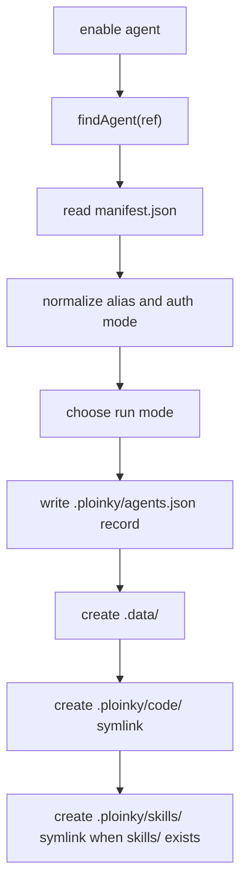
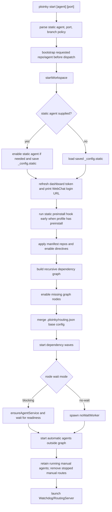
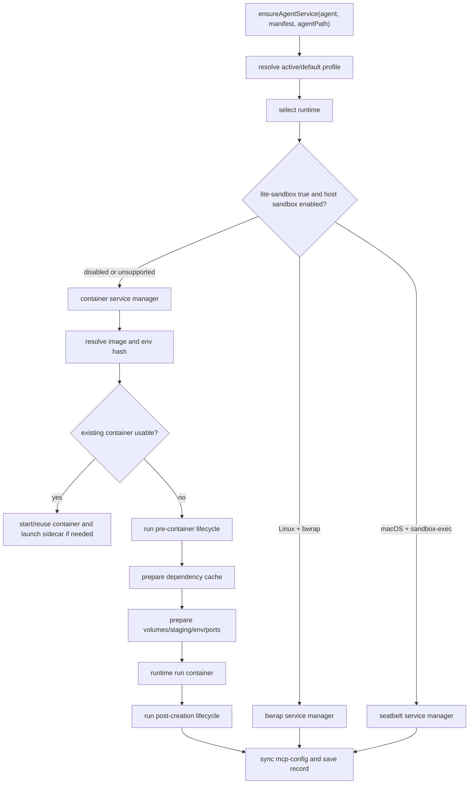
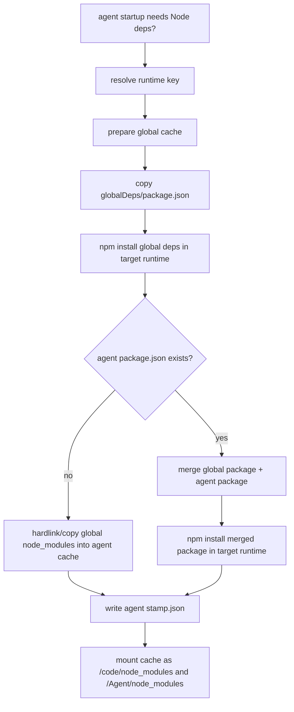
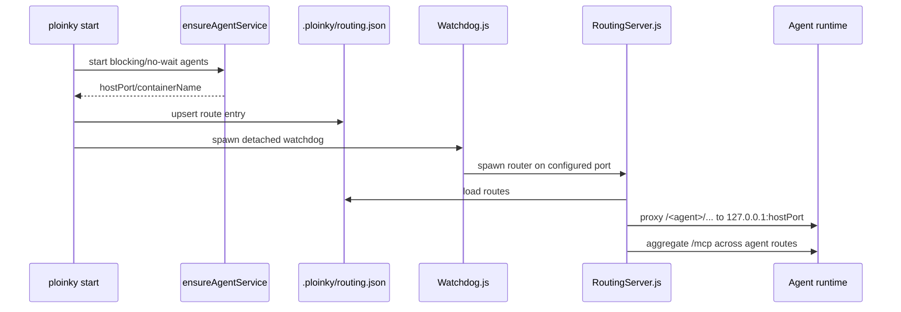

# Ploinky Agent Lifecycle and Runtime Treatment

This document is derived from implementation code only. Existing Ploinky docs and specs were not used as source material. The main code paths consulted are the CLI entrypoints in `bin/` and `cli/`, the shared runtime helpers under `cli/utils/runtime/`, the backend managers under `cli/sandbox/`, the router under `cli/server/`, and the default in-container agent server under `Agent/server/`.

All relative paths below are relative to the workspace directory where `ploinky` is run, because `cli/utils/config.js` sets `PLOINKY_WORKSPACE_ROOT` to the resolved workspace path.

## Source Map

| Area | Primary source files |
| --- | --- |
| Executable entrypoint | `bin/ploinky`, `bin/p-cli`, `bin/ploinky-shell`, `bin/psh`, `cli/index.js`, `cli/shell.js` |
| Command dispatch | `cli/commands/cli.js`, `cli/commands/commandRegistry.js`, `cli/commands/help.js` |
| Workspace paths | `cli/utils/config.js`, `cli/utils/workspace.js`, `cli/utils/workspaceStructure.js` |
| Repo discovery and install | `cli/utils/repos.js`, `cli/commands/repoAgentCommands.js`, `cli/utils/utils.js`, `cli/utils/status.js` |
| Agent enable/disable state | `cli/utils/agents.js` |
| Start/restart/runtime orchestration | `cli/commands/workspaceUtil.js`, `cli/utils/workspaceDependencyGraph.js`, `cli/utils/runtime/bootstrapManifest.js`, `cli/commands/noWaitWorker.js` |
| Container runtime | `cli/sandbox/docker/common.js`, `cli/sandbox/docker/agentServiceManager.js`, `cli/sandbox/docker/containerFleet.js` |
| Host sandbox runtime | `cli/utils/runtime/sandboxRuntime.js`, `cli/sandbox/bwrap/bwrapServiceManager.js`, `cli/sandbox/seatbelt/seatbeltServiceManager.js`, `cli/sandbox/seatbelt/seatbeltProfile.js` |
| Dependency cache | `cli/utils/dependencies/dependencyCache.js`, `cli/utils/dependencies/dependencyRuntimeKey.js`, `cli/utils/dependencies/dependencyInstaller.js`, `globalDeps/package.json`, `cli/commands/depsCommands.js` |
| Manifest env, profiles, lifecycle hooks | `cli/utils/security/secretVars.js`, `cli/utils/runtime/profileService.js`, `cli/utils/runtime/lifecycleHooks.js`, `cli/utils/runtime/manifestVolumePolicy.js`, `cli/utils/runtime/runtimeResourcePlanner.js` |
| Router/watchdog | `cli/server/Watchdog.js`, `cli/server/RoutingServer.js`, `cli/server/containerMonitor.js`, `cli/server/probeWorker.js`, `cli/server/httpServiceRoutes.js` |
| Startup and health checks | `cli/utils/runtime/startupReadiness.js`, `cli/server/utils/agentReadiness.js`, `cli/sandbox/docker/healthProbes.js`, `cli/sandbox/bwrap/bwrapHealthProbes.js` |
| Default agent server | `Agent/server/AgentServer.mjs`, `Agent/server/AgentServer.sh` |

## Workspace State

`initEnvironment()` creates the local Ploinky workspace. The canonical state directory is `.ploinky`.

| Path | Purpose |
| --- | --- |
| `.ploinky/agents.json` | Enabled-agent registry plus `_config` values such as static start config and sandbox setting. |
| `.ploinky/repo_sources.json` | Remembered repo URLs, branches, and repository kind for later update/reinstall and Marketplace categorization. |
| `.ploinky/repos/<repo>` | Cloned agent repositories. Agent manifests are found below this tree. |
| `.data/<agent-or-alias>` | Per-instance persistent agent home. Containers and Linux bwrap mount it at `/root` in every run mode. Disable preserves it. |
| `.ploinky/code/<agent>` | Symlink to the agent's `code/` directory when present, otherwise to the agent root. |
| `.ploinky/skills/<agent>` | Symlink to the agent's `skills/` directory when present. |
| `.ploinky/shared` | Shared writable host directory mounted as `/shared` in containers and host sandboxes. |
| `.ploinky/deps/global/<runtimeKey>` | Runtime-specific global Node dependency cache. |
| `.ploinky/deps/agents/<repo>/<agent>/<runtimeKey>` | Runtime-specific merged agent dependency cache. |
| `.ploinky/deps/bwrap-runtime/<agent-or-alias>` | Regenerated Bubblewrap Agent runtime copies with a pre-created nested dependency mount point. |
| `.ploinky/logs` | Router, watchdog, no-wait worker, and other logs. |
| `.ploinky/running` | PID/status files, including router PID and no-wait worker status. |
| `.ploinky/routing.json` | Router route table written during start/restart. |
| `.ploinky/.secrets` | Encrypted secret store used by `var`, auth, dashboard tokens, and manifest env. |
| `.ploinky/profile` | Active profile name, defaulting to `default`. |
| `.ploinky/data/<key>` | Default host location for `runtime.resources.persistentStorage`. |
| `.ploinky/container-runtime/<container>` | Podman staging directory used when symlink-heavy code needs a real mounted tree. |
| `.ploinky/seatbelt-runtime/<agent>` | macOS seatbelt staging area for copied `Agent/` runtime files. |

## CLI Entrypoints

`bin/ploinky` sets `PLOINKY_ROOT` to the repository root. If the first argument is `-shell`, `sh`, or `--shell`, it execs `bin/ploinky-shell`; otherwise it runs `node cli/index.js "$@"`.

`bin/p-cli` is an alias to `bin/ploinky`. `bin/psh` is an alias to `ploinky sh`.

`cli/index.js` initializes the environment and dispatches a command. With no command arguments, it starts the interactive shell backed by `.ploinky/ploinky_history`. In interactive mode, commands are split on whitespace and passed to the same dispatcher.

Before a `start` command is handled, `cli/index.js` parses static-agent, port, and branch policy flags and runs repo bootstrap for the requested static agent.

## Commands

The command surface is split between the registry in `cli/commands/commandRegistry.js` and explicit switch cases in `cli/commands/cli.js`. The registry is used for known-command checks; dispatcher-only cases such as `webchat`, `dashboard`, `sso`, and `deps` still run because `handleCommand()` has direct cases for them.

| Command | Main behavior |
| --- | --- |
| `help` | Prints generated help from `cli/commands/help.js`. |
| `install [repo] <url> [name] [branch]` / `add [repo] <url> [name] [branch]` | Clones a repo under `.ploinky/repos/<name>`, deriving the name from the URL when omitted, and stores source metadata. |
| `uninstall [repo] <name-or-url>` / `remove [repo] <name-or-url>` | Disables enabled agents from that repo by container key, removes their runtime containers, removes `.ploinky/repos/<name>`, and preserves source metadata for reinstall. |
| `update repo <name>` | Updates one installed repo with `git pull --rebase --autostash` or reclones a non-git repo when source metadata exists, then refreshes `AchillesCopilotBasicSkills` there when eligible. |
| `update repos` | Updates installed Ploinky repos, refreshes runtime Achilles dependencies, and refreshes `AchillesCopilotBasicSkills` in eligible managed repos. |
| `update all [folder]` | Updates the Ploinky runtime, installed repos, managed-repo default skills, discovered workspace git repos, and default skills for discovered repos. |
| `reinstall [agent]` / `reinstall agent <agent>` | Removes the running service for an enabled agent, recreates it with `ensureAgentService`, updates routing, and starts the router if needed. |
| `enable agent <agent> [global|devel <repo>]` | Resolves an agent manifest, writes an enabled-agent record to `.ploinky/agents.json`, and creates work dirs/symlinks. |
| `enable sandbox` | Allows host sandbox runtimes for manifests with `lite-sandbox: true`. |
| `disable agent <agent>` | Removes an enabled-agent record only if no live/stopped container or sandbox process exists for it. Symlinks are removed; the work dir is preserved. |
| `disable agents-all` | Tries to disable all enabled agents and skips ones with live/stopped runtime state. |
| `disable sandbox` | Disables host sandbox runtimes, causing `lite-sandbox` agents to fall back to containers. |
| `sandbox status|enable|disable` | Reads or changes the host-sandbox toggle stored under `_config.sandbox`. |
| `start [agent] [port] [branch flags]` | Ensures repos/agents/dependencies, starts dependency graph services, writes routing, and launches the router watchdog. |
| `restart` | Restarts the saved static workspace: kills router, stops configured agents, and calls `startWorkspace`. |
| `restart router` | Restarts only the router for the saved static workspace. |
| `restart <agent>` | Recreates or restarts one enabled agent and refreshes its route. |
| `stop` | Kills router and stops configured agents without removing containers. |
| `shutdown` | Kills router and destroys workspace containers for enabled agents. |
| `destroy` | Kills router, destroys all workspace containers, removes `.ploinky/deps`, and preserves `.data/<agent-or-alias>`. |
| `clean` | Destroys all workspace containers. It does not explicitly kill the router in the command implementation. |
| `status` | Prints SSO status, router status, repo status, and enabled/running agent state. |
| `list agents` | Lists manifest-bearing agent directories in active repos. |
| `list repos` | Lists predefined, installed, and remembered source repos. |
| `list routes` | Prints `.ploinky/routing.json`. |
| `shell <agent>` | Ensures the agent service is running, then attaches an interactive shell. |
| `cli <agent> [args]` | Ensures the agent service is running, then attaches the manifest CLI command or default CLI script. |
| `webchat` | Prints the `/webchat` URL for the router login flow. Positional config arguments are rejected as removed. |
| `dashboard` | Prints a tokenized dashboard URL. |
| `client status|list|tool` | Talks to the local router MCP endpoint. `call`, `methods`, `task`, and `task-status` are old forms that print migration guidance. |
| `/settings` / `settings` | Opens the settings menu and refreshes the LLM suggestion cache when env changes. |
| `set` | Legacy spelling; prints that the command was renamed to `/settings`. |
| `logs tail [router]` | Tails router log output. Router is the only supported target. |
| `logs last <N> [router]` | Prints the last N router log lines. |
| `var`, `vars`, `echo` | Manage/read encrypted `.ploinky/.secrets` values and resolved env aliases. |
| `expose <name> [value] [agent]` | Edits the source manifest by adding/updating `manifest.expose`. |
| `profile [name|list|show|validate]` | Reads or changes `.ploinky/profile` and validates profile definitions. |
| `default-skills <repo>` | Copies repo skills into workspace `.agents/skills` and manages `.claude` alias symlinks. |
| `sso enable|disable|status` | Binds/unbinds an SSO provider and reports SSO state. |
| `deps prepare|status|clean` | Prepares, reports, or removes dependency caches. |
| `delete` | Legacy path that shows help. |
| `cloud` | Dispatcher path that prints that cloud commands are unavailable in this build. |

`cloud` help text exists, but this build's dispatcher reports cloud commands as unavailable/unsupported.

## Agent Discovery

An agent is discovered by a `manifest.json` file below `.ploinky/repos/<repo>/<agent>/manifest.json`.

`findAgent()` accepts qualified refs (`repo/agent` or `repo:agent`) and unqualified refs. Qualified refs map directly to that repo/agent path. Unqualified refs search all installed repos and fail if no match or multiple matches exist.

`list agents` skips skills-only repos and lists directories that contain `manifest.json`.

## Enabled-Agent Records

`enable agent` does not start a container. It records intent and creates workspace structure.

The registry key is the generated container name from `getAgentContainerName(aliasOrAgent, repo)`: `ploinky_<repo>_<agentOrAlias>_<workspaceBasename>_<workspaceHash>`.

The enabled record includes:

| Field | Value |
| --- | --- |
| `agentName` | Short agent directory name from the manifest path. |
| `repoName` | Repo directory name from the manifest path. |
| `containerImage` | `manifest.container`, then `manifest.image`, then `node:18-alpine`. |
| `projectPath` | Depends on run mode. |
| `runMode` | `isolated`, `global`, or `devel`. |
| `type` | Always `agent` for agent records. |
| `config.binds` | Descriptive runtime binds: per-instance home to `/root`, non-isolated project path to itself, the selected Agent runtime to `/Agent`, agent source to `/code`, and prepared dependencies to both Node resolution targets. Runtime startup recomputes actual binds. |
| `config.ports` | Runtime port mapping metadata from `parseManifestPorts(manifest)` or fallback `{containerPort: 7000}`. Because `parseManifestPorts` only reads profile config, enable-time records normally get the fallback. |
| `auth` | `{mode}` plus local auth metadata when local password auth is enabled. |
| `alias` | Optional route/record alias. |
| `profile` | Optional profile requested by dependency directive or CLI auth options. |

Run modes:

| Mode | Project path |
| --- | --- |
| default / isolated | `.data/<agent-or-alias>`. Legacy isolated `projectPath` values are ignored and recomputed from the current data layout. |
| `global` | Workspace root. |
| `devel <repo>` | `.ploinky/repos/<repo>`, which must already exist. |

Disable behavior is conservative. `disable agent` refuses to remove the record when a live container, stopped container, or sandbox process appears to exist. If it can disable, it clears matching static config, removes symlinks, and leaves `.data/<agent-or-alias>` intact.

## Manifest Fields

Ploinky does not load a central manifest schema in the observed paths. Individual services read the fields they need. The table below describes code-observed behavior.

| Field | Required? | Behavior and fallback |
| --- | --- | --- |
| `manifest.json` file | Yes | Agent discovery requires the file at `.ploinky/repos/<repo>/<agent>/manifest.json`. |
| `container` | No | Preferred container image field. Used before `image`. Supports `${VAR}` interpolation during startup. |
| `image` | No | Secondary image field. Fallback is `node:18-alpine`. Supports `${VAR}` interpolation during startup. |
| `runtime` | No | Must be an object when used for resources. A string `runtime` selector is explicitly rejected as legacy/unsupported. |
| `runtime.resources.persistentStorage` | No | If `key` and `containerPath` exist, creates/mounts host storage. Default host path is `.ploinky/data/<key>`, overridable by `PLOINKY_RESOURCE_<KEY>_HOST`; `dpu-data` also honors `DPU_DATA_ROOT`. |
| `runtime.resources.env` | No | Adds env vars with templates such as `{{PLOINKY_WORKSPACE_ROOT}}`, `{{STORAGE_CONTAINER_PATH}}`, `{{STORAGE_HOST_PATH}}`, `{{secret:NAME}}`, `{{generatedSecret:NAME}}`, and `{{var:NAME}}`. |
| `lite-sandbox` | No | If true and host sandbox is enabled, selects bwrap on Linux or seatbelt on macOS. If host sandbox is disabled, it falls back to container runtime. |
| `profiles` | No | If present, `profiles.default` is required. Active profile comes from record profile or `.ploinky/profile`; non-default profiles are merged over default. |
| `profiles.<name>.openPorts` | No | The only manifest port declarations read by `parseManifestPorts`. If absent at startup, Ploinky maps a random localhost host port to container port 7000 unless host networking is used. |
| `profiles.<name>.additionalServerPort` | No | Internal port for an agent-owned browser service, usually a bare port such as `"3000"` and optionally `host:port`. The router exposes it at `http://<agent>.localhost:<routerPort>/` without requiring a stable host port for that service. |
| `profiles.<name>.env` | No | Overrides top-level `env` for the active profile. |
| `profiles.<name>.secrets` | No | Profile secrets are validated and injected at runtime. |
| `profiles.<name>.mounts` | No | Controls code/skills mount mode. Default and dev profiles are read-write by default; other profiles are read-only by default. |
| `profiles.<name>.network` | No | Overrides top-level `network`. |
| `profiles.<name>.containerSecurity` | No | Overrides top-level `containerSecurity`. Currently only `privileged: true` is implemented. |
| `profiles.<name>.preinstall` | No | Host hook run before container/sandbox creation. For the static agent, `startWorkspace` can run it before manifest directives and dependency graph setup. |
| `profiles.<name>.hosthook_aftercreation` | No | Host hook run after runtime creation. |
| `profiles.<name>.install` | No | Inserted into the runtime entry command before the start/agent/default server command. |
| `profiles.<name>.postinstall` | No | Container/sandbox command run after creation. Without profile handling, legacy `manifest.profiles.default.postinstall` is also checked. |
| `profiles.<name>.hosthook_postinstall` | No | Host hook run after postinstall. |
| `openPorts` at top level | Effectively no | The observed `parseManifestPorts` implementation reads only profile config, not top-level `manifest.openPorts`. |
| `env` | No | Manifest env specs. Resolution order in `secretVars.js` is encrypted secrets, `process.env`, `.env`, then default. Profile `env` replaces top-level `env`. |
| `expose` | No | Adds explicit env values or refs. The `expose` CLI command edits this field in the source manifest. |
| `repos` | No | Object processed by `applyManifestDirectives` during `start`. Values may be URL strings or objects with `url` and `branch`. Repos are ensured and enabled before dependency enable processing. |
| `enable` | No | Top-level and active-profile enable arrays are processed during `start` and dependency graph building. String specs can include `as <alias>` and `no-wait`; object specs can include `agent/ref/spec/name`, `alias/as`, `profile`, and `noWait`/`no-wait`. |
| `startup` | No | General workspace startup policy: `automatic` or `manual`. Absent defaults to `automatic`; invalid values fail validation. Static-agent and dependency graph membership override `manual`. |
| `guest` | No | `guest: true` makes manifest-derived auth mode `guest`. |
| `ploinky` | No | String/list directives. `pwd enable` maps to local auth; `sso enable` maps to SSO auth. |
| `pwd.users` | No | Seeds local password users when local auth is active and CLI user/password were not provided. Each entry needs username/user and password. |
| `start` | No | Main runtime command when present. If both `start` and `agent`/`commands.run` exist, `start` runs as the container entry and the agent command is launched as a detached sidecar. |
| `agent` | No | Agent command. Used before `commands.run`. |
| `commands.run` | No | Agent command fallback after `agent`. |
| `install` | No | Used when active profile has no `install`; inserted before the selected runtime command. |
| `entrypoint` | No | Passed as container `--entrypoint`. |
| `workdir` | No | Container working directory fallback is `/code`. |
| `cli` | No | Command used by `ploinky cli <agent>`. |
| `commands.cli` | No | CLI command fallback after `cli`. |
| `readiness.protocol` | No | Startup readiness protocol: `tcp`, `mcp`, or `none`. If absent, manifests with `start` default to `tcp`; otherwise default is `mcp`. |
| `health.liveness` | No | Watchdog container monitor script probe. Script name must be local to agent root, with no slash or `..`. Failure can restart the container with backoff. |
| `health.readiness` | No | Watchdog container monitor script probe. Failure logs a warning; it does not block startup in the same way as startup readiness. |
| `volumes` | No | Extra host-to-container mounts. Relative host paths are resolved against the workspace root; absolute host paths are honored as declared. Missing paths are created unless marked generated+required. |
| `volumeOptions` | No | Per-container-path options for `volumes`: `generated`, `required`, numeric `chmod`, and `makeWorldWritableSubdirs`. |
| `network` | No | Supports host mode or named network with aliases. Default Docker adds `host.docker.internal`; default Podman uses `slirp4netns:allow_host_loopback=true`. |
| `containerSecurity.privileged` | No | Adds `--privileged` for container runtime when true. |
| `mcp-config.json` beside manifest/code | No | Copied/synchronized into the persistent agent home, `.data/<agent-or-alias>/mcp-config.json`. Seatbelt writes a rewritten `.seatbelt` config in the same work directory. Default AgentServer also searches `/code/mcp-config.json`. |
| `httpServices` | No | Router exposes service prefixes that proxy to the agent route using explicit `access: public`, `access: guest`, or `access: authenticated`. |
| `routerAccess.httpRoutes` | No | Declares agent-relative HTTP route access using `access` only. Valid values are `public`, `guest`, and `authenticated`; public entries expose anonymous `GET`/`HEAD`, guest entries use or mint a guest session, and authenticated entries require a user session before transparent proxying. |
| `endpoints.chatCompletions` | No | Default AgentServer exposes an OpenAI-style chat completions endpoint backed by a command spec. |
| `endpoints.agent-card` | No | Default AgentServer exposes `/agent-card`. |

Removed legacy env features are intentionally rejected: `derive`, `deriveName`, `deriveRepoName`, `deriveRepo`, `deriveAgentName`, `deriveAgent`, `deriveBytes`, `deriveFormat`, `generatedSecretScope`, and `{{derivedMasterSecret:NAME}}`.

## Auth Mode Processing

Auth mode can be supplied by the CLI or inferred from the manifest:

| Source | Result |
| --- | --- |
| CLI `--auth none` | `none` |
| CLI `--auth pwd` or `--auth local` | `local` |
| CLI `--auth sso` | `sso` |
| CLI `--auth guest` | `guest` |
| `guest: true` | `guest` |
| `ploinky` contains `pwd enable` | `local` |
| `ploinky` contains `sso enable` | `sso` |
| None of the above | `none` |

For local auth, the record gets a generated users variable name such as `PLOINKY_AUTH_<ROUTE>_USERS`. If `--user` and `--password` are provided, Ploinky writes one admin local user into the encrypted password store. Otherwise, if `pwd.users` exists, those users are hashed and written. Local auth can therefore be enabled without users if neither source provides credentials; the code records local mode but does not seed a users payload.

## Start Flow

`ploinky start` is the point where manifests are interpreted deeply and runtime processes are created.

Manifest `repos` and `enable` directives are not applied during `enable agent`; they are applied during `startWorkspace`. Dependency graph construction also reads `enable` arrays recursively.

The manifest `startup` field affects only enabled agents outside that graph. Missing or `automatic` agents start during general workspace startup. A stopped `manual` agent stays stopped and its stale route is removed, while an already running manual agent is retained. Static and dependency nodes always start regardless of `startup`.

`enable` dependency refs can be blocking or no-wait. The graph classifier treats the static node as blocking. A child is blocking when it is reachable through a path with only blocking edges; it is no-wait only when every path to it includes a no-wait edge. Blocking waves are started and then checked for readiness before Ploinky continues.

SSO-provider dependencies are special. A manifest that looks like an SSO provider is included only when the parent agent auth mode is SSO.

## Service Creation Flow

`ensureAgentService` is the common runtime entrypoint. It selects host sandbox or container runtime, prepares lifecycle hooks/dependencies, creates or reuses runtime state, and records actual runtime metadata.

Runtime selection details:

| Manifest/config state | Runtime |
| --- | --- |
| `lite-sandbox: true`, sandbox enabled, Linux with `bwrap` | Host bwrap runtime. |
| `lite-sandbox: true`, sandbox enabled, macOS with `sandbox-exec` | Host seatbelt runtime. |
| `lite-sandbox: true`, sandbox disabled | Container runtime fallback. |
| No `lite-sandbox` | Container runtime. |
| `runtime` is a string | Error. Legacy selector is unsupported. |

The host-sandbox toggle is disabled by default unless `enable sandbox` sets `_config.sandbox.disableHostRuntimes` to false. Environment variable `PLOINKY_DISABLE_HOST_SANDBOX=1` forces host sandbox disabled.

## Dependency Installation

Ploinky's current container startup path does not run `npm install` inside long-lived agent containers. It prepares runtime-specific dependency caches first and mounts those caches read-only.

Dependency cache paths:

| Cache | Path |
| --- | --- |
| Global | `.ploinky/deps/global/<runtimeKey>` |
| Agent | `.ploinky/deps/agents/<repo>/<agent>/<runtimeKey>` |

Runtime keys include OS/libc/architecture/Node-major details. Containers are probed by running Node inside the target image. Host sandboxes use keys like `bwrap-<platform>-<arch>-node<major>` or `seatbelt-<platform>-<arch>-node<major>`.

`globalDeps/package.json` supplies core dependencies: `achillesAgentLib` and `mcp-sdk`.

For container runtimes, cache installation is done in an ephemeral runtime command:

1. Pull/ensure the target image.
2. Mount the cache path at `/install`.
3. Set working directory `/install`.
4. Install OS build helpers with `apk` or `apt-get` when available.
5. Configure GitHub URL rewrites.
6. Run `npm install --no-package-lock --no-audit --no-fund`.

For bwrap and seatbelt, cache installation is run on the host in the cache directory.

Agent cache behavior:

| Agent package state | Behavior |
| --- | --- |
| No agent `package.json` | Reuse global cache by hardlinking `node_modules` with `cp -al` when possible, otherwise copying. |
| Agent `package.json` exists | Merge global deps with agent deps/devDeps/scripts/name, write merged package, run npm install in cache. |
| Manifest has only `start` and no agent package | Container startup may skip core dependency preparation. |
| LLM runtime manifest | Forces dependency preparation. |

The `deps` command exposes this machinery:

| Command | Behavior |
| --- | --- |
| `deps prepare` | Prepares caches for enabled agents. |
| `deps prepare <repo>/<agent>` | Prepares caches for one agent, skipping start-only/no-package agents. |
| `deps status` | Prints cache stamp/validity information. |
| `deps clean <repo>/<agent>` | Removes one agent's dependency cache. |
| `deps clean --global` | Removes global caches. |
| `deps clean --all` | Removes all dependency caches. |

There is also a legacy `dependencyInstaller.js` path used by lifecycle code only when profile lifecycle is run without `skipInstallHooks`; the main container creation path uses `dependencyCache.js`.

## Container Runtime

Container runtime chooses `podman` first if installed, otherwise `docker`. If neither exists, `getRuntime()` exits the process with an installation message.

### Command Selection

The long-lived container command is selected in `startAgentContainer`:

| Manifest command fields | Runtime behavior |
| --- | --- |
| `start` and `agent`/`commands.run` | Container entry runs `start`; agent command is later launched as a detached sidecar with `runtime exec -d`. |
| Only `start` | Container entry runs `start`. |
| Only `agent`/`commands.run` | Container entry runs a shell command that changes to `/code`, optionally runs install, then runs the agent command. |
| Neither | Container entry runs the default `/Agent/server/AgentServer.sh`, optionally after install. |

`entrypoint` becomes container `--entrypoint`. `workdir` defaults to `/code`.

The install command is `activeProfile.install` if present, otherwise `manifest.install`. It is inserted into the entry command before the selected runtime command.

### Docker Mounts

For Docker-style runtime, the main mounts are:

| Host source | Container target | Mode |
| --- | --- | --- |
| Ploinky repo `Agent/` | `/Agent` | read-only |
| Agent code path (`<agent>/code` if present, otherwise agent root) | `/code` | profile-controlled read-write/read-only |
| Prepared agent dependency cache | `/code/node_modules` | read-only |
| Prepared agent dependency cache | `/Agent/node_modules` | read-only |
| `.ploinky/shared` | `/shared` | read-write |
| Agent home (`.data/<agent-or-alias>`) | `/root` | read-write |
| Global or devel `projectPath` / current working directory | Same absolute path inside container | read-write |
| Agent `skills/`, when it exists outside code | `/code/skills` | profile-controlled read-write/read-only |
| `runtime.resources.persistentStorage.hostPath` | `runtime.resources.persistentStorage.containerPath` | read-write |
| `manifest.volumes` host path | configured container path | read-write by default |
| LLM model/state/shared paths | `/models`, `/runtime`, `/Agent/llm-runtime` | runtime-specific |

Profile mount defaults come from `profileService.js`: `default` and `dev` are read-write for code/skills; other profiles default to read-only unless overridden.

### Podman Staging

Podman uses a staging directory under `.ploinky/container-runtime/<container>`:

| Copy/link operation | Source | Destination |
| --- | --- | --- |
| Copy Ploinky Agent runtime | repo `Agent/` excluding `Agent/node_modules` | `.ploinky/container-runtime/<container>/Agent` |
| Link Agent dependencies | prepared dependency cache | staged `Agent/node_modules` |
| Stage code tree | agent code path entries | staged `code/` with symlinks |
| Override code dependencies | prepared dependency cache | staged `code/node_modules` |
| Apply `/code/...` manifest volume links | `.ploinky` volume host paths | staged code entries |

Podman receives `NODE_OPTIONS=--preserve-symlinks --preserve-symlinks-main`. It also receives extra self-mounts for real symlink targets. Manifest volumes that target `/code/node_modules` are rejected.

Default Podman networking uses `slirp4netns:allow_host_loopback=true` and `--replace`. Default Docker networking adds `host.docker.internal:host-gateway`.

### Ports

Open ports come from active profile `openPorts`. Accepted forms include:

| Form | Meaning |
| --- | --- |
| `7000` | Host port 7000 to container port 7000 on `127.0.0.1`. |
| `8080:7000` | Host port 8080 to container port 7000 on `127.0.0.1`. |
| `0:7000` or `:7000` | Ephemeral host port to container port 7000. |
| `127.0.0.1:8080:7000` | Explicit host IP, host port, container port. |
| `8000-8002:7000-7002` | Port range, same length on both sides. |
| `8080:7000/udp` | UDP mapping. |

If no open ports are defined and networking is not host mode, Ploinky chooses a random host port between 10000 and 59999 and maps it to container port 7000 on localhost.

Profile `additionalServerPort` is separate from `openPorts`. It accepts a bare port such as `3000` for a service running inside the agent runtime; `127.0.0.1:3000` is also accepted. At startup and restart, Ploinky publishes that server port on `127.0.0.1` with an ephemeral host port for container runtimes, records the resolved upstream in `.ploinky/routing.json`, and exposes it through the router at `http://<agent>.localhost:<routerPort>/`. The AgentServer/MCP port remains the normal port-7000 route.

## Host Sandbox Runtimes

Host sandboxes are selected only for `lite-sandbox: true` agents when sandbox support is enabled.

### Linux bwrap

The bwrap runtime starts a host process with Bubblewrap. It prepares dependency cache with the `bwrap` runtime family, stages the shared Agent runtime under `.ploinky/deps/bwrap-runtime/<agent-or-alias>/`, and mounts a constrained filesystem. The staging copy excludes source `Agent/node_modules` content and creates an empty `node_modules` directory before `/Agent` becomes read-only, allowing the prepared cache to be mounted at `/Agent/node_modules` without modifying the installed source tree.

Important bwrap mounts:

| Host/source | Sandbox target |
| --- | --- |
| System libraries/binaries | Read-only host paths as configured by service manager. |
| `/proc` | New `/proc`. |
| `/dev` | Device bind. |
| tmpfs | `/tmp`. |
| Staged Agent runtime under `.ploinky/deps/bwrap-runtime/` | `/Agent` read-only. |
| Agent code path | `/code`, read-write or read-only by profile. |
| Prepared dependency cache | `/code/node_modules` and `/Agent/node_modules` read-only. |
| `.ploinky/shared` | `/shared`. |
| Agent private key when present | `/run/ploinky-agent.key`. |
| Agent home (`.data/<agent-or-alias>`) | `/root` read-write. |
| Project path/current working directory | `/root` in isolated mode; the same absolute workspace or repository path in global and development modes. |
| Agent skills path | `/code/skills` when present. |
| Manifest volumes | Configured target paths, with relative host paths resolved against the workspace root and absolute host paths honored as declared. |
| Runtime persistent storage | Configured container path. |

The bwrap process does not unshare networking, so agent ports bind on the host. It does unshare PID. The runtime explicitly sets env vars with `--clearenv` plus `--setenv`, including `PORT`, router URL, manifest env, profile env/secrets, runtime resource env, `NODE_PATH=/code/node_modules`, `HOME=/root`, `PATH`, and identity variables. `WORKSPACE_PATH` is `/root` in isolated mode and remains the separately mounted workspace or development checkout in global and development modes.

The bwrap entry command follows the same broad selection as containers. When both `start` and agent command exist, it runs start in the background and execs the agent command.

### macOS seatbelt

The seatbelt runtime starts a host process through `sandbox-exec`. It does not provide Linux-style virtual mount paths. Instead, it rewrites paths and grants sandbox permissions to real host paths.

Important seatbelt copy/link operations:

| Operation | Source | Destination |
| --- | --- | --- |
| Copy Ploinky Agent runtime | repo `Agent/` excluding `Agent/node_modules` | `.ploinky/seatbelt-runtime/<agent>/Agent-<pid>-<timestamp>` |
| Link Agent dependencies | prepared dependency cache | staged `Agent/node_modules` |
| Link code dependencies | prepared dependency cache | real agent code path `node_modules`; errors if a non-symlink already exists |
| Rewrite MCP config | source `mcp-config.json` | resolved work directory `mcp-config.seatbelt.json` with `/code` and `/Agent` replaced by real paths |

Seatbelt env includes `PLOINKY_AGENT_LIB_DIR`, `PLOINKY_INVOCATION_AUTH_MODULE`, `PLOINKY_CODE_DIR`, `NODE_PATH`, router env, runtime resources, profile vars, profile secrets, and identity vars.

The generated seatbelt profile grants reads/writes to required real paths, denies protected runtime paths, and can make code/skills read-only depending on profile mount mode.

## Manifest Volumes and Runtime Resources

Manifest volumes are explicit trusted filesystem grants from the agent manifest. `resolveManifestVolumeHostPath` resolves relative paths against the workspace root and honors absolute paths as declared. Containers, bwrap, and seatbelt profile generation no longer require the resolved host path to live inside `.ploinky`.

When a configured volume host path does not exist:

| Case | Behavior |
| --- | --- |
| `volumeOptions.generated === true` and not required | Creates the parent directory for file-like targets or the directory for directory-like targets. |
| File-like host or container path | Creates parent directories and an empty file. |
| Directory-like path | Creates the directory. |
| `generated === true` and `required === true` | Fails if the file/directory is missing or empty. |

Numeric `chmod` is applied best-effort. `makeWorldWritableSubdirs` creates/chmods listed subdirectories.

`runtime.resources.persistentStorage` is separate from `manifest.volumes`. It creates a per-resource host directory and mounts it to the configured `containerPath`; env templates can refer to the storage paths.

## Environment and Secrets

Ploinky builds runtime env from several sources:

1. Manifest/profile env specs from `secretVars.js`.
2. `manifest.expose`.
3. Ploinky runtime vars such as `PLOINKY_MCP_CONFIG_PATH`, `AGENT_NAME`, `WORKSPACE_PATH`, and `PLOINKY_WORKSPACE_ROOT`.
4. Runtime resource env.
5. Profile vars: `PLOINKY_PROFILE`, `PLOINKY_PROFILE_ENV`, `PLOINKY_AGENT_NAME`, `PLOINKY_REPO_NAME`, `PLOINKY_CWD`, `PLOINKY_CONTAINER_NAME`, and `PLOINKY_CONTAINER_ID`.
6. Profile secrets.
7. Router vars: `PLOINKY_ROUTER_PORT`, `PLOINKY_ROUTER_HOST`, and `PLOINKY_ROUTER_URL`.
8. Optional SSO client credentials.
9. `NODE_PATH`.
10. Authoritative per-agent identity/master-key env vars added last after reserved identity variables are stripped.

Manifest env resolution order is encrypted `.ploinky/.secrets`, then `process.env`, then `.env`, then manifest default. Wildcards are supported, with API-key-like names excluded from broad wildcard expansion.

Required non-sensitive env entries must have defaults in profile definitions unless they are generated or sensitive.

## Files Copied or Generated

| When | Source | Destination | Runtime(s) |
| --- | --- | --- | --- |
| `enable agent` | Agent source path | `.ploinky/code/<agent>` symlink | All |
| `enable agent` | Agent `skills/` path | `.ploinky/skills/<agent>` symlink | All, when present |
| `ensureAgentService` | Agent `mcp-config.json` | resolved work directory `mcp-config.json` | Containers |
| Container dependency prep | `globalDeps/package.json` | `.ploinky/deps/global/<runtimeKey>/package.json` | Containers and host sandboxes |
| Container dependency prep | Global/agent package metadata | `.ploinky/deps/agents/<repo>/<agent>/<runtimeKey>/package.json` | Containers and host sandboxes |
| Podman startup | repo `Agent/` | `.ploinky/container-runtime/<container>/Agent` | Podman |
| Podman startup | Agent code entries | `.ploinky/container-runtime/<container>/code` symlink tree | Podman |
| Podman startup | Prepared deps | staged `Agent/node_modules` and `code/node_modules` | Podman |
| Bubblewrap startup | repo `Agent/` excluding `Agent/node_modules` | `.ploinky/deps/bwrap-runtime/<agent-or-alias>/Agent-...` | Bubblewrap |
| Bubblewrap startup | Prepared deps | `/code/node_modules` and staged `/Agent/node_modules` mount point | Bubblewrap |
| Seatbelt startup | repo `Agent/` | `.ploinky/seatbelt-runtime/<agent>/Agent-...` | Seatbelt |
| Seatbelt startup | Source MCP config | resolved work directory `mcp-config.seatbelt.json` | Seatbelt |
| Router start | Runtime route data | `.ploinky/routing.json` | Router |
| No-wait start | Worker state | `.ploinky/running/no-wait/<container>.json` | No-wait dependencies |
| Watchdog start | Router PID/logs | `.ploinky/running/router.pid`, `.ploinky/logs/router.log`, `.ploinky/logs/watchdog.log` | Router |

## Startup Readiness vs Health Probes

Startup readiness is handled by `workspaceUtil.js`, `startupReadiness.js`, and `cli/server/utils/agentReadiness.js`. It is used while `ploinky start` is waiting for blocking dependency waves.

| Startup readiness protocol | Behavior |
| --- | --- |
| `none` | Mark ready without a port-bound probe. |
| `tcp` | Wait for local host port to open. |
| `mcp` | Wait for local host port, then perform MCP initialize, initialized notification, and tools/list. |

Default startup readiness protocol is `tcp` when the manifest has `start`; otherwise it is `mcp`.

Health probes are different. The router watchdog's container monitor watches automatic enabled records every few seconds. It also watches a `startup: manual` record while that agent has a live route, because the route records explicit activation. A general restart removes stale routes for stopped manual agents; explicit enable and generic CLI activation recreate them. If a monitored runtime is not running, the watchdog schedules a restart through `ensureAgentService` with backoff and a circuit breaker. If a manifest has `health`, a worker runs configured script probes inside the container:

| Probe | Behavior |
| --- | --- |
| `health.readiness.script` | Runs `sh "./<script>"` in `/code`. Success marks probe ready; failure warns. |
| `health.liveness.script` | Runs the script repeatedly. Failure restarts the container and applies CrashLoopBackOff. |

Probe script names must be plain filenames in the agent root. Slashes and `..` are rejected.

For bwrap agents, monitor liveness checks process state and a separate bwrap health helper can check `http://127.0.0.1:<port>/health`.

## Router and Agent Request Path

The router is launched by `Watchdog.js`, not directly by the CLI foreground process. The watchdog writes logs, starts `RoutingServer.js`, health-checks `/health`, restarts the router process after repeated failures, and starts the container monitor.

The container monitor checks per-container maintenance locks before it schedules an automatic restart and again when a scheduled restart callback executes. The second check covers the interval in which an operator reinstall or explicit restart can acquire the lock after the watchdog has already created its backoff timer. When maintenance is active, the callback clears its in-progress restart state and defers container evaluation to a later monitor tick.

Router-owned paths include `/health`, `/mcp`, `/agent-card`, `/auth/*`, `/api/agents/*`, `/api/marketplace`, `/webchat`, `/dashboard`, `/status`, `/upload`, `/blobs`, `/workspace-files`, `/metrics`, `/admin`, and `/__agent`.

`/api/marketplace` is a first-party JSON management API for the Marketplace plugin. GET requires an authenticated local or SSO user and returns repository, source metadata, repository kind, agent, enabled-registry, and live runtime-status data. POST requires a local admin session and supports `install_repo`, `uninstall_repo`, `enable_agent`, and marketplace-specific `disable_agent`. Repository install requires a URL, accepts an optional name and branch, clones the checkout, and records source metadata. Repository uninstall disables enabled agents from that repo by container key, removes their runtime containers, removes the checkout, and preserves `repo_sources.json` metadata so the repo can be installed again. Marketplace deactivation removes the enabled-agent registry entry before removing the runtime container; the ordinary direct `disable agent` CLI command remains conservative and refuses to remove records while runtime state exists.

Agent routes are stored under `routing.routes[routeKey]`. The route key is the alias when present, otherwise the short agent name. A plain `/` request redirects to the static route's `/index.html` when a static route exists.

`httpServices` can expose agent-backed HTTP prefixes through the router. Service declarations choose `public`, `guest`, or `authenticated` access. Authenticated service routes can issue invocation metadata and validate delegation config. Public service routes run without router identity, while guest service routes use an existing user session or a scoped guest session.

## Default In-Container Agent Server

When no manifest start/agent command is configured, Ploinky runs the default server under `Agent/server/AgentServer.sh` / `Agent/server/AgentServer.mjs`.

The server listens on `PORT`, defaulting to 7000. It binds to `0.0.0.0` when container identity env vars are present, otherwise `127.0.0.1`.

Config discovery:

| Config | Search order |
| --- | --- |
| MCP config | `PLOINKY_AGENT_CONFIG`, `MCP_CONFIG_FILE`, `AGENT_CONFIG_FILE`, `PLOINKY_MCP_CONFIG_PATH`, `/tmp/ploinky/mcp-config.json`, `${PLOINKY_CODE_DIR || /code}/mcp-config.json`, `process.cwd()/mcp-config.json` |
| Manifest | `PLOINKY_AGENT_MANIFEST`, `PLOINKY_MANIFEST_FILE`, `AGENT_MANIFEST_FILE`, `${PLOINKY_CODE_DIR || /code}/manifest.json`, `process.cwd()/manifest.json` |
| Static root | `PLOINKY_CODE_DIR` or `/code` |

The default server provides:

| Endpoint/capability | Behavior |
| --- | --- |
| `GET /health` | Returns server health. |
| `GET /agent-card` | Returns manifest endpoint card when configured. |
| `GET /getTaskStatus` / `/task` | Returns async task status when authorized by invocation token. |
| `/mcp` | Streamable HTTP MCP server for configured tools/resources/prompts. |
| `GET /v1/models` | Runs `endpoints.models` when configured; otherwise returns one `default` model using `manifest.capabilities.tags` or `generic-agent`. |
| Static files | Serves files from code root for other GET/HEAD paths. |
| `endpoints.chatCompletions` | Optional OpenAI-style `/v1/chat/completions` backed by a command spec. |

MCP tool and resource commands require router-minted invocation headers before command execution.

## Restart and Stop Semantics

| Operation | Router | Agent runtime |
| --- | --- | --- |
| `restart` | Kills and relaunches router. | Stops configured agents, then starts workspace again. |
| `restart router` | Kills and relaunches router. | Leaves containers/processes untouched. |
| `restart <agent>` | Updates route after restart. | For containers: `runtime restart` when existing, or forced recreate for sandbox paths. |
| `stop` | Kills router. | Stops configured agents but does not remove containers. |
| `shutdown` | Kills router. | Destroys workspace containers for enabled agents. |
| `destroy` | Kills router. | Destroys all workspace containers, clears `.ploinky/deps`, and preserves `.data/<agent-or-alias>`. |
| `clean` | Does not explicitly kill router in command code. | Destroys all workspace containers, clears `.ploinky/deps`, and preserves `.data/<agent-or-alias>`. |
| `disable agent` | Clears matching static config if disabling succeeds. | Refuses if runtime state exists. |

## Code-Observed Caveats

1. Enable-time port records are mostly descriptive. `enableAgent` calls `parseManifestPorts` without profile config, and that function only reads profile `openPorts`, so enable-time records normally fall back to container port 7000.
2. Top-level `manifest.openPorts` is not read by the observed `parseManifestPorts` implementation.
3. Profile `additionalServerPort` does not require a stable manifest host port; container runtimes publish it automatically on a localhost ephemeral port used only by the router proxy.
4. Manifest `repos` and `enable` are applied at `start`, not at `enable agent`.
5. Container runtime dependency installs happen in caches, not in the long-running containers.
6. Podman and seatbelt copy/stage runtime files; Docker mostly mounts them directly.
7. `clean` destroys containers but does not explicitly kill the router in the dispatcher path.
8. `cli/commands/help.js` contains cloud help, but `cli/commands/cli.js` treats cloud commands as unavailable in this build.
9. `client tool --agent` resolves ambiguity, but the observed call path invokes `client.callTool(toolName, payloadObj)` without passing target-agent metadata.
10. Seatbelt links prepared dependencies into the real agent code path as `node_modules`; it errors if that path exists and is not a symlink.
11. Manifest health probes are watchdog/container-monitor probes and are separate from startup readiness.
