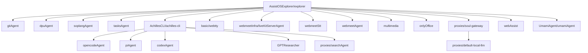
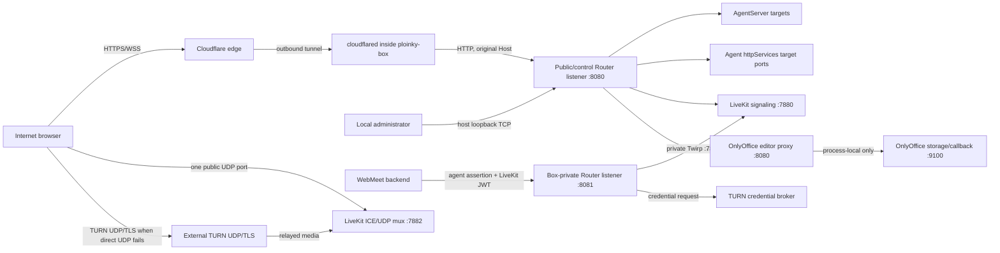

# Ploinky Box Edge Routing and Publication — Design

Date: 2026-07-15

Status: approved architecture authority; implementation partially complete

Scope: `ploinky`, `container-image-builds`, `AssistOSExplorer`, `webmeetInfra`, `UmamiAgent`, `AchillesCLI`, `proxies`, and `basic`

Design posture: clean-slate; no backward compatibility, migration, dual-read,
or automatic operating-mode fallback paths

This approved design supersedes the architecture proposed by
[`2026-07-09-web-publishing-agent-design.md`](./2026-07-09-web-publishing-agent-design.md)
and the outer-port promotion portion of
[`2026-07-09-graph-driven-box-publish-planning-design.md`](./2026-07-09-graph-driven-box-publish-planning-design.md).

Implementation status (2026-07-15): independent runtime, manifest, image, test,
and documentation slices have been applied, but managed-bridge reachability to
private Router `8081` remains inactive and fail-closed on the observed rootless
Podman `host-gateway` topology. Ploinky DS004 Question #8 records the exact
evidence and unresolved architecture choice. This implementation note does not
amend the decision register or weaken the section 17 acceptance criteria.

## 1. Executive decision

The complete Explorer stack can use exactly one TCP publication and one UDP
publication at the Ploinky-box boundary, but only after the current networking
contract is replaced.

| Question | Decision |
| --- | --- |
| Are one router TCP port and one UDP port sufficient? | Yes at the physical-host boundary: all HTTP, HTTPS-origin, SSE, and WebSocket traffic goes through RoutingServer; LiveKit uses one ICE/UDP mux; TURN is external. RoutingServer also owns a box-private TCP listener with no outer mapping for agent-only calls. |
| Is the router TCP port public on the Internet? | No. The physical host publishes it on loopback for local administration. `cloudflared`, running inside the box, reaches the same router through box loopback using outbound connections. |
| What is publicly reachable on the physical host? | One LiveKit UDP media port. There is no inbound Internet-facing TCP socket when Cloudflare publication is enabled. |
| How are extra agent servers reached? | Existing `httpServices` entries gain only a target container `port`. RoutingServer privately resolves that port and proxies HTTP, SSE, and WebSocket traffic to it. No agent HTTP port becomes an outer publication. |
| What happens to `additionalServerPort`? | It is deleted from the target contract. It could technically represent one secondary listener, but retaining it would preserve a second target-selection and proxy path. `httpServices[].port` handles both primary and secondary HTTP listeners uniformly. |
| What happens to `httpServices` and its access values? | They remain the current route contract. `slug`, prefixes, `access`, identity behavior, and delegations stay in agent manifests and continue to feed `HttpRouteAccessPolicy`; redesigning that ownership is out of scope. |
| What happens to `openPorts`? | It has no outer-box publication role. The outer box does not read it or any other manifest field. Agent-local uses may remain inside Ploinky core, but no `openPorts` value can add a physical-host mapping. |
| Does the outer box inspect the dependency graph? | No. The graph-driven outer publish planner is removed. The wrapper always creates the same router TCP and reserved UDP mappings before any workspace, profile, or agent graph is known. |
| Where does `cloudflared` run? | In the outer `ploinky-box` image, supervised as part of the box control plane. It is not an agent. |
| What happens when no Cloudflare credentials exist? | The selected operating mode is `local-only`; `cloudflared` is not started and no public HTTP hostname is active. This is a mode selection, not a failure fallback. |
| Is a Cloudflare tunnel token enough to configure hostnames? | No. A connector token can run the tunnel but cannot update tunnel ingress or DNS. Ploinky therefore requires a separate least-privilege Cloudflare API token when the admin wants Ploinky to manage public hostnames. |
| What happens when Cloudflare configuration is incomplete or invalid? | Public publication fails closed. The connector is stopped or remains stopped, the error is visible to the local admin, and the runtime does not silently change to `local-only`. |
| What does LiveKit use? | Loopback-only HTTP on `7880`: public browser signaling and private Twirp are separate named routes through RoutingServer. Media uses one direct UDP mux on `7882`; Redis, Egress, and health remain private; TURN is external. |
| What does TURN need? | A listener plus relay sockets, commonly TURN/UDP and TURN/TLS. Those sockets live on the external TURN service. Same-box Coturn is incompatible with the strict one-UDP box boundary. |
| What does OnlyOffice need? | An authenticated control route, a narrowly public editor-transport route with WebSocket support, process-local document storage/callbacks, and no UDP publication. |
| What happens to `basic/web-publishing`? | It is removed from Explorer and deleted as an architecture component. Ploinky owns publication, Cloudflare lifecycle, hostname routing, and derived public topology. |

## 2. Scope, definitions, goals, and non-goals

### 2.1 Definitions

| Term | Meaning in this design |
| --- | --- |
| Agent listener | A socket opened inside an agent container. It is not externally reachable merely because it exists. |
| Router target | An agent HTTP listener that RoutingServer can reach through a private mapping or the selected private network namespace. |
| Box publication | An outer container-engine `-p` mapping from the physical host into `ploinky-box`. This is the port count that the main requirement constrains. |
| HTTP service route | A manifest `httpServices` entry containing a stable slug, prefixes, access behavior, and optionally a target container port. |
| Public hostname | An exact DNS hostname whose Cloudflare ingress terminates at RoutingServer and whose router mapping selects one enabled agent root and/or named manifest HTTP services. This is an origin proxy, not an HTTP `301/302` redirect to a private port. |
| Reserved box UDP slot | The fixed `7882:7882/udp` outer mapping. It bypasses RoutingServer and is owned by the box runtime contract, not an agent manifest. |
| Public Router listener | RoutingServer binds box port `8080` on an address reachable by the outer port forward. Same-box clients use the origin URL `http://127.0.0.1:8080`; the physical host uses its loopback `routerPublish`. Bind address and client origin are deliberately distinct concepts. Exact-host classification occurs before path dispatch. |
| Private Router listener | A second listener on runtime-owned box port `8081`, reachable only through box loopback and managed inner-bridge interfaces, with no physical-host mapping and no Cloudflare ingress. It accepts only exact, signed agent assertions for private service calls such as LiveKit Twirp and the TURN broker. |
| Local-only | A valid operating mode with no Cloudflare connector and no Internet HTTP publication. The router remains available through its physical-host loopback mapping. |
| Cloudflare mode | A valid operating mode in which Ploinky reconciles DNS and tunnel ingress, starts `cloudflared`, and serves configured public hostnames. |
| Public route | A router entry point. It does not automatically mean anonymous access; the service route's existing `access` declaration remains authoritative through `HttpRouteAccessPolicy`. |

### 2.2 Goals

| Goal | Measurable result |
| --- | --- |
| Minimize and stabilize the box boundary | Every managed box has one loopback TCP publication for RoutingServer and one reserved public UDP publication, independent of the enabled graph. |
| Keep Ploinky generic | Ploinky routes manifest-declared HTTP services and deployment-declared hostnames without hardcoding Explorer, OnlyOffice, LiveKit, Umami, or any optional agent id. |
| Unify HTTP routing | Path routes, public-host routes, HTTP requests, SSE streams, and WebSocket upgrades use one route resolver and one access-policy path. |
| Remove graph-derived exposure | No manifest, dependency, readiness probe, CLI escape hatch, or persisted agent state can add or remove an outer publication. |
| Integrate Cloudflare at the correct ownership layer | The box image owns the connector binary and Ploinky core owns desired publication state, credentials, reconciliation, health, and admin UX. |
| Preserve application security boundaries | Router authentication, route access, delegation, origin handling, rate limits, and application JWTs remain explicit and fail closed. |
| Make media behavior honest | Signaling success is not reported as media readiness; direct UDP and TURN paths are tested independently. |
| Keep manifests slim | Reuse `httpServices` and add only an optional target `port`. The reserved UDP slot is absent from agent manifests. Do not add a general server inventory or move current policy fields. |

### 2.3 Non-goals

| Non-goal | Reason |
| --- | --- |
| Preserving current manifests or persisted publication state | This is a clean target contract. Old fields are rejected, not translated. |
| Preserving `additionalServerPort`, graph promotion of `openPorts`, or direct host access to ports such as `8082`, `7880`, `17000`, or `3000` | The target uses one `httpServices` resolver for all router-compatible listeners and a fixed box-owned UDP slot. No migration or compatibility path is retained. |
| Falling back from a broken Cloudflare configuration to local publication | Silent mode changes conceal outages and can expose a different surface than the administrator selected. |
| Self-hosting TURN inside the strict two-port box topology | TURN requires distinct listener and relay sockets. |
| Sending WebRTC media through standard Cloudflare Tunnel | Cloudflare Tunnel is the HTTP/WebSocket signaling path, not the browser WebRTC UDP or TURN relay path. |
| Making RoutingServer a general TCP/UDP proxy | Its security and routing model is HTTP-oriented. The only selected non-HTTP box socket is the fixed LiveKit UDP slot; TURN and any future non-HTTP infrastructure stay external or require a new box-level architecture decision. |
| Multi-node LiveKit, multi-box failover, or media-region selection | The selected target is one Ploinky box and one LiveKit SFU instance. |
| Supporting arbitrary public mutation endpoints | Current `public` access rejects writes. The selected Umami exception uses a narrow, agent-owned proxy behind current `guest` access; generic anonymous writes remain out of scope. |

## 3. Current code evidence and constraints

### 3.1 Current publication and routing behavior

| Observed behavior | Evidence | Consequence |
| --- | --- | --- |
| RoutingServer uses inner port `8080`. | `container/runtime-contract.mjs` | The outer box needs one stable router target. |
| The wrapper normally publishes the router to physical-host loopback. | `container/runtime-contract.mjs`, `container/runtime-supervisor.mjs` | Local administration already fits one TCP publication. |
| Every generated publish becomes an outer engine `-p`. | `container/runtime-contract.mjs` | Any manifest-derived outer claim expands the boundary and couples box creation to workspace state. |
| The current publish planner promotes profile `openPorts`. | `container/box-publish-planner.mjs`, `cli/services/boxStartPublishPlan.js` | The target deletes this outer planning path; the box wrapper emits its two fixed mappings without reading the graph. |
| AgentServer routing is normally synthesized around port `7000`. | `cli/services/docker/agentServiceManager.js` | Ordinary agents do not need stable outer ports. |
| `additionalServerPort` is singular and is resolved to a private ephemeral mapping. Only GPTResearcher and Umami currently use it. | `cli/services/profileServer.js`, workspace manifests | It remains a special target and proxy path. OnlyOffice does not use it: the editor currently reaches web-publishing nginx through `openPorts` `8082:8080`. |
| Secondary-server host routing recognizes only `<routeKey>.localhost`. | `cli/server/RoutingServer.js`, `cli/server/profileServerProxy.js` | The existing secondary path is not a public-hostname routing contract. |
| `httpServices` already owns slug, prefix rewrite, access, identity/invocation behavior, and delegations, but always resolves to the primary route host port. | `cli/server/httpServiceRoutes.js`, `cli/server/routerHandlers.js`, `cli/server/wsServiceProxy.js` | Adding only a target container port preserves the current policy contract while allowing GPTResearcher `8000`, Umami `3000`, OnlyOffice `8080`, and LiveKit `7880`. |
| The current secondary-server route bypasses `HttpRouteAccessPolicy`; HTTP and WebSocket use a different generic-auth path. | `cli/server/RoutingServer.js`, `cli/server/profileServerProxy.js`, `cli/server/wsServiceProxy.js` | Deleting that special route and resolving every declared `httpServices` target through one HTTP/WebSocket plan removes the drift. |
| `HttpRouteAccessPolicy` already evaluates manifest service `public`, `guest`, and `authenticated` decisions. | `cli/server/policy/HttpRouteAccessPolicy.js`, `cli/server/policy/HttpRouteProviders.js` | The target reuses this behavior. Moving service access into persisted policy is deliberately out of scope. |
| Ploinky security documentation treats public Internet use as requiring additional hardening. | `docs/specs/DS011-security-model.md` | Publication cannot be considered complete until origin, CSRF, rate-limit, upload, and admin-command controls pass acceptance tests. |

The current implementation therefore cannot meet the two-port requirement by
configuration alone. It requires a new hard-cut runtime contract.

### 3.2 Explorer dependency graph

The Explorer root enables the agents below through
`AssistOSExplorer/explorer/manifest.json`. Achilles CLI and Soul Gateway add the
shown transitive dependencies.



`basic/web-publishing` is currently enabled as a profile dependency and startup
config provider. The target removes both references.

### 3.3 Listener inventory and target disposition

| Agent or group | Current relevant listener(s) | Target disposition | Outer port |
| --- | --- | --- | --- |
| Explorer, gitAgent, dpuAgent, soplangAgent, tasksAgent, Achilles CLI, opencodeAgent, piAgent, codexAgent, multimedia, webAssist | Standard AgentServer or agent-owned HTTP service on `7000` | Existing router/AgentServer path | None |
| webmeetAgent | Agent/custom service on `7000`; current profile may also reserve stable loopback `17001` | Router target on the normal agent path; stable loopback publication removed | None |
| Soul Gateway | AgentServer-compatible HTTP API on `7000` | Existing AgentServer and `httpServices` paths through RoutingServer | None |
| GPTResearcher | AgentServer `7000` plus UI/API `8000` | `httpServices[].port: 8000` through RoutingServer | None |
| WebTTY | Start-only HTTP/SSE service `7681` | Authenticated `httpServices[].port: 7681` | None |
| SearchAgent | AgentServer `7000`, SearXNG `8888`, optional browser pool `8890` | AgentServer routed; support servers remain private to the agent | None |
| default-local-llm | AgentServer `7000`, llama server `8080` | AgentServer routed; llama listener remains private | None |
| webmeetStt | STT service around `9000`, currently promoted through a stable loopback mapping | No outer publication. No current consumer was found outside the agent after the prior LiveKit AI worker deletion; dependency removal is a separate product decision. | None |
| OnlyOffice | Control `7000`, editor proxy `8080`, storage/callback `9100`, embedded DocumentServer `80`; today control/editor are loopback `openPorts`, and web-publishing nginx reaches editor `8082:8080` | Control and editor become distinct, net-new Router targets; storage and DocumentServer remain process-local | None |
| Umami | AgentServer `7000`, Umami web app `3000`, Postgres `5432`, MCP adapter `7301` | AgentServer and selected web routes use RoutingServer; Postgres and adapter remain private | None |
| LiveKit server agent | Health `17000`, signal `7880`, ICE/TCP `7881`, UDP range `7882-7892`, Egress `7980`, Redis `6379`, Coturn `3478`, relay range `20000-20010`, and current production TLS `80/443` | Signal routed; one UDP mux direct; health/Egress/Redis private; ICE/TCP, Coturn, local TLS, and ranges removed | `7882/udp` |
| `basic/web-publishing` | AgentServer, nginx `8081`, `cloudflared` | Component removed; responsibilities move to Ploinky core and the box image | None |

The exceptional current listeners are visible in
`AchillesCLI/GPTResearcher/manifest.json`, `basic/webtty/manifest.json`,
`webmeetInfra/liveKitServerAgent/manifest.json`,
`AssistOSExplorer/onlyOffice/manifest.json`, and
`UmamiAgent/umamiAgent/manifest.json`. SearchAgent and default-local-llm start
their support servers from their startup scripts rather than manifest
publications.

### 3.4 Adversarial-review disposition

The companion review was checked against the current implementations and the
pinned upstream versions. The decisions below are part of this revised design;
they are not a second, competing backlog.

| Finding | Disposition | Design action |
| --- | --- | --- |
| P1-1 — public-host control plane | Accepted with modification | Resolve and classify `Host` before global path dispatch. Dedicated service hosts expose the selected service plus exact required browser-auth transactions; agent-root hosts expose only their root/mounts plus explicitly selected closed-catalog browser surfaces. Router health/admin/policy/discovery/broker/private APIs remain local/private. |
| P1-2 — current routes do not carry `httpServices[].port` | Not a missing design decision | The implementation gap is real, but sections 6.2, 7.1, and 7.4 already define the target registry and common HTTP/SSE/WebSocket plan. Section 7.4 now names the concrete replacement checklist. |
| P1-3 — LiveKit `7880` bypass and private Twirp | Accepted with modification | Bind LiveKit HTTP to loopback, define public signaling and private Twirp services on the same port, and admit Twirp only through the box-private Router listener with an exact agent assertion. |
| P1-4 — stale-policy guarantee | Accepted | Candidate files are non-authoritative staging inputs. Only a validated immutable generation is authoritative; raw edits have no runtime meaning until coordinated apply. |
| P1-5 — unrestricted host networking | Accepted with modification | Require a box-configured capability for an exact effective instance and enable generation, reject every other host-mode launch, verify socket ownership, and never treat the shared loopback namespace as control authorization. |
| P1-6 — TURN-consumer identity | Accepted with modification | Assertions carry effective instance and enable generation, use revocable per-generation credentials, bind method/path/audience/body, and require replay protection plus a current-registry check. |
| P1-7 — LiveKit candidate advertisement | Accepted | Require literal `media.publicIPv4` as `rtc.node_ip`; no discovery or candidate fallback is permitted. |
| P1-8 — one-time TURN credentials | Accepted with modification | Return expiry and perform a controlled SDK disconnect/recreate/rejoin with fresh join material before expiry and after network transitions; backend-only refresh is insufficient. |
| P1-9 — topology activation and restarts | Accepted with modification | Separate immutable configuration generation from mutable publication generation, resolve topology per operation, and never restart consumers for readiness changes. Any unavoidable config restart is targeted and drain-aware. |
| P1-10 — GPTResearcher and Umami subpaths | Accepted | Pin sources, implement real base-path support, implement the missing Umami `3001` proxy before declaring it, and prove assets, APIs, redirects, and WebSockets in a browser. |
| P1-11 — web-publishing hard cut | Accepted with modification | Delete it repository-wide from executable/configuration paths, images, workflows, tests, and normative docs while preserving the generic config-provider feature and archived decision records. |
| P2-1 — static runtime contract | Accepted | Introduce runtime contract v5, reject v4, and remove the full planner/coverage/provenance call graph and all `additionalServerPort` branches. |
| P2-2 — Egress `7980` collision | Accepted | Set template `7980` and health `7981`; probe their distinct semantics and publish neither. |
| P2-3 — OnlyOffice hardening | Accepted with modification | Pin digests, make support listeners process-private, replace forwarding headers, enforce origins and temporal JWT claims, bound callbacks/fetches/redirects, and add adversarial tests. The existing per-instance bridge is retained rather than described as shared. |
| P2-4 — browser topology delivery | Accepted | Keep the mounted snapshot for backends and add an authenticated, non-secret Router projection resolved per browser/session operation. |

### 3.5 Evidence-dossier disposition

The independent evidence dossier
`REVIEW_FINDINGS_2026-07-15-box-edge-routing-EVIDENCE.md` and its companion
verdict were also validated. Its numbering is local to that review.

| Finding | Disposition | Design action |
| --- | --- | --- |
| P1-1 — fixed UDP producer missing | Accepted | Runtime contract v5 adds an unconditional UDP-reservation constructor beside `routerPublish`; deleting the planner alone is insufficient. |
| P1-2 — incomplete hard-cut inventory | Accepted with modification | Remove every planner/coverage/provenance importer, environment branch, label, gate, and test. Reject v4 and require explicit recreate; do not add the reviewer's compatibility or automatic recreate path. |
| P2-1 — per-service targets are substantial | Accepted, already specified | Treat parser retention, N distinct private mappings, routing-state schema, common resolver, and profile-proxy deletion as explicit runtime work, while keeping the manifest addition to one `port` field. |
| P2-2 — broker wiring is net-new | Accepted | Add private listener, router-owned assertion audience, current-generation ACL, replay protection, and WebMeet replacement of static TURN credentials. |
| P2-3 — current LiveKit generation differs | Accepted | Rewrite every profile's generator to fixed mux/literal node IP/no discovery/no range and runtime-verify `tcp_port: 0`. |
| P2-4 — removed web-publishing capabilities | Accepted with modification | Explicitly remove LAN/nginx-only HTTP, generated internal/TURN/TLS/cert variables, and tunnel creation. Retain loopback local-only, require an existing tunnel for Cloudflare mode, and make revocation/deletion of old plaintext credential state a destructive activation prerequisite rather than a migration path. |
| P2-5 — topology mechanisms are net-new | Accepted | Mark mounting, resolver/watch support, browser projection, and split generations as new runtime work; do not introduce fleet restart. |
| P2-6 — nested UDP fidelity unproven | Accepted | Make native amd64/arm64 cross-network bidirectional media through the physical-to-box mapping a release gate. |
| P2-7 — Umami/OnlyOffice accuracy | Accepted | Mark `3001` as new and a deliberate Umami DS reversal; record OnlyOffice's current openPorts+nginx path and its Router path as new behavior. |
| P3 — OnlyOffice `/example/` wording | Accepted | Correct the allowlist description and test the actual path. |
| P3 — legacy cloudflared hardcoded origins | Accepted only as deletion evidence | Delete those agents. Integrated cloudflared correctly uses fixed in-box `127.0.0.1:8080`, independent of the configurable physical host port. |
| P3 — `--port` disposition | Accepted | Retain it only as the loopback router host-port selector; it cannot alter inner `8080`, UDP, or the mapping count. |
| `--token-file` minimum version | External/build verification | Keep the pinned image requirement, but verify the selected multi-architecture release and option in the image build rather than treating current repository code as proof. |

## 4. Target architecture and trust boundaries



### 4.1 Ownership

| Component | Owns | Must not own |
| --- | --- | --- |
| Outer box wrapper/runtime | Physical-host port mappings, box image selection, volumes, and lifecycle | Agent-specific hostnames or application policy |
| Ploinky core | Public/control and box-private Router listeners, route table, current HTTP-policy composition, admin publication API/UI, Cloudflare desired state, credentials, reconciliation, non-secret topology snapshot/projection, TURN REST credential broker, and status | Hardcoded optional agent ids or product-specific path lists |
| `cloudflared` | Outbound connector from Cloudflare edge to `127.0.0.1:8080` | DNS desired state, route authorization, agent discovery, TURN, or UDP media |
| Agent manifest | Current HTTP service route definitions, target container ports, and access classes | Deployment DNS names, Cloudflare account data, reserved outer UDP state, or raw outer engine arguments |
| Local/public route configuration | Exact host-to-manifest-service mapping | Raw target ports or authorization overrides |
| `HttpRouteAccessPolicy` | Evaluate the current manifest and operator HTTP access sources and execute their existing identity semantics | Target address selection, DNS, or Cloudflare lifecycle |
| Agent implementation | Application-level JWTs, endpoint/path allowlists, callback validation, and protocol-specific behavior | Physical-host publication |
| External TURN | TURN listener, relay range, TLS certificate, abuse controls, relay bandwidth, and credential validation | Ploinky HTTP routing, credential issuance, or LiveKit signaling |

### 4.2 Trust boundaries

| Boundary | Required behavior |
| --- | --- |
| Internet to Cloudflare | Cloudflare terminates public TLS and optional Cloudflare Access. Cloudflare Access is defense in depth, not the application authorization source. |
| `cloudflared` to RoutingServer | The client origin is fixed to `http://127.0.0.1:8080`, independent of RoutingServer's box-interface bind and the configurable physical-host port. RoutingServer strips client-provided forwarding and Ploinky identity headers, then synthesizes canonical host and scheme from the matched publication entry. |
| Public Router listener to private Router operations | There is no forwarding bridge. Public service hosts cannot reach the private listener, TURN broker, private LiveKit API, or other agent-only operations. |
| Agent to private Router listener | The caller uses a router-consumed assertion header bound to exact effective instance, enable generation, audience, method, path, body digest, expiry, and nonce. Router strips that header before proxying and preserves application `Authorization` headers such as the LiveKit API JWT. |
| RoutingServer to agent HTTP target | Private only. Router creates identity/delegation headers after policy succeeds. Browser-supplied identity headers never pass through. |
| Browser to LiveKit | LiveKit room JWT authorizes signaling. Ploinky login cookies are not required and are not forwarded to LiveKit. |
| Browser to OnlyOffice editor transport | Signed OnlyOffice configuration and opaque session/document tokens authorize editor use. The public transport proxy remains path-limited. |
| DocumentServer to local storage/callback | Loopback only, expiring opaque URL tokens, mandatory body-bound temporal outbox JWTs, strict fetch/callback validation, and no router publication. |
| Browser to Umami telemetry | A narrow agent-owned telemetry proxy is separated from the authenticated dashboard. Under the current access model it uses a scoped `guest` route, suppresses injected auth-info, discards browser credentials before calling Umami, and enforces exact paths, body limits, origin policy, and rate limits. |

## 5. Outer box port contract

### 5.1 Selected full-stack contract

| Physical-host mapping | Bind | Purpose | Internet inbound |
| --- | --- | --- | --- |
| `<routerHostPort>:8080/tcp` | `127.0.0.1` | Local administration and the stable box router target | No |
| `7882:7882/udp` | `0.0.0.0` | One reserved box UDP slot; LiveKit uses it as its direct ICE/UDP mux | Yes |

No agent HTTP listener, AgentServer, health socket, database, Redis listener,
OnlyOffice listener, LiveKit signal listener, Egress listener, or TURN socket is
published at the outer boundary.

Managed box mode has no escape hatch around this table. The outer CLI rejects
explicit `--publish`, `--expose`, and `--listen-lan`; persisted arbitrary
publications are invalid desired state. The router mapping is always loopback
and the UDP mapping is always `7882:7882/udp`.

Inside the box, RoutingServer's public listener binds `0.0.0.0:8080` (or the
equivalent explicit box interfaces) so the outer engine can deliver the
physical-loopback port forward; binding only box `127.0.0.1:8080` would make
that forward unreachable. This does not create a wildcard physical-host
publication: the outer TCP mapping remains bound to physical
`127.0.0.1`. `cloudflared` uses box loopback, while managed inner agents use
the box-side gateway only where an allowed Router surface requires it.

The private listener binds box loopback plus managed inner-bridge interfaces on
`8081`; an interface firewall rejects the box's outer-facing interface. It has
no outer `-p` entry. A bridge-mode agent reaches it at
`http://host.containers.internal:8081`; a host-mode runtime reaches it at
`http://127.0.0.1:8081`. Signature and ACL checks remain mandatory even on
these network-restricted binds.

Runtime contract v5 constructs both mappings directly. Alongside the existing
`routerPublish`, `createDefaultRuntimeConfig` creates an unconditional
box-owned UDP reservation equivalent to `{ hostIp: "0.0.0.0", hostPort:
"7882", containerPort: "7882", protocol: "udp" }`;
`mergeDesiredRuntimeConfig` preserves that exact value and accepts no
caller override. This is new constructor code, not an accidental result of
deleting the planner. The existing publication formatter emits the reservation
as the second outer `-p`. Contract v5 has no `extraPublishes` or raw-extra
publication field; its complete publication state is `routerPublish` plus the
fixed `udpReservation`.

The wrapper does not start the dependency publish planner, read a
workspace/profile/manifest, or change the mapping set when agents are enabled
or disabled. The graph is still used inside Ploinky core for its normal job of
starting agents and building private HTTP routes; it is not an input to
outer-box creation or reconciliation. `--port` remains only the physical-host
side of `routerPublish`; the box-side Router port remains `8080`, so
`cloudflared` always uses `http://127.0.0.1:8080`. Managed mode rejects
`--publish`, `--expose`, and `--listen-lan`.

The hard cut rejects runtime contract v4 and accepts only v5; an old box must be
explicitly destroyed and recreated. There is no migration, translation,
dual-read, or automatic destructive action. The implementation removes:

| Removed surface | Required call-site cleanup |
| --- | --- |
| `container/box-start-publish-plan.mjs`, `container/box-publish-planner.mjs`, `cli/services/boxStartPublishPlan.js`, `cli/services/boxPublicationCoverage.js` | Remove imports/calls from `workspaceUtil.js`, `cli/commands/cli.js`, and `server/authHandlers/marketplaceRoutes.js`. |
| Outer-publication coverage helpers and environment contract | Remove definitions/exports/calls from `docker/common.js`, `docker/index.js`, `agents.js`, `agentServiceManager.js`, `containerMonitor.js`, and `runtime-supervisor.mjs`, including `PLOINKY_OUTER_PUBLICATION_CONTRACT`, `PLOINKY_OUTER_PUBLICATION_REQUIRED`, plan-version labels, and the old plan-version gate. |
| Graph-derived publish provenance and labels | Remove create/replace/reconcile persistence and every reader; v5 validates only its two constructor-owned mappings. |
| Planner/coverage tests and harness branches | Delete `boxPublishPlanner`, `boxStartPublishPlan`, `boxStartPublishPlanLock`, and `outerPublicationCoverage` suites; remove publication-planner cases from `workspaceDependencyGraph`, runtime-supervisor harness/tests, `marketplacePublication`, and `containerMonitorPublication`; rewrite CLI/workspace/agent-launch coverage around v5. A full import/lint/test run must prove no dangling reference remains. |
| `additionalServerPort` routing path | Remove manifest/profile parsing, routing-file state, `profileServerProxy`, host extraction, Docker/Seatbelt/bwrap launch branches, readiness branches, and associated tests; `httpServices[].port` is the only secondary HTTP-target path. |

Old planner state is not read or translated.

That deletion also removes the current inner launcher's imports of
`implicitAgentServerBoxPort` and outer-publication coverage assertions. They are
not retained under a new planner name. Bridge-network AgentServer `7000` and
explicit `httpServices[].port` targets use engine-assigned box-loopback
ephemeral ports; Ploinky inspects the assigned ports and records them in private
routing state. Non-reserved inner `openPorts` remain ordinary inner mappings.
Inner launch validates mapping syntax, inner collisions, and the reserved
`8080/tcp`/private `8081/tcp`/`7882/udp` exclusions, but never asks whether an inner socket is
covered by a physical-host publication.

The outer engine must acquire physical-host `7882/udp` even when LiveKit is not
enabled. If another container, process, or managed box already owns that
wildcard port, box creation fails with an explicit fixed-port collision; the
wrapper never chooses another host port.

LiveKit runs with the inner container's `network.mode: "host"`, which in the
nested runtime means the box network namespace, and binds `7882/udp` there.
Opening the outer UDP mapping alone would not deliver packets to a bridge-only
inner agent; host networking is the intentionally selected inner handoff and
avoids a second UDP NAT/proxy layer. There is no graph-driven UDP owner registry:
the kernel's exclusive bind is the arbitration point. LiveKit startup fails if
`7882/udp` is already occupied, and its readiness script must verify that the
LiveKit process owns the listener.

Host mode is a privileged box-network capability, not a manifest entitlement.
Box security configuration allowlists an exact effective instance plus its
current enable generation. Ploinky core rejects `network.mode: "host"` for
every other instance, starts both Router listeners before host-mode runtimes,
and verifies the expected runtime owns `7882/udp` without taking over
`8080/tcp` or private `8081/tcp`. The allowlist is generic box state and
contains no hardcoded LiveKit id. Because LiveKit, Egress, and Redis currently
share one composite runtime namespace, the enforceable boundary is the granted
runtime plus verified LiveKit socket ownership; per-process isolation would
require splitting that runtime or passing an already-open socket descriptor.

`cloudflared` also needs outbound connectivity to Cloudflare, including the
documented tunnel transport on port `7844`. An outbound connection is not a
physical-host inbound publication and does not add a port to this contract.

The UDP publication exists even when LiveKit is not installed or running. In
that state the engine mapping has no listener behind it and packets are dropped.
This small unused exposure is the price of making the outer contract constant
and eliminating graph/manifest processing from the box wrapper.

### 5.2 Contract by operating mode

| Mode | Router TCP | LiveKit UDP | Public HTTP | Cloudflare process |
| --- | --- | --- | --- | --- |
| `local-only`, Explorer without LiveKit | Loopback | Fixed mapping exists; no listener | None | Not started |
| `local-only`, full Explorer stack | Loopback | Fixed mapping with LiveKit listener | No Cloudflare hostname | Not started |
| `cloudflare`, full Explorer stack | Loopback | Public `7882/udp` | Cloudflare outbound tunnel to the loopback router | Required and health-checked |
| Invalid/incomplete Cloudflare configuration | Loopback remains available to the admin | Fixed mapping unchanged | Unavailable for new joins because signaling is unavailable | Stopped; state is `publication-error` |

The invalid state does not become `local-only`; it remains a failed Cloudflare
selection until the administrator repairs or explicitly removes the Cloudflare
configuration. In this design, `local-only` describes HTTP publication, not the
absence of the fixed UDP mapping. If LiveKit is running, its socket is still
network-reachable at `7882/udp`, although Ploinky advertises no supported public
join topology without complete signaling and media desired state.

### 5.3 Why self-hosted TURN does not fit

| TURN design | Additional box sockets | Decision |
| --- | --- | --- |
| External/managed TURN | None | Selected |
| LiveKit embedded TURN/UDP | A distinct TURN UDP listener | Rejected for the strict boundary |
| LiveKit embedded TURN/TLS | A distinct raw TCP/TLS listener and certificate/domain | Rejected for the strict boundary |
| Same-box Coturn | Listener TCP/UDP plus a UDP relay range | Rejected |
| No TURN | None | Rejected for supported public production because restrictive networks lose media fallback |

## 6. Slim manifest contract

### 6.1 Design principle

The target retains `httpServices` as the current route contract for
router-compatible HTTP, SSE, and WebSocket surfaces. Its existing `slug`,
prefix, `access`, `guestScope`, `invocation`, `includeAuthInfo`, `delegations`,
and `notFoundMessage` semantics do not move. Existing agent-manifest and
route-table sources, array/object forms, and accepted field aliases remain in
scope unchanged. Examples use the canonical agent-manifest form. The only
addition is an optional integer `port` telling RoutingServer which container
listener the service uses.

The manifest therefore declares only the HTTP-service routes that RoutingServer
may target privately. It does not declare the fixed outer UDP slot and does not
add a server inventory, a policy section, deployment hostnames, Cloudflare data,
or entries for every process-local listener.

Redis, Postgres, OnlyOffice storage, llama, SearXNG, Egress, and health-only
listeners remain absent unless RoutingServer itself must proxy them. Merely
opening a process-local listener does not create an `httpServices` route.

Specialized-runtime examples use `<selected-digest>` as a design placeholder.
Implementation must replace it with the reviewed exact digest; a literal
placeholder, tag-only image, or environment-selected version fails validation.

### 6.2 Exact schema changes

| Manifest surface | Target rule | Why it exists | Cost/limitation |
| --- | --- | --- | --- |
| `httpServices[].port` | Optional integer TCP container port in `1-65535`. When omitted, the service keeps today's behavior and targets the owning route's primary private port, normally AgentServer `7000`. An explicit value creates or reuses a private router target for that container port. | It lets the same existing service record select GPTResearcher `8000`, Umami `3000`/`3001`, OnlyOffice `7000`/`8080`, WebTTY `7681`, or LiveKit `7880`. | A start-only runtime has no implicit AgentServer target, so each routed service must declare `port`. |
| Existing `httpServices` fields | `slug`, prefixes, `access`, `guestScope`, `invocation`, `includeAuthInfo`, `delegations`, and `notFoundMessage` retain their current parsing and route meaning. Existing aliases (`name`, `prefix`, `path`, `targetPrefix`, and `upstreamPrefix`), array/object forms, and `route.httpServices` input remain accepted. A `slug` stays optional for prefix-only use, but is required and must be unique within the owning agent when host configuration selects that service by name. | Reuses the route and policy model already implemented and documented. | Current `public` remains read-only (`GET`/`HEAD`); current `guest` creates or reuses the identity selected by the winning policy decision. Named selection and its uniqueness check are a new runtime use of the existing slug, not a new manifest field. |

Although `port` is the only new manifest field, named host selection also
requires `normalizeServiceSpec` to retain the existing normalized slug in the
runtime definition; the current implementation computes that slug but drops it.
This is an explicit resolver/validation extension. It does not change existing
prefix-only service routing.

Several `httpServices` entries may share one port because they can represent
different prefixes and access modes on the same application. Ploinky creates at
most one private runtime target per distinct explicit port. For a bridge-network
container this is a box-loopback ephemeral mapping; for a host-network
runtime it is the corresponding box-loopback listener. Neither creates a
physical-host publication outside `ploinky-box`.

If `port` is omitted, the owning route must have a valid primary private target.
If `port` is explicit, the runtime must resolve that exact container port before
the service is mounted. Missing, invalid, or unresolved targets fail that
service closed. No request or hostname configuration may supply a raw port.
This proposal does not change when existing local prefix routes are accepted.
Public-host and derived local-alias activation perform an additional ambiguity
check over the effective combination of manifest and `route.httpServices`
sources: the canonical prefix of every selected service must not equal or
overlap another enabled service prefix that would also match the request. The
check fails that host/alias activation, not graph loading. It is needed because
the current pathname policy aggregates every matching prefix while current
service dispatch selects the first match.

`openPorts` is not part of this outer-edge contract. If Ploinky core retains it
for an inner agent-container mapping, that mapping ends at the box namespace and
does not add an outer engine mapping. The inner launcher must reject any
`openPorts` mapping whose resolved box-side interval collides with reserved
`8080/tcp`, private `8081/tcp`, or `7882/udp`; otherwise it could hijack a mapping that already
exists. This validation occurs during normal inner agent launch and cannot
change the outer mapping set. LiveKit does not need `openPorts` because its inner
runtime shares the box network namespace.

Readiness does not make a service routable or public. Existing MCP readiness
uses the primary AgentServer target. TCP readiness may infer the sole explicit
`httpServices[].port` of a simple start-only runtime; a runtime with several
listeners uses the existing `health.readiness.script` mechanism for a composite
check. This avoids adding `readiness.port`, `readiness.path`, or another
manifest section.

### 6.3 Deleted fields and semantics

| Deleted surface | Replacement | Reason |
| --- | --- | --- |
| Singular `additionalServerPort` | `httpServices[].port` | Retaining it is technically possible for the current stack, but it would preserve a second host-only resolver and proxy path that bypasses the HTTP-service policy flow. The port belongs on the existing service record that already says how the request is routed and authorized. |
| Outer promotion of agent `openPorts` | Fixed box-owned `7882:7882/udp` mapping | Box creation must not depend on an agent graph. Any retained `openPorts` use is inner-runtime-only and cannot change the physical-host boundary. |
| Implicit AgentServer for an `agent` command that does not actually serve AgentServer | Use `start` and explicit readiness/routes | The command type must describe the runtime contract; LiveKit is infrastructure, not an MCP AgentServer. |
| Stable loopback host ports for agent HTTP services | RoutingServer | Loopback ports still consume the outer box publication contract and bypass unified hostname/access routing. |

There is no parser translation, deprecation interval, dual-read behavior, or
automatic manifest rewrite. A manifest containing singular
`additionalServerPort` or an invalid `httpServices[].port` fails schema
validation. No agent manifest field is accepted as outer publication input.

### 6.4 Minimal ordinary AgentServer manifest

An ordinary agent needs no new networking section:

```json
{
  "container": "docker.io/assistos/ploinky-node:24-bookworm-tools",
  "agent": "node /code/agent.mjs",
  "readiness": {
    "protocol": "mcp"
  }
}
```

The `agent` command declares the standard AgentServer contract. Ploinky creates
its private router target on `7000`; no outer mapping is created.

### 6.5 OnlyOffice target manifest shape

The following is a networking-only excerpt. Existing image, environment,
volume, and generated-secret fields remain normal manifest data. The current
control route and DPU delegation stay in the manifest; the editor adds one more
service entry on its own private target port.

```json
{
  "container": "docker.io/assistos/onlyoffice-agent@sha256:<selected-digest>",
  "entrypoint": "/bin/bash",
  "start": "-lc \"node src/index.mjs\"",
  "health": {
    "readiness": {
      "script": "scripts/healthcheck.sh"
    }
  },
  "httpServices": [
    {
      "slug": "onlyoffice",
      "port": 7000,
      "externalPrefix": "/services/onlyoffice/",
      "internalPrefix": "/control/",
      "access": "authenticated",
      "delegations": [
        {
          "key": "dpuConfidential",
          "targetAgentId": "agent:./dpuAgent",
          "tools": [
            "dpu_workspace_roots",
            "dpu_confidential_list",
            "dpu_confidential_get",
            "dpu_confidential_update"
          ],
          "scopes": [
            "dpu:confidential:read",
            "dpu:confidential:write"
          ],
          "ttlSeconds": 28800,
          "when": {
            "queryParam": "path",
            "pathRoots": ["/Confidential"]
          }
        }
      ]
    },
    {
      "slug": "onlyoffice-editor",
      "port": 8080,
      "externalPrefix": "/public-services/onlyoffice-editor/",
      "internalPrefix": "/",
      "access": "public"
    }
  ]
}
```

Why this stays small:

| Omitted item | Reason |
| --- | --- |
| Storage `9100` | Only the embedded DocumentServer uses it on process loopback. RoutingServer does not need it. |
| Embedded DocumentServer `80` | The editor proxy, not RoutingServer, owns the DocumentServer allowlist and header sanitation. |
| WebSocket flag | Every `httpServices` target supports upgrade proxying through the same route plan. The OnlyOffice proxy decides which upgrade paths are valid. |
| New policy section | None is needed; the existing `access` and delegation fields remain on the two service entries. |
| Public hostname | It is deployment state, not an agent fact. The box configuration maps a hostname to `httpService: "onlyoffice-editor"`. |
| Outer port | HTTP reaches this service only through RoutingServer. |

### 6.6 LiveKit target manifest shape

This is a networking-only excerpt, not a complete runtime manifest.

```json
{
  "container": "docker.io/assistos/livekit-server-agent@sha256:<selected-digest>",
  "about": "WebMeet LiveKit signaling, media, Redis, and Egress runtime.",
  "start": "sh /code/scripts/start-livekit-server-agent.sh",
  "health": {
    "readiness": {
      "script": "scripts/healthcheck.sh"
    }
  },
  "network": {
    "mode": "host"
  },
  "httpServices": [
    {
      "slug": "livekit-signal",
      "port": 7880,
      "externalPrefix": "/public-services/livekit-signal/",
      "internalPrefix": "/",
      "access": "public"
    },
    {
      "slug": "livekit-api",
      "port": 7880,
      "externalPrefix": "/services/livekit-api/",
      "internalPrefix": "/twirp/livekit.RoomService/",
      "access": "authenticated"
    }
  ]
}
```

| Field | Reason |
| --- | --- |
| `start` instead of `agent` | The supervisor starts infrastructure processes and does not expose an MCP AgentServer. This prevents an implicit `7000` route. |
| Root `network.mode: host` | The SFU shares the box namespace, so the selected UDP socket is not hidden behind an extra inner bridge/SRC-NAT layer. The outer box remains the only physical-host publication boundary. Root placement is the slimmest declaration once all profile-level network overrides are deleted. |
| Composite readiness script | The script checks the supervisor, signaling, Redis, Egress as configured, and the UDP listener without making the health listener route-eligible. |
| Two services on `7880` | `livekit-signal` is the browser HTTP/WebSocket surface. `livekit-api` names the private Twirp target without adding a port; box configuration marks it private-only and lists exact effective caller instances. It cannot be selected by a public hostname or public-prefix request. |
| No UDP manifest field | WebRTC media cannot use the HTTP router, but the box already owns `7882:7882/udp`. LiveKit's fixed `rtc.udp_port: 7882` binds that socket through host networking; no graph or manifest value creates the outer mapping. |

The generated LiveKit configuration, rather than the manifest, makes the media
socket selection explicit:

```yaml
bind_addresses:
  - "127.0.0.1"
rtc:
  node_ip: "<validated media.publicIPv4>"
  tcp_port: 0
  udp_port: 7882
  use_external_ip: false
turn:
  enabled: false
```

`tcp_port: 0` is required because LiveKit v1.11.0 defaults the omitted value to
`7881`; merely deleting the old line would violate the TCP boundary. Because
disable-by-zero is not an upstream-documented guarantee for the pinned version,
runtime acceptance must prove that no `7881/tcp` listener exists. The UDP range
keys are absent because they are ignored when the UDP mux is used and retaining
them would make the intended socket set ambiguous. LiveKit's HTTP server binds
only `127.0.0.1:7880`; its UDP mux is configured separately and still binds the
box-namespace `7882/udp` socket. The preinstall hook reads the validated literal
external node address and fixed UDP port from `PLOINKY_EDGE_TOPOLOGY_FILE` and
writes `rtc.node_ip`; it deletes the current production
`use_external_ip: true` branch and has no discovery fallback. Ploinky verifies
the effective listeners and ICE candidates after startup.

Redis `6379`, Egress template `7980`, Egress health `7981`, and internal metrics
are not declared because they are private implementation details. The generated
Egress configuration must set both distinct ports explicitly and readiness must
probe health semantics as well as the template endpoint when composite Egress
is required. Pinned Egress v1.9.1 binds its health listener to a wildcard
address, so box firewall policy restricts `7981` to the health supervisor (or a
pinned patch changes the bind); "not outer-published" is not treated as
process-level isolation. Coturn, ICE/TCP `7881`, the UDP range,
Nginx, Certbot, ports `80/443`, and TURN relay ports do not exist in the target
manifest.

Every target profile uses the same inner signaling/media ports `7880` and
`7882`; the current development renumbering to `17880`/`17882` is deleted. Box
isolation removes the need for profile-specific inner ports and keeps the
`httpServices` declaration profile-independent. The selected single-box target
allows one process to bind `7882`; a conflict fails LiveKit startup and
readiness rather than changing the outer mapping. The current default, dev, and
prod profile-level `network` objects are also deleted: Ploinky profile network
settings override the root, so leaving even one bridge override would break the
UDP handoff. Manifest tests must resolve every selectable LiveKit profile and
prove its effective network mode is `host`.

### 6.7 Umami target manifest shape

This is a networking-only excerpt. The current access model cannot express an
anonymous public `POST`: `public` is intentionally limited to `GET`/`HEAD`.
The target therefore gives the dashboard its authenticated route and adds a
narrow agent-owned telemetry proxy on `3001` with a scoped `guest` route.

```json
{
  "container": "docker.io/assistos/umami-agent@sha256:<selected-digest>",
  "agent": "sh /code/scripts/start-umami-agent.sh",
  "readiness": {
    "protocol": "mcp"
  },
  "httpServices": [
    {
      "slug": "umami-dashboard",
      "port": 3000,
      "externalPrefix": "/services/umami/",
      "internalPrefix": "/services/umami/",
      "access": "authenticated"
    },
    {
      "slug": "umami-telemetry",
      "port": 3001,
      "externalPrefix": "/public-services/umami-telemetry/",
      "internalPrefix": "/",
      "access": "guest",
      "invocation": false,
      "includeAuthInfo": false
    }
  ]
}
```

Postgres `5432` and the MCP adapter `7301` remain private and absent from the
manifest routing contract. The `3001` proxy permits only the pinned tracking
script and ingestion paths, validates method/content type/body size/origin, and
rate-limits before forwarding to Umami `3000`. Unknown paths never reach Umami.

The current Umami stack has no `3001` process or manifest service, and its DS01
previously selected direct tracker ingestion. This proposal deliberately
reverses that decision: the narrow proxy is net-new blocking implementation,
not a route pointed at a presumed listener. Service normalization and readiness
must fail until it exists. The image, Umami source, and MCP adapter are pinned
to immutable digests/commits; the adapter binds explicitly to loopback/private
networking. Umami starts with exact `BASE_PATH=/services/umami`, and Router
preserves that prefix upstream so generated assets, redirects, APIs, and
WebSockets remain coherent.

This is guest-capable telemetry, not truly identity-free anonymous telemetry:
RoutingServer still creates a short-lived, service-scoped guest session. The two
flags suppress the router-injected `x-ploinky-auth-info` and invocation token;
they do not strip ordinary `Cookie` or `Authorization` request headers under the
current proxy implementation. The narrow `3001` proxy must treat those headers
as untrusted transport input, never log them, and remove them before forwarding
to Umami `3000`. Supporting identity-free anonymous writes would require a
change to the current access policy and is explicitly outside this design's
scope.

### 6.8 GPTResearcher and WebTTY shapes

These are networking-only excerpts:

```json
{
  "agent": "sh /code/scripts/start-gpt-researcher.sh",
  "httpServices": [
    {
      "slug": "gpt-researcher",
      "port": 8000,
      "externalPrefix": "/services/gpt-researcher/",
      "internalPrefix": "/services/gpt-researcher/",
      "access": "authenticated"
    }
  ]
}
```

GPTResearcher is pinned to an immutable source commit and configured or patched
with the same `/services/gpt-researcher` root path before the route can
activate. Its HTML, static assets, API clients, redirects, and WebSocket URLs
must all honor that base. A successful root response alone is insufficient.

```json
{
  "start": "node /opt/webtty-agent/server.mjs",
  "readiness": {
    "protocol": "tcp"
  },
  "httpServices": [
    {
      "slug": "webtty",
      "port": 7681,
      "externalPrefix": "/services/webtty/",
      "internalPrefix": "/",
      "access": "authenticated"
    }
  ]
}
```

## 7. Route resolution and HTTP/WebSocket behavior

### 7.1 Private HTTP-service target registry

For every enabled normalized `httpServices` entry, Ploinky resolves a private
target:

```text
(effective agent instance, service slug/external prefix)
    -> explicit service port or primary AgentServer target
    -> private reachable address
```

Conceptual runtime state for OnlyOffice is:

```json
{
  "routes": {
    "onlyOffice": {
      "httpServices": {
        "onlyoffice": {
          "containerPort": 7000,
          "url": "http://127.0.0.1:43121"
        },
        "onlyoffice-editor": {
          "containerPort": 8080,
          "url": "http://127.0.0.1:43122"
        }
      }
    }
  }
}
```

This file is runtime state, not publication configuration. The ephemeral host
ports are never accepted from an Internet request and never appear in
Cloudflare state. Multiple service entries that use the same explicit port share
one private mapping. A request can select only the owning route's primary target
or a valid normalized `httpServices` entry; it can never select a raw port.

### 7.2 Local and public route selection

The current prefix route remains unchanged: RoutingServer matches a request
path to `httpServices[].externalPrefix`, evaluates access, rewrites to
`internalPrefix`, and proxies to the selected private target. The only new route
input is the service's resolved `port` target.

Local routing exists independently of Cloudflare. For a service with a `slug`,
Ploinky may also derive the collision-safe alias
`<slug>.<effective-route-key>.localhost:<routerHostPort>`. The alias selects the
same service definition; it does not create a second policy or proxy path.
Before installing the alias, Ploinky applies the same prefix-ambiguity and
access-aware equal-rank policy checks used for a public service host. A failed
check installs no alias and reports the conflict; the existing prefix route is
unchanged.
Entries without a slug remain prefix-only.

A service selected as a key in `security.internalServiceConsumers` is removed
from public/control prefix and hostname resolution and exists only on the
box-private listener for its exact caller ACL. This is deployment security
state, not a new manifest field or access value. Its manifest policy remains a
mandatory route-admission gate, but it is never sufficient agent-to-agent
authorization; the current-generation caller ACL is a second mandatory gate.

Public hostname configuration contains no access class, prefix rewrite, or raw
port. It either selects the existing agent root, mounts named manifest services
at their existing external prefixes, or selects one named service at a
dedicated host root:

```json
{
  "hosts": {
    "explorer.example.com": {
      "agent": "AssistOSExplorer/explorer",
      "routerSurfaces": [
        "browser-auth",
        "agent-mcp",
        "workspace-assets",
        "blob-transfer",
        "marketplace-ui",
        "user-admin",
        "topology-projection"
      ],
      "mounts": [
        {
          "agent": "AssistOSExplorer/onlyOffice",
          "httpService": "onlyoffice"
        }
      ]
    },
    "office.example.com": {
      "agent": "AssistOSExplorer/onlyOffice",
      "httpService": "onlyoffice-editor"
    },
    "meet.example.com": {
      "agent": "webmeetInfra/liveKitServerAgent",
      "httpService": "livekit-signal"
    },
    "analytics.example.com": {
      "agent": "UmamiAgent/umamiAgent",
      "httpService": "umami-telemetry"
    }
  }
}
```

An `agent` entry without `httpService` selects that agent's existing root/static
route and therefore uses the current manifest-route/default-route policy
providers; this proposal does not reinterpret it as an HTTP service. A `mounts`
entry can add only an existing, uniquely slugged `httpServices` route at its
declared external prefix. A dedicated `httpService` host selects only that
service. These are the existing root-route and HTTP-service policy paths joined
by one exact-host selector; none of them accepts a target port.

`routerSurfaces` is public-host reachability configuration, not a manifest
section and not an authorization override. It is permitted only on an
agent-root host and selects names from this closed Router-owned catalog; raw
paths and unknown names are rejected:

| Surface | Exact reachable Router behavior after its existing policy/auth check |
| --- | --- |
| `browser-auth` | Login, the configured callback, logout/logged-out, and authenticated token/account operations, all bound to this host's selected route key and generation; query input cannot select another agent. |
| `agent-mcp` | MCP browser support assets and exact enabled-agent MCP routes in the selected root's compiled dependency closure; aggregate MCP, discovery, and internal `__agent` routes remain denied. |
| `workspace-assets` | The authenticated, path-sanitized workspace static-file surface only. |
| `blob-transfer` | Authenticated upload/blob handlers with their existing route, quota, and origin checks. |
| `marketplace-ui` | The existing authenticated marketplace handler only; user/agent administration and policy commands are not included. |
| `user-admin` | The selected root's exact local-user and router-settings paths only; the existing local-admin session, Origin, and CSRF checks remain mandatory. |
| `topology-projection` | One authenticated locator query, restricted to the selected root or one of this host's named mounts. |

The default list is empty. This explicit list is required because Explorer uses
several browser-facing Router facilities, while treating every global handler
as reachable would expose the control plane. Each named surface is still
evaluated by its current handler and policy; selecting it only makes the
handler eligible on that exact host. The local/control host is published only
through the physical-host loopback mapping and cannot be configured as
Cloudflare ingress. Because a granted host-mode runtime shares box networking,
socket provenance alone is not authorization: every control handler requires a
real admin session, mutations additionally require origin/CSRF validation, and
agent assertions are never accepted as admin credentials. Only rate-limited
login/bootstrap assets are reachable before authentication. Detailed Router
health moves off TCP to a supervisor-only Unix socket outside every agent
mount.

RoutingServer resolves the accepted listener/interface class and exact `Host`
against the active generation before any global pathname dispatch, then
classifies the request as local/control, managed-agent, agent-root, or
dedicated-service. `Host` can select reachability but never authorizes a
local/control operation. A request received on a managed inner-bridge interface
remains `managed-agent` even if it spoofs a localhost or public `Host`; it may
use normal agent/service proxy paths and their existing assertion/delegation
policy, but no browser or administrative Router-owned surface. A host-mode
runtime can reach box loopback and imitate the local transport, so its hard
boundary is the unforgeable admin session rather than an unenforceable source
classification. An impossible listener/interface/host combination fails
closed. A dedicated service host exposes only its selected service
namespace. For an `authenticated` service it may additionally expose the exact
browser-auth transaction set `/auth/login`, the configured SSO callback,
`/auth/logout`, and `/auth/logged-out`; `guest` permits that set only when the
host configuration explicitly enables optional login, and `public` permits no
auth exception. An agent-root host exposes only its selected root namespace,
named mounts, and explicitly listed `routerSurfaces`. Auth state is bound to
the selected host, route key, and generation; query parameters cannot switch
the agent context, and callback URLs are built from canonical desired-state
host data.

Every Router-owned path outside the selected host surface is rejected before
dispatch. Dedicated service hosts therefore deny health, admin, marketplace,
policy, discovery, MCP, dashboard, status, workspace, blobs, uploads,
`/auth/token`, `/auth/account`, topology, TURN broker, and private service
invocation. Agent-root hosts always deny health, user/agent administration,
policy commands, discovery, aggregate MCP, Router dashboard/status/webchat,
TURN broker, and private service invocation; marketplace, workspace, blob,
agent-MCP, auth-support, and topology handlers are reachable only when their
closed capability is explicitly listed. WebMeet's browser token flow therefore
remains on an agent-root application host with `browser-auth`; it is not made
available on the LiveKit signaling host. Multi-host SSO requires the IdP
callback registration or a separately designed canonical callback broker;
publication cannot activate until the selected approach validates.

For an agent-root host, RoutingServer maps browser `/` to the internal canonical
policy path `/<encoded-effective-route-key>` and browser `/x` to
`/<encoded-effective-route-key>/x`. Its selected namespace is that canonical
root and every descendant. The original browser path is retained for upstream
dispatch after policy succeeds. This mirrors the current expansion performed
for `routerAccess.httpRoutes`, supplies the effective route key to the existing
default provider, and subjects agent-root hosts to the same pathname partition
and generation gate as named services. A mounted service takes precedence only
inside its declared external prefix and uses its own service canonicalization.

For a mounted service, the browser path already contains the manifest's
`externalPrefix`. For a dedicated host, RoutingServer internally prepends that
service's `externalPrefix` for dispatch and policy evaluation, then performs the
normal `internalPrefix` rewrite. For example, public
`wss://meet.example.com/rtc` is evaluated as the canonical service path
`/public-services/livekit-signal/rtc` and proxied to LiveKit as `/rtc`. The
canonical path is internal router state; it is not exposed as a redirect.

The mapping is a reverse proxy, not a redirect. A redirect would reveal an
internal hostname or port and ask the browser to connect to an address that is
not published.

### 7.3 How `HttpRouteAccessPolicy` knows the service is allowed

No new endpoint-policy store is introduced. The existing path is retained:

```text
manifest httpServices entry
    -> normalizeServiceSpec(...)
    -> createHttpServiceProvider(...)
    -> HttpRouteAccessPolicy.evaluate({ pathname, method, routeKey })
```

The provider gives `HttpRouteAccessPolicy` the normalized service's canonical
`externalPrefix`, `access`, route key, and guest scope. A prefix request already
has that canonical pathname; a dedicated hostname is converted to it before
policy evaluation. The selected service is mounted only when its manifest entry
validates, and the router opens no upstream connection unless the resulting
policy decision succeeds.

The current policy combines every matching provider by access rank; the more
restrictive principal rank wins, while equal-rank ties retain the first
provider's metadata. Persisted providers are currently evaluated before the
HTTP-service provider. Public-host or local-alias validation must therefore
compare equal-rank ties using the metadata that the winning access executor
actually consumes: no metadata for `public`, the effective `guestScope` for
`guest` (including the current route-key-derived fallback when absent), and
`routeKey` for `authenticated`. A mismatch fails validation instead of relying
on provider order. A higher-rank provider remains the intentional current
winner, even when that changes the methods or identity context allowed by the
service declaration alone. This is validation around current policy semantics,
not a new policy model.

Validation is pathname-complete. For each selected canonical namespace (a
service prefix or the encoded agent-root namespace), Ploinky
normalizes every persisted, manifest, and HTTP-service exact or wildcard policy
path that intersects it and builds a prefix trie. The trie partitions the
selected namespace into equivalence classes whose matching-provider sets are
constant; representatives include the service root, every intersecting exact
path, every wildcard boundary and a synthetic descendant, and the remaining
gaps. GET, HEAD, and POST are evaluated in every partition. Validation and
status record a winner and effective execution metadata per partition, not one
winner for the whole service. With the provider set and generation frozen, any
request path belongs to one of those validated match-set classes.

Policy-source health is a prerequisite, separate from
`HttpRouteAccessPolicy.evaluate()`. If `listHttpRoutes()` reports corruption or
cannot be read, or any enabled manifest/provider input is unreadable, malformed,
or structurally invalid, validation fails and all host selectors are inactive;
Ploinky must not treat the current providers' skipped entries as an empty, valid
policy. Because an unreadable source cannot prove which prefix it would have
covered, the failure is global rather than guessed to be route-local. No
pre-existing selector can remain active once the coordinator begins that apply,
and no new selector can activate until every source is healthy and the complete
partition matrix validates.

The generation is a collision-resistant content id, not the current
`mtimeMs:size` cache token. Ploinky builds one immutable policy/route snapshot
and computes a canonical SHA-256 digest over the exact persisted-policy bytes
and health state, enabled-route records (including route auth and static-route
fallback inputs), raw enabled-manifest/provider bytes and parse results,
normalized HTTP-service definitions, host selectors, and resolved private
target definitions. Provider caches, partition validation, route planning, and
request evaluation all consume that same snapshot and digest.

Manifest bytes, policy JSON, routing files, and host configuration are
non-authoritative staging inputs. A live request never evaluates those mutable
files directly and a raw file edit has no runtime effect. One serialized
coordinator is the only supported apply path:

```text
inactivate affected selectors before acknowledging a revocation
    -> read exact candidate bytes
    -> validate every source, target, provider, path partition, and method matrix
    -> compile and persist an immutable route-and-policy generation + digest
    -> atomically install its active pointer
    -> leave selectors inactive on any failure
```

There is no previous-generation fallback. A crash after inactivation but before
installation recovers inactive. Startup verifies the persisted generation
digest before installing any selector; an unreadable or corrupt active store
publishes none. A periodic full-content hash and filesystem watcher may detect
staging drift or tampering and submit a candidate to the same coordinator, but
neither mechanism is authorization currency and neither makes raw editing a
supported revocation API.

Each active host selector stores the committed generation and selected
root/service fingerprint it validated. The resolver acquires an immutable
route-plan lease against that generation for every HTTP, SSE, or WebSocket
request. A coordinated policy, manifest, service, route, or host apply first
inactivates affected selectors and cancels their uncommitted leases; those
selectors return a bounded `503` without opening an upstream connection until
the complete GET, HEAD, and representative non-read (`POST`) decision matrix
validates in every pathname partition. Unreadable or invalid candidate input
leaves the affected selectors inactive. Cloudflare may continue to deliver
traffic during this interval, but it receives only the fail-closed response.

The enforceable invariant is: no request is authorized by a partial, invalid,
unreadable, or superseded active generation; a staged source edit has no runtime
effect until coordinated apply.

The lease closes the authorization-to-dial race. Immediately before opening or
reusing an upstream HTTP/SSE connection and sending its first request byte, or
before dialing a WebSocket target, the handler atomically commits the lease only
if the selector is still active on the same snapshot. Invalidation cancels all
uncommitted leases; a failed commit returns `503` without an upstream byte or
dial. Connections that already committed are governed by the documented
bounded-lifetime rule rather than retroactive revocation.

This is the concrete answer to “how does the policy know?”: the
`httpServices` entry is already one of the policy's providers. The hostname
mapping supplies transport selection only. It does not create an allow rule,
change `access`, mint a delegation, or bypass the service provider.

Private-listener services use an explicit composition rather than pretending an
agent assertion is a browser session. At generation compile time, every
`security.internalServiceConsumers` target is canonicalized to its manifest
service path and evaluated by `HttpRouteAccessPolicy` for every reachable
path/method partition. Activation requires a valid selected service whose final
effective decision is `authenticated`; a missing, denied, `public`, or `guest`
partition fails the private selector. At request time the same compiled policy
fingerprint must still match, then a dedicated private-agent executor verifies
the exact current-generation assertion and caller ACL. It does not create a
user, guest, browser session, or manifest user delegation. Both gates must pass
before target resolution and lease commit. This preserves the service policy
as a defense-in-depth admission rule while keeping machine identity distinct
from real-user authentication.

| Policy outcome | Enforcement behavior |
| --- | --- |
| `public` | If the final winning decision is `public`, no Ploinky user identity is created; only `GET` and `HEAD` are allowed and other methods are denied. |
| `guest` | Reuse a real user when present, otherwise mint a short-lived guest identity using the winning decision's effective scope (`guestScope`, or the current route-key-derived default when absent). Equal-rank effective-scope conflicts are rejected; an intentional higher-rank provider and its effective scope remain authoritative. |
| `authenticated` | Require a real authenticated user; guest identity is insufficient. Signed identity metadata is injected only after success. |
| Private `authenticated` service | On private `8081` only, require the compiled effective `authenticated` decision and then the dedicated current-generation agent-ACL executor; never substitute the agent for a browser user or mint user delegations. |
| Missing/invalid selected service or denied policy | Deny without opening an upstream connection. |

The table reflects current behavior. In particular, current `public` cannot be
used for Umami's ingestion `POST`; section 6.7 deliberately uses `guest` and a
narrow proxy. Changing these meanings or moving them out of manifests is out of
scope.

### 7.4 Unified route plan and enforcement

HTTP requests and WebSocket upgrades must call the same resolver and receive the
same immutable route plan:

| Plan value | Source |
| --- | --- |
| Effective agent identity | Enabled-agent registry and alias resolution |
| Root or service selection | Exact-host state plus the existing root route or normalized `httpServices` entry |
| Service slug, prefixes, access, identity flags, and delegations | Existing `httpServices` entry when a service is selected |
| Container port | `httpServices[].port`, or the current primary target when omitted |
| Private target URL | Runtime HTTP-service target registry |
| Host selection | Local alias or Ploinky public-host desired state |
| Access decision and identity execution | Current `HttpRouteAccessPolicy` plus its existing providers |
| Canonical host/scheme | Matched local/public route state |
| Limits | Router security policy plus agent-owned narrow-proxy controls where required |

This route plan requires a deliberate runtime replacement, not only schema
parsing: `normalizeServiceSpec` retains validated `slug` and `port`; the inner
launcher creates one private mapping per distinct explicit TCP port; routing
state stores the service-to-target map inside the immutable generation; HTTP,
SSE, and WebSocket stop dialing the route's single `hostPort`; and the separate
profile-server proxy is deleted. A generation is captured before asynchronous
authentication and synchronously rechecked immediately before constructing the
upstream HTTP request or target socket.

Resolution and enforcement order is fixed:

```text
exact Host classification + active generation lease + path-prefix match
    -> enabled agent root or existing httpServices entry
    -> existing root path or canonical external service path
    -> current HttpRouteAccessPolicy decision
    -> anonymous pass, guest bootstrap, user authentication, or private-agent ACL executor
    -> strip spoofable forwarding/identity headers
    -> mint manifest-allowed signed identity/delegation metadata
    -> apply internalPrefix and resolve the service's private target URL
    -> atomically commit the still-current lease
    -> proxy
```

HTTP and SSE authorize and commit the snapshot lease before sending upstream
bytes. SSE preserves streaming, cancellation, and backpressure. WebSocket
authorizes and commits before returning `101` or dialing the target. The same
target, rewrite, canonical headers, limits, and audit identity apply to all
three transports. Policy is checked at connection establishment; expiry of a
session is not re-evaluated mid-SSE or mid-WebSocket, which is a documented
limitation requiring bounded session and connection lifetimes.

| Rule | Reason |
| --- | --- |
| Host matching is exact, lower-cased, IDNA-normalized, and port-stripped. | Prevent ambiguous or suffix-based routing. |
| Unknown hosts receive `404` or `421` and are never sent to a default agent. | Default routing can expose the wrong application. |
| A host can reference only an enabled existing agent root or a valid, uniquely slugged `httpServices` entry; mounts use only the latter. | Preserve the current root policy path while preventing raw-port selection and stale configuration. |
| Host selection never creates or changes `access`, identity flags, or delegations. | DNS configuration must not become an authorization override. |
| Router strips inbound `Forwarded`, `X-Forwarded-*`, `Authorization`, Ploinky identity, and delegation headers as appropriate, then creates trusted values. | Prevent host, scheme, and identity spoofing. |
| Canonical public scheme is `https`; local-only routes use `http`. | The origin is determined from selected topology, not untrusted headers. |
| Proxy errors name the service slug in local diagnostics but reveal no private port or container identity to Internet clients. | Keep operations actionable without leaking topology. |

### 7.5 Private agent identity and enable generations

Private Router authorization extends the existing signed-agent primitive without
adding manifest fields. At enable time, Ploinky assigns the effective instance
an opaque `enableGeneration`; disable/re-enable, instance replacement, or alias
rebinding creates a new generation. Runtime identity includes canonical agent
id, effective instance id, and generation, and its assertion credential is
derived from the master key over all three. A stable canonical agent secret is
not sufficient for a private capability.

Every private-listener assertion uses `Ploinky-Agent-Assertion` and binds the
fixed router-owned audience, effective caller, generation, method, normalized
path, body digest, issued/expiry time, and unique nonce. Verification checks the
signature, mandatory replay cache, current enabled-instance registry, and exact
box ACL before dispatch. Router removes the assertion header; application
`Authorization` is independent. These variables and credentials are injected
by runtime and never declared or supplied by an agent manifest.

## 8. Cloudflared integration and public-host management

### 8.1 Box image and lifecycle

`container-image-builds/images/ploinky-box/Dockerfile` installs one exact,
multi-architecture `cloudflared` release and verifies its checksum/signature,
architecture, executable status, and actual `--token-file` support. The selected
release must satisfy the externally documented minimum (currently asserted as
`2025.4.0`), but the Dockerfile may not use a floating "or newer" reference.
The box entrypoint verifies the pinned version again before reporting healthy.

Ploinky core supervises the connector; the process is not started by an agent
manifest. It runs with a token file, not a token in argv or environment that can
appear in routine process inspection. Runtime token files are mode `0600`, live
on ephemeral storage, and are removed on stop.

### 8.2 Credentials

| Credential | Capability | Required because | Storage rule |
| --- | --- | --- | --- |
| Tunnel connector token | Connect this `cloudflared` instance to an existing remotely managed tunnel | `cloudflared tunnel run` needs connector authority | Encrypted under a dedicated Ploinky master-key purpose; materialized only as an ephemeral token file |
| Cloudflare API token | Update the selected tunnel's ingress configuration and the selected zone's DNS records | A tunnel connector token has no management authority | Separate encrypted secret; least privileges for the exact account/tunnel/zone |
| Account id, zone id, tunnel id | Scope API operations | Prevent discovery-wide credentials and ambiguous targets | Non-secret desired-state metadata |

The management token is scoped to the selected account with Cloudflare Tunnel
Edit and to the selected zone with DNS Edit; Ploinky validates the supplied
`tunnelId` before mutation. Cloudflare's account permission is not represented
as an exact-tunnel resource grant, so Ploinky must not claim stronger provider
scoping than Cloudflare enforces. The connector and management tokens remain
separate because they have different runtime consumers, exposure windows, and
rotation lifecycles. The admin UI displays scopes and identifiers but never
reads secrets back.

### 8.3 Operating-mode selection

| Stored state at startup | Selected state |
| --- | --- |
| No Cloudflare connector token, no API token, and no Cloudflare identifiers | `local-only` |
| Complete connector token, API token, identifiers, and at least one valid hostname | `cloudflare-reconciling`, then `cloudflare-ready` only after remote and connector checks pass |
| Any partial tuple | `publication-error`; no connector starts |
| Complete tuple but rejected token, DNS error, ingress error, or connector health failure | `publication-error`; connector is stopped and no automatic mode change occurs |

### 8.4 Desired-state configuration

Secrets are represented by opaque handles, never literal values in tracked or
status-readable configuration:

The angle-bracketed IPv4 value below is a non-executable placeholder. Runtime
configuration requires a canonical globally routable unicast IPv4 address;
documentation and other special-use ranges are rejected.

```json
{
  "cloudflare": {
    "accountId": "account-id",
    "zoneId": "zone-id",
    "tunnelId": "tunnel-id",
    "tunnelTokenSecret": "publication/cloudflare-connector",
    "apiTokenSecret": "publication/cloudflare-api"
  },
  "media": {
    "publicIPv4": "<configured-public-ipv4>",
    "addressMode": "nat-forward"
  },
  "turn": {
    "urls": [
      "turn:turn.example.net:3478?transport=udp",
      "turns:turn.example.net:5349?transport=tcp"
    ],
    "credentialMode": "turn-rest",
    "sharedSecret": "media/turn-rest",
    "credentialConsumers": [
      "AssistOSExplorer/webmeetAgent"
    ]
  },
  "security": {
    "hostNetworkAllowedInstances": [
      "webmeetInfra/liveKitServerAgent"
    ],
    "internalServiceConsumers": {
      "webmeetInfra/liveKitServerAgent/livekit-api": [
        "AssistOSExplorer/webmeetAgent"
      ]
    }
  },
  "hosts": {
    "office.example.com": {
      "agent": "AssistOSExplorer/onlyOffice",
      "httpService": "onlyoffice-editor"
    },
    "meet.example.com": {
      "agent": "webmeetInfra/liveKitServerAgent",
      "httpService": "livekit-signal"
    }
  }
}
```

`media.publicIPv4` and `addressMode` are explicit operator inputs for the direct
UDP candidate. The value is a stable literal IPv4 address because the selected
LiveKit `rtc.node_ip` and outer `0.0.0.0` mapping do not define DNS selection,
multi-A rotation, or IPv6 publication. The port is not configurable state; it
is the box contract's fixed `7882`. `addressMode` is either `direct` when that
address is assigned to the host or `nat-forward` when upstream NAT forwards
`7882/udp`. Ploinky performs no public-IP discovery and has no candidate
fallback. The `turn.sharedSecret` value is an opaque secret-store handle, not
literal credential material. `credentialConsumers`,
`hostNetworkAllowedInstances`, and `internalServiceConsumers` are
box-configuration ACLs, not manifest sections. Each configured name resolves to
one effective enabled instance, and Ploinky binds the capability to that
instance's current enable generation. Wildcards, unresolved instances, stale
generations, and aliases that resolve ambiguously are rejected. This keeps the
manifest slim and authorization data-driven without hardcoding WebMeet or
LiveKit in Ploinky core.

The router's authenticated admin surface performs a staged update:

| Stage | Behavior |
| --- | --- |
| Validate | Require a readable, non-corrupt persisted policy repository and readable/schema-valid enabled manifest/provider inputs; validate credentials, zone membership, selected roots and uniquely slugged `httpServices`, service-prefix ambiguity, hostname uniqueness, and current access declarations. Partition every selected namespace by all intersecting policy paths, reject equal-rank collisions that change access-relevant execution metadata (`guest`: effective scope; `authenticated`: route key), and build the canonical immutable snapshot/digest. |
| Prepare | Build one remote ingress rule per hostname, all targeting `http://127.0.0.1:8080`, plus a terminal not-found rule. Build DNS CNAME changes for the tunnel. |
| Apply remote | Update tunnel ingress and DNS using the scoped API token. Any partial result is recorded for deterministic reconciliation. |
| Commit local | Atomically commit the router host table only after remote desired state matches. |
| Start connector | Materialize the connector token file and start `cloudflared`. |
| Prove ready | Check connector health and perform an end-to-end request for each configured hostname through Cloudflare. Only then report `cloudflare-ready`. |

On any error, Ploinky stops the connector to fail closed. The loopback admin
route remains available so the operator can repair desired state. Reconciliation
is idempotent and retries the selected Cloudflare state; it never selects a
different mode automatically.

### 8.5 Generic topology handoff

Ploinky core is the source of truth for non-secret edge topology. It writes a
versioned JSON snapshot under a box-owned runtime directory, bind-mounts that
directory read-only into every managed agent, and injects the reserved runtime
variable `PLOINKY_EDGE_TOPOLOGY_FILE` for both host hooks and the container.
It also injects `PLOINKY_INTERNAL_ROUTER_URL`, which points to the box-private
Router listener and is usable only from managed runtime networking. These are
new generic runtime mechanisms, not manifest sections; no private ephemeral
target port is exported.

Reachability is deterministic per effective network mode. Default/bridge
launch retains the existing `--hosts-file=none` plus exactly one
`--add-host host.containers.internal:host-gateway` contract and verifies that
the name resolves to the box side of the selected managed inner bridge. It
injects `PLOINKY_ROUTER_URL=http://host.containers.internal:8080` and
`PLOINKY_INTERNAL_ROUTER_URL=http://host.containers.internal:8081`. Host-mode
runtimes receive the corresponding `127.0.0.1` URLs. Neither URL contains the
configurable physical `routerHostPort`; both name fixed box listener ports.
Launch fails if the managed mapping is absent, duplicated, resolves outside the
selected box gateway, or if a bridge caller cannot complete the private-listener
assertion probe. The private-listener firewall admits only loopback and managed
inner-bridge interfaces.

An illustrative snapshot is:

```json
{
  "schemaVersion": 2,
  "configurationGeneration": "sha256:consumer-config-digest",
  "publicationGeneration": 42,
  "state": "cloudflare-ready",
  "services": [
    {
      "routeKey": "onlyOffice",
      "slug": "onlyoffice-editor",
      "configuredBrowserUrl": "https://office.example.com/",
      "activeBrowserUrl": "https://office.example.com/",
      "routerPath": "/public-services/onlyoffice-editor/"
    },
    {
      "routeKey": "liveKitServerAgent",
      "slug": "livekit-signal",
      "configuredBrowserUrl": "wss://meet.example.com/",
      "activeBrowserUrl": "wss://meet.example.com/",
      "routerPath": "/public-services/livekit-signal/"
    }
  ],
  "media": {
    "publicIPv4": "<configured-public-ipv4>",
    "udpPort": 7882,
    "turn": {
      "urls": [
        "turn:turn.example.net:3478?transport=udp",
        "turns:turn.example.net:5349?transport=tcp"
      ],
      "credentialMode": "turn-rest",
      "credentialPath": "/api/edge/turn-credentials"
    }
  }
}
```

Service records come only from statically validated desired local/public host
selectors and are keyed by the generic pair `(effective route key, service
slug)`. Consumer code owns the slug it requests; Ploinky contains no Explorer,
OnlyOffice, LiveKit, WebMeet, or Umami identifier. `configuredBrowserUrl` is
statically validated desired configuration that hooks may use before a target exists;
`activeBrowserUrl` is present only after that exact selector and target are
active. A `local-only` snapshot uses derived `.localhost` values for both. A
`publication-error` or `reconciling` snapshot may retain the configured value
but omits the active value, so no consumer can mistake stale desired topology
for a working publication.

This snapshot is built by Ploinky core after the box exists, using the normal
inner route/manifest model. It is not consulted by the outer wrapper and cannot
change either fixed outer mapping. Removing graph and manifest processing from
box creation/publication therefore does not remove the metadata Ploinky still
needs to launch and privately route managed agents.

The snapshot contains no Cloudflare token, TURN shared secret or secret handle,
OnlyOffice JWT, LiveKit API secret, browser credential, raw target port, or
process-local storage URL. The topology directory uses immutable generation
files plus an atomic `current.json` replacement, so readers see one complete
snapshot. `configurationGeneration` changes only when consumer-visible desired
configuration changes. `publicationGeneration` changes when targets become
ready, inactive, reconciling, or failed. A readiness transition can therefore
publish new active locators without changing process configuration or causing a
restart.

Ploinky provides one generic resolver/watcher library for backends and hooks.
Long-lived backends resolve the current snapshot per join, editor-session
creation, dashboard open, or other operation that advertises a locator; they do
not retain the startup value. Hooks may read desired configuration while
reconciling, but any operation that serves a browser join requires the selected
active locator and `local-ready` or `cloudflare-ready`. Unknown schema, missing
locator, stale generation, or error state fails closed. There is no
legacy-environment fallback.

Browsers cannot read the mounted file. On the public/control Router listener,
an authenticated `GET /api/edge/topology?routeKey=...&slug=...` returns only the
requested active `(routeKey, slug)`, browser URL, publication state, and
generation. It requires a real user and evaluates that selected service's
existing `HttpRouteAccessPolicy` GET decision for the same caller before
returning the locator; authentication alone cannot enumerate other services.
It returns `Cache-Control: no-store` and `503` while the selector is inactive,
reconciling, stale, or failed. It never returns the whole inventory, private
targets, raw ports, media secrets, secret handles, or the private Router URL.
Dedicated service-host classification denies this Router-owned endpoint.

Startup and change ordering is explicit:

| Phase | Required behavior |
| --- | --- |
| Static prepare | Load and validate desired host/service/policy definitions without requiring a running private target. Atomically write a new configuration generation in `reconciling` state with no active URLs. |
| Start | Run hooks and start enabled agents in dependency order with the prepared snapshot. Resolve engine-assigned private targets after their containers exist; keep affected selectors inactive. |
| Activate/readiness change | After target, process, policy, Cloudflare, and end-to-end checks succeed, atomically activate selectors and replace the snapshot with a new publication generation. Do not restart any agent. |
| Configuration change | Inactivate affected selectors and publish the new configuration generation. Resolver-based consumers observe it on their next operation. Restart only a process whose own non-reloadable configuration changed, identify it from generic runtime ownership state, and drain it before restart. Do not restart the fleet and do not add manifest consumer declarations. |
| Failure | Keep affected selectors inactive, publish `publication-error` with no active URL, and leave the failed generation selected for repair. Do not restore an old URL or old generation as a fallback. |

An unavoidable targeted restart is dependency-aware and application-drained.
For OnlyOffice that means stop accepting new editor sessions, persist session
and callback-acknowledgement metadata, force-save/close active documents, wait
for the callback acknowledgement, and only then stop within a bounded timeout;
failure aborts the restart and leaves the new selector inactive. Media-address
changes drain rooms and restart only the effective runtime holding the
host-network capability. No readiness-only transition can trigger either path.

Explorer/OnlyOffice read the selected editor browser URL; WebMeet reads the
LiveKit WSS URL, router path, advertised IPv4/UDP pair, TURN URLs, and private
broker endpoint; Umami reads its selected browser URLs. Agent-local callback or
storage addresses remain owned by the agent. This replaces the generated-value
responsibility of `basic/web-publishing` without retaining a config-provider
agent or inventing per-product environment-variable output in Ploinky core.

## 9. LiveKit, UDP, and TURN

### 9.1 LiveKit plane separation

| Plane | Listener | Route | Authentication | Outer publication |
| --- | --- | --- | --- | --- |
| Signaling | `7880/tcp` HTTP/WebSocket | Public hostname -> RoutingServer -> `httpService: "livekit-signal"` | LiveKit room JWT | None |
| Direct media | `7882/udp` ICE/UDP mux | Direct physical host -> box -> LiveKit | ICE/DTLS/SRTP | One UDP |
| Administration/Twirp | `httpService: "livekit-api"` on loopback `7880` | Box-private Router listener only | Current-generation Ploinky agent assertion plus LiveKit API JWT | None |
| Health | `17000/tcp` | Private readiness | Runtime-local | None |
| Redis | `6379/tcp` | Process/box private | Service secret/network boundary | None |
| Egress | Template `7980`, health `7981`, and internal control | Process/box private | LiveKit internal contract | None |
| TURN fallback | External provider endpoints | Browser -> external TURN -> LiveKit media | Ephemeral TURN credentials | None on box |

The public listener permits only the `livekit-signal` browser surface. WebMeet
room administration calls `livekit-api` through
`PLOINKY_INTERNAL_ROUTER_URL`; Ploinky first requires the compiled service
policy's effective `authenticated` admission, then verifies the exact
current-generation caller ACL and strips its agent assertion. It preserves the
separate `Authorization: Bearer <LiveKit API JWT>` header, rewrites only the
declared Twirp prefix, and proxies to loopback `7880`. Listing a caller under
`security.internalServiceConsumers` makes that service private-only: it cannot
be selected by public host configuration or a public-prefix request. Neither
the assertion nor the LiveKit JWT can satisfy the other gate.

### 9.2 One-UDP decision

LiveKit supports an ICE/UDP mux through `rtc.udp_port`. The target config sets
that field to `7882`, leaves `rtc.port_range_start` and `rtc.port_range_end`
unset, and explicitly sets `rtc.tcp_port: 0`. The explicit zero matters because
the pinned LiveKit v1.11.0 default is `7881`; omission would silently create a
box-namespace ICE/TCP listener even though it is not outer-published. LiveKit
must advertise the actual externally reachable SFU address and fixed port. The
generator writes `rtc.node_ip` from validated `media.publicIPv4`, writes
`use_external_ip: false`, writes `udp_port: 7882`, and removes the current
production discovery branch and UDP range.

The advertised candidate comes only from validated box-level
`media.publicIPv4` and `media.addressMode` desired state plus the fixed box port
`7882`. The address must be the direct or NAT-forwarded IPv4 address of the box,
not a Cloudflare Tunnel origin. Missing or changed media state blocks public
media readiness and requires LiveKit configuration reconciliation. The runtime
never substitutes a container address, DNS lookup, interface guess, discovered
public IP, or alternate port.

This decision has hard prerequisites:

| Prerequisite | Failure behavior |
| --- | --- |
| Host firewall permits inbound and outbound `7882/udp`. | Media readiness fails. |
| Any upstream NAT forwards `7882/udp` to the physical host. | Media readiness fails; signaling health alone is insufficient. |
| LiveKit advertises the configured externally reachable IPv4 candidate rather than a container address. | Media readiness fails with a topology diagnostic. |
| The single UDP socket passes workload-specific packet loss, jitter, CPU, and reconnect thresholds. | The deployment is not approved at that workload. |
| A two-browser cross-network smoke proves bidirectional media through the physical-host-to-box UDP mapping on supported native amd64 and arm64 hosts, recording Podman, Netavark, and Aardvark versions. | Release is blocked; process-local and signaling checks cannot prove source-address fidelity through the nested publication hop. |

LiveKit recommends a UDP range for maximum performance. A single mux is a
capacity trade-off: it reduces port count but concentrates packet handling,
queueing, and failure on one socket. No participant or track capacity is
promised until a representative load test passes.

### 9.3 TURN decision

TURN is required for a supported public deployment because some browsers cannot
use direct UDP due to VPN, firewall, NAT, or enterprise network policy. The
selected external TURN service should expose both TURN/UDP and TURN/TLS, use
time-limited credentials, and be regionally close to users and the SFU.

| Requirement | Reason |
| --- | --- |
| Time-limited credentials | Static shared credentials enable relay abuse and are difficult to revoke per session. |
| TURN/UDP and TURN/TLS endpoints | TURN/UDP is efficient; TURN/TLS provides the broadest practical fallback on restrictive networks. |
| Provider bandwidth, abuse, and rate monitoring | Relayed audio/video is expensive and Internet-facing. |
| Candidate-pair verification | Joining a room does not prove the expected TURN path carried media. |
| Privacy review | A relay observes network metadata and carries encrypted media packets. |

The current standalone Coturn configuration uses `3478` TCP/UDP plus relay UDP
`20000-20010`, and its generated configuration disables TLS and DTLS. It is
removed from `liveKitServerAgent`; it cannot be compressed into the same socket
as LiveKit's direct `rtc.udp_port` under the documented configuration model.

Ploinky's router-owned private TURN credential broker is a new endpoint on the
box-private Router listener. It has a fixed router-owned assertion audience and
accepts only the exact effective caller instance and current enable generation
listed in `turn.credentialConsumers`. The launched identity and every agent
assertion include both values; its credential is derived per generation and is
revoked on disable/re-enable or alias rebinding. Verification binds audience,
method, path, body digest, expiry, and nonce, checks the live enabled-instance
registry and ACL, and requires a replay cache. The assertion travels in a
router-consumed header distinct from `Authorization`, which remains available
for an upstream LiveKit JWT. The broker resolves the long-term TURN secret in
core, caps provider TTL, rate-limits, and audits without credential values. It
is not an `httpServices` route and has no public-listener handler.

The WebMeet implementation deletes `WEBMEET_TURN_USER`/
`WEBMEET_TURN_PASSWORD` and its static credential emission. For each authorized
join it calls `PLOINKY_INTERNAL_ROUTER_URL` plus the topology
`credentialPath`, then returns the session-bound username, password, URLs, and
`expiresAt` to the browser. The long-term secret never enters an agent
environment, Explorer JavaScript, LiveKit client configuration at rest, logs,
or topology status.

The pinned LiveKit browser SDK retains the ICE configuration supplied at room
construction, so a backend-only refresh is insufficient. Before `expiresAt`
and after a network transition, WebMeet obtains fresh complete join material
and performs a controlled Room disconnect, recreation, and rejoin. Production
readiness is blocked until a meeting longer than the original credential TTL,
followed by forced relay/reconnect, succeeds without using an expired
credential. There is no static credential, old-join-material, or oversized-TTL
fallback. Credential minting or controlled-rejoin failure makes supported
public media not ready. The caller ACL remains desired state, not a hardcoded
WebMeet special case.

### 9.4 Media publication readiness

Process readiness, HTTP publication readiness, and media readiness are separate:

| Check | Owner | Pass condition |
| --- | --- | --- |
| LiveKit process bundle | Agent composite readiness script | Supervisor, signaling, Redis/Egress as configured, and the local UDP listener are healthy. |
| Signaling publication | Ploinky publication-health controller | A request traverses the configured Cloudflare hostname to the `livekit-signal` HTTP service. |
| Direct ICE/UDP | Ploinky publication-health controller using a configured external probe runner | A synthetic external browser selects the advertised direct `7882/udp` candidate and carries bidirectional media. |
| TURN/UDP and TURN/TLS | Same external probe runner | Forced-path tests select each external relay transport and carry bidirectional media. |

The controller runs media probes at least every 60 seconds in public-media mode.
A result older than two probe intervals is stale and cannot sustain
`public-media-ready`. Ploinky cannot prove inbound NAT or restrictive-network
TURN behavior from inside the same box, so no configured external runner means
the runtime may report process and signaling health but must not claim public
media readiness.

## 10. OnlyOffice topology

| Plane | Target | Callers | Route/access | Outer publication |
| --- | --- | --- | --- | --- |
| Control/session API | `httpServices` entry `onlyoffice` on decorator `7000` | Authenticated Explorer browser | Existing `/services/onlyoffice/` route; `access: "authenticated"` requires a user and permits the scoped DPU delegation | None |
| Editor transport | `httpServices` entry `onlyoffice-editor` on decorator proxy `8080` | Browser loaded by OnlyOffice configuration | Dedicated public hostname selects the existing `access: "public"` service; signed OnlyOffice config/session protects use | None |
| Document storage/download | `127.0.0.1:9100` | Embedded DocumentServer only | Process-local opaque URLs | None |
| Save callback | `127.0.0.1:9100` | Embedded DocumentServer only | Process-local callback with validation | None |
| DocumentServer | `127.0.0.1:80` behind decorator proxy | Decorator only | Agent-owned strict allowlist | None |

OnlyOffice therefore needs no UDP and no extra outer TCP port. One RoutingServer
TCP port is sufficient because HTTP and WebSocket use the same HTTP-service
resolver and current `HttpRouteAccessPolicy` decision path.

Explorer and the OnlyOffice decorator resolve the selected editor browser URL
through the current topology resolver for each new editor session; browser code
uses the authenticated Router projection when it needs the locator directly.
The decorator continues to construct its own process-loopback storage and
callback URLs; Ploinky neither exports nor rewrites them. The target deletes the
old `ONLYOFFICE_PUBLIC_URL` generated-value path and internal-URL consumer
branches rather than retaining either as a fallback.

The current editor proxy already blocks command, convert, `/example/`, welcome, info,
internal, and health surfaces while allowing the editor assets, cache files,
and `/doc/*` WebSocket path. The target retains that proxy rather than routing
DocumentServer directly.

| Security requirement | Reason/limitation |
| --- | --- |
| Exact image digest and versioned route contract | DocumentServer and its support services are pinned by digest, not a mutable tag or overridable version. Every upgrade must re-prove the positive and negative HTTP/WS path set. |
| Process-private support listeners | DocumentServer, storage/callback, and bundled support services bind loopback inside the composite container. The existing per-instance isolated bridge remains, but neither the box host nor a sibling agent may dial DocumentServer `80` or storage `9100`. A split deployment uses a dedicated isolated inner network. |
| Canonical forwarding and origin | Router/decorator delete every inbound `Forwarded`, `X-Forwarded-*`, and untrusted `Host`, then set host/proto from the committed route plan. Every present `Origin` must match the exact configured browser origin; WebSocket and state-changing requests require it, while only allowlisted safe asset GETs may omit it. |
| Mandatory temporal JWT validation | Editor configuration JWTs use an algorithm allowlist and validated `iat`, `nbf`, and `exp`. The pinned DocumentServer is configured with request outbox signing enabled, `HS256`, a bounded `expires` value, `outbox.inBody: true`, an empty exclusion regex, and the same derived secret. Every callback must contain the signed outbox token; the decorator accepts the decoded signed payload as the sole callback body and rejects unsigned sibling fields, missing tokens, wrong algorithms/secrets, missing or stale `iat`/`exp`, future `iat`/`nbf`, and any payload/body mismatch. Loopback plus the short-lived opaque session token remains an independent mandatory gate. If the candidate image cannot prove this exact outbox contract, its pin is rejected. |
| Bounded callback and fetch handling | Enforce callback content type, body bytes, parse time, download duration, redirect count, and result bytes. Reject redirects or revalidate scheme, resolved addresses, and exact allowed origin on every hop; metadata and unrelated private addresses always fail. |
| Callback acknowledgement and persisted session metadata | Browser UI state does not prove durability. Persist session/callback-ack state and make the last acknowledged callback version the recovery boundary. |
| Composite readiness checks `control`, `editor`, DocumentServer, storage, and callback dependencies | A TCP listener on `7000` alone can be healthy while the editor plane is unusable. |
| Authenticated control stays path-mounted on the Explorer hostname | Ploinky session cookies are host-only; a separate control hostname would require its own login/SSO session. |

## 11. Umami publication policy

Umami's dashboard and telemetry are different security surfaces. Because the
current `public` policy rejects `POST`, the target does not expose the whole
Umami application on one public route. It adds a narrow telemetry proxy on
`3001`; the proxy is part of UmamiAgent, not Ploinky core.

| Surface | Target | Policy |
| --- | --- | --- |
| Dashboard/admin API | `httpService: "umami-dashboard"` on Umami `3000` | Existing `access: "authenticated"`; Umami auth remains enabled as defense in depth |
| Tracking script | `httpService: "umami-telemetry"` on proxy `3001` | Existing `access: "guest"`; proxy permits only the pinned read path |
| Ingestion | Same telemetry proxy | Existing `guest` access permits the request without login; proxy permits only the pinned `POST` path and enforces body, content-type, origin, and rate limits |
| MCP AgentServer | Standard `7000` | Normal Ploinky agent policy |
| Postgres and MCP adapter | `5432`, `7301` | Process/private network only |

`invocation: false` and `includeAuthInfo: false` suppress injected Ploinky
auth-info and invocation metadata, but RoutingServer still creates a guest
session and current passthrough preserves ordinary `Cookie` and `Authorization`
headers. The `3001` proxy must discard those headers before its private request
to Umami `3000` and must never log them. This is publicly reachable without
login, not a truly identity-free anonymous write. That limitation is accepted
to keep the existing access model unchanged. Unknown proxy paths fail before
Umami `3000` is dialed. The Umami version remains pinned and positive/negative
proxy tests are required because upstream tracking paths may change.

The dashboard/plugin resolves its locator from the authenticated Router
projection when opened; it does not construct `.localhost` URLs or cache a
startup value in local storage. The pinned Umami and proxy build must pass a
real browser test for base-path assets, redirects, dashboard/API requests,
tracking script, ingestion, and any WebSocket use before activation.

## 12. Web-publishing removal and responsibility transfer

| Deleted `basic/web-publishing` responsibility | New owner |
| --- | --- |
| `cloudflared` binary and child process | `ploinky-box` image and Ploinky core supervisor |
| nginx HTTP reverse proxy | Removed; RoutingServer is the only HTTP/WebSocket origin proxy |
| Public hostname desired state | Ploinky admin publication configuration |
| Cloudflare tunnel ingress and DNS changes | Ploinky Cloudflare reconciler using scoped management credentials |
| Generated OnlyOffice/LiveKit URLs | Ploinky non-secret topology snapshot |
| Explorer settings dashboard | Router-owned authenticated publication settings |
| Agent-published startup configuration | Removed; Ploinky computes topology before dependency startup |
| Internal OnlyOffice/WebMeet upstream URLs | Removed; process-local endpoints stay agent-owned and cross-agent HTTP uses named Router targets. Consumers resolve browser locators per operation. |
| TURN/TLS/certificate environment outputs | Removed; external TURN desired state and Cloudflare TLS replace them. No certbot or same-box TURN variables remain. |
| Tunnel creation | Removed; the admin supplies an existing tunnel id, its connector token, and a scoped management token. Ploinky manages ingress and DNS for that tunnel but does not create accounts or tunnels. |
| LAN nginx and nginx-only publication | Removed as a capability. Token-absent `local-only` means Router access through the physical-host loopback mapping, not LAN exposure. |

The hard cut is repository-wide:

| Area | Required deletion or rewrite |
| --- | --- |
| Explorer | Remove `basic/web-publishing` from `enable` and `configProviders`; remove deployment workflow variables, pulls, probes, and generated-value checks. |
| OnlyOffice and WebMeet | Delete every `ONLYOFFICE_PUBLIC_URL`, generated internal/callback URL, `WEBMEET_*LIVEKIT*`, static TURN credential, TLS hostname, certificate-email, and upstream fallback branch; use the current topology resolver, process-local URLs, and private Router APIs. |
| Ploinky | Remove web-publishing and standalone cloudflared image/catalog fallbacks and all product-specific generated-value readers. Keep the generic config-provider subsystem; rename any web-publishing test fixture rather than deleting generic coverage. |
| Images and workflows | Delete `container-image-builds/images/web-publishing-agent`, its publish workflow, and every agent-owned cloudflared/nginx build path. Integrated cloudflared exists only in `ploinky-box`. |
| Agent repositories | Delete `basic/web-publishing` and the obsolete standalone `basic/cloudflared` publication component, including nginx, token-in-argv/env, and plaintext status-state paths. |
| Destructive cutover prerequisite | Before v5 activation, revoke every connector/API token ever supplied to web-publishing or standalone cloudflared, delete the old plaintext `secret-state.json` and affected config-provider `.secrets` entries from retained storage, destroy the old box, and issue new least-privilege credentials directly to Ploinky core. Record revocation and deletion evidence in the operator runbook. |
| Tests and normative docs | Rewrite deployment matrices, tests, DS specifications, HTML docs, and operator docs around Ploinky-owned publication. Add a scoped forbidden-reference CI check over executable, configuration, workflow, test, and normative-doc paths. Archived historical design/review records are explicitly exempt. |

Ploinky does not retain a compatibility agent, provider adapter, legacy config
reader, nginx mode, token import path, legacy-secret cleanup job, or tunnel
creation shim. Runtime v5 never reads prior web-publishing state; the explicit
destroy/recreate hard cut is the only supported boundary. Credential revocation
and file destruction are external, destructive activation prerequisites, not a
migration or runtime cleanup path; Ploinky v5 neither imports nor interprets
the old files.

## 13. Security model

### 13.1 Mandatory router controls

| Control | Requirement |
| --- | --- |
| Default-deny host routing | Unknown and unconfigured hosts never reach an agent. |
| Host-first surface selection | Classify the listener/interface and exact host before pathname dispatch; a managed bridge cannot promote itself with `Host`. A dedicated service host receives only its selected service plus access-mode-specific auth transactions. An agent-root host receives only its root, named mounts, and explicitly selected closed-catalog `routerSurfaces`. Every other Router-owned surface is denied. Host-mode loopback reachability is explicitly untrusted and cannot replace control authentication. |
| HTTP-service authorization | Hostname selection creates no policy entry. `HttpRouteAccessPolicy` still computes the final `authenticated`, `guest`, or `public` decision from its current providers; the publication UI/status shows the winning source, effective scope, and method behavior for every pathname partition. MCP `internal` and `admin` remain a separate policy domain. |
| Validated-policy snapshot | Every active host selector references one canonical SHA-256 generation compiled from readable, structurally valid sources with every pathname partition validated. The same immutable generation feeds provider evaluation and target planning; mutable source readability and `mtime:size` are not request-time identity. |
| Authoritative generation | Mutable manifests, policy JSON, routes, and host files are staging inputs only. One serialized apply validates and atomically installs a complete immutable generation; raw edits never change live authorization. Invalid candidates remain inactive and there is no previous-generation fallback. |
| Authorization-to-dial lease | A request must atomically commit its still-current snapshot lease immediately before its first upstream byte or WebSocket dial. Mutation cancels uncommitted leases; a mismatch returns `503` without touching the target. |
| WebSocket authorization | Upgrade requests pass the same route access check before a target socket is opened. |
| Forwarded-header sanitation | Strip untrusted forwarding, identity, authorization, cookie, and delegation headers as required; synthesize canonical values. |
| Origin and CSRF | State-changing authenticated browser routes require origin validation and CSRF defense. |
| Public ingestion | Explicit path/method allowlist, body-size limit, content-type validation, origin policy, per-source and global rate limits, no injected Ploinky auth-info, and mandatory removal of browser `Cookie`/`Authorization` before the narrow proxy calls Umami. |
| Uploads | Per-route size, count, timeout, and storage quotas. |
| Local/control authorization | Every TCP control/status handler requires a real admin session; state changes also require exact Origin and CSRF. Agent assertions, user delegations, service JWTs, and mere localhost reachability are never admin credentials. Only rate-limited login/bootstrap assets precede authentication; detailed supervisor health exists only on a process-private Unix socket not mounted into agents. |
| Admin publication API | Admin-only, CSRF-protected, fully audited, secret write-only, and exact-zone/tunnel scoped. |
| Private Router operations | `8081/tcp` is bound only on box loopback/managed inner-bridge interfaces, firewalled from the outer-facing interface, and never outer-published. A private service must first retain a compiled effective `authenticated` policy decision; then current-generation agent assertions use a dedicated stripped header, fixed router-owned audience, request binding, mandatory nonce replay cache, and exact box ACL. The executor creates no browser user or delegation. Public listeners have no broker/private-service handler. |
| Reserved box sockets | The outer wrapper exposes only router `8080/tcp` and fixed `7882/udp`; no manifest or CLI value can add another outer mapping. The inner launcher rejects every bridged `openPorts` mapping that overlaps reserved box sockets. Host networking requires an exact instance/current-generation capability; LiveKit readiness verifies socket ownership and a bind conflict fails startup. |
| Error handling | Internet responses do not disclose target ports, container ids, filesystem paths, tokens, or Cloudflare API bodies. |
| Audit | Record desired-state changes, actor, route key and service slug, policy decisions, remote reconciliation result, and connector lifecycle without secret values. |

### 13.2 Secret handling

| Secret | Browser visibility | Agent visibility | Logs/status/argv |
| --- | --- | --- | --- |
| Cloudflare connector token | Write-only admin input | None | Never |
| Cloudflare API token | Write-only admin input | None | Never |
| Admin session signing key | Browser receives only a scoped, expiring, host-bound opaque session cookie after login | None, including host-mode runtimes | Never |
| LiveKit API secret | None | Only private LiveKit/WebMeet consumers that require it | Never |
| TURN credential material | Short-lived browser credential only for the current session; long-term minting secret stays server-side | Long-term secret only in Ploinky's private credential broker; ephemeral values pass through the authorized join backend | Long-term secret never |
| OnlyOffice JWT secret | None | Only decorator and DocumentServer | Never |

## 14. Operations and failure behavior

| Event | Required behavior |
| --- | --- |
| Box starts with no Cloudflare state | Select `local-only`; do not spawn `cloudflared`; supervisor-socket Router health is independent. |
| Physical host `7882/udp` is already occupied | Fail box creation with the fixed-port conflict and owning engine/container details when available; do not remap or start a box without its required boundary. |
| Admin saves complete Cloudflare state | Validate, reconcile remote desired state, commit host routes, start connector, prove end-to-end readiness. |
| Admin saves partial Cloudflare state | Reject atomically; do not start connector. |
| Tunnel token is invalid | Set `publication-error`, stop connector, show redacted actionable error locally. |
| API token lacks scope | Set `publication-error`; report the failed capability without echoing the token or Cloudflare response secrets. |
| DNS or ingress partially applies | Stop connector, retain reconciliation journal, and retry toward the same desired state. |
| Connector exits | Restart with bounded backoff; after threshold, remain `publication-error`. Never select local-only automatically. |
| Configured agent/route disappears | Remove the route from active router state and fail publication reconciliation until desired state is corrected. |
| Coordinated policy, manifest, service, or enabled-route apply | Atomically mark affected host selectors `policy-revalidating` before acknowledging the change, cancel uncommitted route-plan leases, compile the candidate, and deny new requests before upstream connection. Reactivate only selectors whose source, target, prefix, and per-partition GET/HEAD/POST checks pass; leave failures inactive and report the exact conflict locally. |
| A coordinated apply candidate contains a corrupt, malformed, or unavailable persisted/manifest/provider source | Leave the relevant selectors inactive and reject activation. Do not reinterpret skipped/missing entries as empty policy; install only after every source and affected partition validates. |
| Source monitor detects out-of-band drift | Record tampering/staging drift and submit the exact bytes to the coordinated apply path. The raw edit itself has no authorization effect; the apply first inactivates affected selectors and either installs a valid generation or leaves them inactive. |
| Unknown Host arrives | Reject without proxying. |
| Agent target is unhealthy | Return `502/503` for that route; do not send to a different agent or port. |
| LiveKit signal is healthy but UDP candidate is unreachable | Public media readiness is failed, not degraded to signal-only success. |
| External TURN is unavailable | Surface media fallback failure; direct UDP may still work, but the supported public topology is not ready. |
| OnlyOffice callback fails | Preserve recoverable state and report persistence failure; do not claim browser save as durable. |
| Readiness/publication state changes | Atomically advance only `publicationGeneration`; do not restart consumers. |
| Consumer configuration changes | Resolve new values per operation. Drain and restart only a runtime whose non-reloadable process configuration changed; abort rather than destroy active OnlyOffice or LiveKit sessions without acknowledgement. |

## 15. Decision register

| ID | Decision | Reason | Rejected alternative | Consequence or limitation |
| --- | --- | --- | --- | --- |
| D01 | Adopt a clean hard-cut contract. | The current port model is internally inconsistent and the user does not require compatibility. | Dual schemas, translators, or staged deprecation | All affected manifests and runtime code must land together. |
| D02 | Runtime contract v5 constructs one loopback router TCP mapping and one unconditional fixed `7882:7882/udp` mapping for every managed box. | It is the minimum stable boundary and makes the UDP producer explicit without inspecting workspace state. | Per-agent stable ports, caller-supplied extra publications, or graph-dependent mappings | v4 boxes are rejected and must be explicitly recreated; the UDP mapping is idle when LiveKit is absent. |
| D03 | Route all HTTP, SSE, and WebSocket traffic through RoutingServer. | These protocols can share one TCP origin and one policy engine. | nginx/web-publishing or direct agent ports | RoutingServer must handle long-lived streams, backpressure, and upgrades reliably. |
| D04 | Retain `httpServices` and add only optional `httpServices[].port`. | The existing record already names the route, rewrites the path, declares access, controls identity, and grants delegations; the missing fact is its private target port. | Plural `additionalServerPorts`, a new endpoint schema, or raw port selection | The manifest continues to couple route topology and access intent; redesigning that boundary is deferred. |
| D05 | Let local/public host configuration reference an existing agent root or a uniquely slugged `httpServices` entry. | It preserves current root routing while a service slug survives port changes and prevents deployment state from selecting undeclared raw ports. | Hostname -> raw port | Slug renames invalidate service-host mappings and fail reconciliation; root routes retain their existing policy behavior. |
| D06 | Keep `externalPrefix` and `internalPrefix` in `httpServices`. | They are current application routing behavior and removing them would broaden this project into URL/CORS/cookie redesign. | Move rewrites into deployment state | Agent manifests remain responsible for their canonical mount and upstream rewrite. |
| D07 | Keep `access`, identity flags, and delegations in `httpServices` and reuse the existing HTTP-service policy provider. | It preserves current semantics and directly answers how `HttpRouteAccessPolicy` receives the allow decision. | Endpoint-aware PolicyService state | Independent endpoint-policy ownership remains a possible future project, not part of this design. |
| D08 | Make `7882:7882/udp` a fixed outer-box contract and delete graph-derived outer publication planning. | The wrapper can construct the complete boundary before a workspace exists, and LiveKit can bind the reserved box socket through host networking. | Promote `openPorts`, inspect the dependency graph, or support arbitrary direct-port declarations | Every box carries an idle UDP mapping when LiveKit is absent; the slot has one owner and one fixed number. |
| D09 | Never promote readiness, private routes, or agent `openPorts` to outer publications. | Health and router reachability are internal control-plane concerns, and the fixed outer contract must not depend on manifests. | Stable loopback convenience ports or manifest-driven outer mappings | Diagnostics use router status or in-box inspection; retained `openPorts` behavior is inner-runtime-only. |
| D10 | Put `cloudflared` in the box image and supervise it from Ploinky core. | Publication belongs to the box edge, not an optional agent. | `basic/web-publishing` or standalone Cloudflare agent | Box image release and security maintenance now include `cloudflared`. |
| D11 | Use local-only as an explicit credential-absent mode. | It provides a complete offline/local product without pretending public publication exists. | Start a quick tunnel or expose router TCP | No public HTTP access exists until full Cloudflare state is configured. |
| D12 | Fail Cloudflare mode closed; never auto-switch modes. | Silent fallback hides configuration failures and changes the selected exposure contract. | Keep previous connector or expose LAN/router | Cloudflare outage removes public HTTP while local loopback administration remains. |
| D13 | Require a scoped Cloudflare API token in addition to the tunnel token for Ploinky-managed hostnames. | Connector tokens cannot update remote ingress or DNS. | Token-only UI with manual dashboard steps | One additional credential and permission set is required. |
| D14 | Reverse-proxy every Cloudflare hostname through the same router origin. | Host selection belongs in one trusted router; Cloudflare need not know agent ports, and a `301/302` redirect would expose an unreachable private target. | One tunnel origin per agent or redirects to agent ports | Router availability affects all public HTTP services. |
| D15 | Keep HTTP-service access independent of hostname mapping. | DNS/publication is transport selection, not authorization. | Mark a hostname public and infer guest/public access | A hostname works only when the selected manifest service validates and its current policy decision succeeds. |
| D16 | Strip and synthesize forwarding/identity headers. | Cloudflare and multi-proxy traffic otherwise permits origin and identity spoofing. | Trust incoming `X-Forwarded-*` | The router must know canonical scheme from desired state. |
| D17 | Configure LiveKit with literal `rtc.node_ip`, `rtc.udp_port: 7882`, `rtc.tcp_port: 0`, no UDP range, and no embedded TURN. | It meets the UDP boundary and prevents discovery from advertising an uncontrolled address. | UDP range, `7881/tcp`, or public-IP discovery | Runtime must prove zero disables ICE/TCP; lower peak headroom, a single candidate, load testing, and external TURN are mandatory. |
| D18 | Use external TURN with Ploinky-brokered short-lived credentials and controlled client rejoin before expiry. | It preserves restrictive-network fallback without box sockets or static secrets, and the pinned SDK does not accept a backend-only ICE-server refresh. | Same-box Coturn, embedded TURN, static/agent-held credentials, no TURN, or oversized-TTL fallback | Cost, latency, broker/provider availability, and a visible reconnect become dependencies; long-session and network-transition tests are blocking. |
| D19 | Model LiveKit as `start`, not `agent`. | It supervises infrastructure and has no MCP AgentServer contract. | Invent an AgentServer/health shim | Operations use private health/status rather than MCP readiness. |
| D20 | Remove LiveKit Nginx, Certbot, and local Coturn. | Cloudflare owns signaling TLS and external TURN owns TURN/TLS. | Duplicate TLS and TURN stacks in the image | Public signaling depends on Cloudflare; media TLS fallback depends on TURN provider. |
| D21 | Split OnlyOffice control, editor transport, and local storage planes, and require temporally bounded body-signed DocumentServer outbox callbacks. | They have different callers and authorization models; loopback and an opaque URL token do not authenticate callback content by themselves. | Route DocumentServer or all decorator paths as one public service; conditional callback signing | Editor path allowlist and callback JWT behavior remain version-sensitive, so an image pin cannot activate until its outbox contract passes. |
| D22 | Keep Umami dashboard on authenticated `3000` and add a narrow guest telemetry proxy on `3001`. | Current `public` rejects ingestion `POST`; a separate proxy can constrain paths and abuse without changing the access model or exposing all of Umami. | Make all of `3000` guest/public or redesign public-write policy | Telemetry creates a scoped guest session and is not truly identity-free; the extra listener remains private behind RoutingServer. |
| D23 | Remove web-publishing and standalone agent-owned Cloudflare publication repository-wide; require destructive revocation/deletion of their old credentials and plaintext state before v5 activation. | RoutingServer, topology, and the box supervisor own the retained responsibilities, while leaving old connector/API tokens valid would preserve access outside the new trust boundary. | Compatibility shim, dormant agent, legacy config reader, or runtime cleanup/import job | All consumer hooks/workflows/images/tests/docs change coherently; runtime v5 reads no old state, and operators must issue new credentials after the destructive cut. |
| D24 | Keep deployment hostnames out of agent manifests. | Hostnames vary per box and Cloudflare account; agents should stay reusable. | Agent-declared domains | Ploinky publication config is an additional desired-state artifact. |
| D25 | Reject unknown hosts, missing agents, unknown service slugs, invalid service declarations, and unresolved service ports. | Default routing can leak or misdirect applications. | Explorer as catch-all or hostname-implied access | Every public hostname must resolve to a valid enabled-agent root or current manifest service. |
| D26 | Pin application images/source commits and make runtime dependency checks blocking. | LiveKit invokes drifting binaries; OnlyOffice, Umami/MCP, and GPTResearcher currently include mutable or unpinned inputs. | Floating tags/sources or runtime discovery | Exact digests/commits and base-path/security contracts must be selected before implementation can activate routes. |
| D27 | Derive a local `.localhost` alias for each uniquely slugged HTTP service. | Local-only must expose the same router-selected service without Cloudflare or stable host ports. | Require Cloudflare or direct ports for browser services | Slugless entries remain available only at their current external prefixes. |
| D28 | Require explicit media address/NAT state and make cross-network media probes a release gate. | Signaling health cannot prove candidate correctness or source-address fidelity through the nested outer UDP mapping. | Public-IP autodetection or inside-box-only checks | Native amd64 and arm64 two-browser tests and ongoing external probes are required before public-media readiness. |
| D29 | Reject `--publish`, `--expose`, and `--listen-lan`; retain `--port` only for the loopback TCP host side mapped to fixed inner `8080`. | This preserves local port selection without allowing a third publication or changing UDP. | Treat two ports as only a graph default | Ad hoc outer or LAN publication requires a different unmanaged product mode outside this design. |
| D30 | Authorize only from an atomically installed, pathname-complete route-and-policy generation and require an authorization-to-dial lease. | Mutable file reads, weak cache keys, silently skipped entries, and mid-request replacement can authorize an invalid or superseded state. | Make raw files authoritative, fall back to an old generation, trust timestamps/watchers, or check only at request entry | Raw edits have no runtime meaning; affected hosts return `503` during coordinated apply and invalid candidates remain inactive. |
| D31 | Deliver topology through a box-owned snapshot/resolver plus an authenticated browser projection, with separate configuration and publication generations. | Backends and browsers need current non-secret locators without manifest consumer declarations or fleet restart. | Config-provider agent, startup-only reads, browser filesystem access, hardcoded consumers, or restart-all | Consumers adopt the new resolver in the same release; every agent can see the non-secret mounted inventory, while browsers receive one requested locator only. |
| D32 | Put TURN REST minting and private LiveKit invocation on a managed-interface-only Router listener using both compiled service-policy admission and exact current-generation caller ACLs. | Long-term secrets stay in core, private service calls do not leak onto public hosts, and an agent assertion is not confused with a real-user session. | Inject secrets, browser broker, broad agent access, bypass `HttpRouteAccessPolicy`, or reuse application `Authorization` for the assertion | Private bind/gateway injection, assertion audience/header, replay cache, identity generation, private executor, and WebMeet client work are net-new. |
| D33 | Treat host networking as a box-granted capability for an exact effective instance/current generation, and never treat box-loopback origin as control authorization. | A manifest alone must not grant access to box sockets, and network provenance cannot distinguish a granted host-mode process from trusted core on loopback. | Trust every host-mode manifest, trust localhost, or hardcode a LiveKit id | The composite runtime can reach box TCP sockets; unforgeable endpoint credentials remain mandatory, and process-level isolation requires splitting it. |
| D34 | Classify listener/interface plus exact host before Router path dispatch and use a closed reachability allowlist for every non-control public host. | Current global dispatch can expose health/admin/auth/token/control paths on both service and agent-root hostnames, while Explorer legitimately needs a small set of browser Router facilities; `Host` alone cannot prove a local-control transport. | Path-first dispatch, host-only trust, blanket global handlers, or raw configurable path lists | Dedicated hosts receive only their service/auth transaction paths; agent-root hosts must explicitly select named Router capabilities, managed bridges cannot spoof control class, and callback registration is a publication prerequisite. |

## 16. Limitations and required validation

| Limitation or unknown | Impact | Required validation or operating rule |
| --- | --- | --- |
| `httpServices` continues to carry access and delegation intent. | Agent manifests remain a policy input rather than pure topology. | Accept this existing boundary for the current scope; any move to independent endpoint policy requires a separate design and threat review. |
| Service slugs selected by host configuration are stable API. | Renaming `onlyoffice-editor`, `livekit-signal`, or similar slugs invalidates local/public aliases. | Reconciliation must detect every stale reference before activating publication. |
| Current `HttpRouteAccessPolicy` is pathname-based and current dispatch uses the first prefix match. | Equal or ancestor/descendant service prefixes can make policy and target selection disagree. | Preserve current prefix-route behavior, but reject a public-host or derived-alias activation when its selected service has an ambiguous enabled `externalPrefix`; canonicalize a dedicated-host request to the selected prefix and test that no other service can match. |
| Policy access rank is not a strict method subset and providers are pathname-specific. | A matching `guest` or `authenticated` provider outranks `public`; because the public write guard runs after aggregation, the final higher-rank decision can permit non-read methods that the service's `public` provider alone would deny. Nested exact/wildcard providers can produce different winners below one service prefix. | Keep current semantics in scope, expose the winner and GET/HEAD/write matrix per provider-path partition, and atomically inactivate affected selectors on every policy-input change until the new generation validates. Equal-rank ambiguity in access-relevant execution metadata remains a hard activation error. |
| Current policy providers can skip entries when persisted state is corrupt or an enabled manifest/provider input cannot be parsed. | A restrictive rule could disappear from a naively compiled candidate. | Candidate compilation treats every source-health result as a mandatory gate and never installs skipped input as an empty policy. When scope is unknowable, the coordinated apply inactivates all selectors until repaired and revalidated. |
| Current provider caches use file timestamp and size. | Same-size content replacement can evade the current cache. | Replace live evaluation with the coordinator's exact-byte digest and immutable generation. Raw files are non-authoritative staging; a watcher/hash may report drift, but only coordinated apply changes runtime policy. |
| Current `public` access rejects writes. | Umami ingestion cannot be a truly anonymous public `POST` without changing policy semantics. | Use the scoped-guest narrow proxy in this design; treat anonymous public writes as future work. |
| Guest telemetry creates a Ploinky guest session cookie. | Privacy expectations and browser cookie persistence differ from identity-free analytics, and blocked cookies can increase session churn. | Disclose the behavior, forward no identity metadata, minimize TTL/data, and test beacon/fetch behavior across supported browsers. |
| HTTP policy is checked when an SSE/WebSocket connection is established. | A session may expire while a long-lived connection remains open. | Bound policy/session and connection lifetimes; test reconnect reauthorization and consider active revocation separately. |
| The fixed UDP mapping exists when LiveKit is absent. | The container engine still installs the `7882/udp` mapping, although no process receives packets behind it. | Document the invariant and verify that an absent LiveKit listener drops packets without starting any substitute service. |
| `local-only` does not remove the fixed UDP mapping. | With LiveKit running, unsolicited UDP can still reach the SFU socket even though no public HTTP hostname or supported public join topology is advertised. | Treat `local-only` as HTTP-publication state, retain ICE/DTLS/SRTP authorization, apply host/network UDP rate controls, and let an operator firewall `7882` when media is not wanted. |
| Only one process can own the reserved box UDP slot. | A second SFU or an earlier process binding `7882/udp` prevents LiveKit from starting. | Grant one exact current-generation runtime the capability, fail on bind conflict, and verify after launch that LiveKit owns the socket. |
| LiveKit host networking shares the box namespace. | The granted composite runtime can inspect, reach, or attempt to bind other box sockets and can spoof a localhost `Host`; interface/source checks cannot distinguish it from core loopback. | Deny host mode without the exact generation capability, start Router first, run least-privileged, verify sockets continuously, require independent credentials on every private/control operation, keep detailed health on an unmounted supervisor Unix socket, and split the composite runtime if process-level isolation becomes mandatory. |
| Any physical-host process or container already owns UDP `7882`. | The fixed wildcard mapping cannot be created, including for a box that will not run LiveKit; a second managed box is one instance of this conflict. | Fail box creation with an actionable owner diagnostic. The selected contract permits one owner per physical host; coexistence requires a future explicit box-level bind/port design with matching candidate advertisement, never auto-remapping. |
| The selected media boundary is IPv4-only. | An IPv6-only host/address cannot receive the `0.0.0.0:7882/udp` mapping, and LiveKit cannot be given an AAAA-only or rotating DNS name as the selected node address. | Require one stable literal `media.publicIPv4`; dual-stack media needs a separate outer mapping/address-family design and external probes. |
| Single LiveKit UDP socket capacity is unproven for the intended workload. | Packet loss, jitter, CPU contention, or reconnect storms may appear below the range-based design's capacity. | Define representative rooms/tracks/bitrates and pass a sustained load test before production approval. |
| NAT, CGNAT, double NAT, nested publication, and firewall behavior vary. | A correct Cloudflare hostname can coexist with unusable or wrong-source media. | Block release until native amd64/arm64 cross-network tests prove bidirectional direct media through the physical-to-box mapping; unsupported client networks rely on external TURN. |
| External TURN, the private broker, and controlled client rejoin are new dependencies. | Provider/broker outage, bandwidth cost, latency, privacy boundary, provider lock-in, minting failure, or rejoin failure can block supported meetings. | Multi-path and longer-than-TTL browser tests, provider/broker monitoring, budget, regions, exact current-generation ACL, replay protection, and secret rotation. |
| The generated topology snapshot is visible to every managed agent. | An agent can learn selected service slugs, public/local browser URLs, public media address, and TURN endpoints, although it receives no secret or raw private target. | Keep the schema non-secret and omit inactive/private process inventory; if service-name confidentiality becomes a requirement, add per-agent projections in a separate design. |
| Snapshot mounting, resolver/watch support, browser projection, and two-generation activation do not exist today. | This is material Ploinky and consumer implementation, despite adding no manifest field. | Implement and contract-test per-operation resolution. Readiness never restarts agents; any non-reloadable configuration change uses one targeted drain-aware restart and leaves the selector inactive on drain failure. |
| Public media readiness needs an external probe runner. | The box cannot prove its own inbound NAT and restrictive-network paths. | Treat absent or stale external results as not public-media-ready; do not downgrade to an inside-box check. |
| Standard Cloudflare Tunnel does not carry LiveKit media or TURN. | Public WSS success does not reduce media port needs. | Keep media diagrams, status, and docs explicit; never advertise tunnel media support. |
| Cloudflare hostname management needs an API token and existing tunnel metadata. | A connector token cannot update DNS/ingress, and this design does not create accounts or tunnels. | Admin UX requires existing tunnel id, connector token, scoped API token, account, and zone; validate them before applying. |
| Cloudflare outage removes public HTTP. | Explorer, OnlyOffice editor loading, LiveKit joins/reconnects, and telemetry become unavailable publicly. | Local loopback admin remains reachable; no automatic exposure change is permitted. |
| RoutingServer is a shared failure and throughput point. | All HTTP/WSS services share its CPU, memory, connection limits, and restart lifecycle. | Load-test concurrent WebSockets/SSE/uploads and implement graceful drain/restart. |
| OnlyOffice proxy allowlist is version-sensitive. | A DocumentServer update may break an asset or accidentally add a new surface. | Pin the exact image digest and run browser route/negative-path/security contract tests before upgrade. |
| `ALLOW_PRIVATE_IP_ADDRESS=true` increases OnlyOffice SSRF exposure. | A compromised signed flow could target private addresses. | Keep storage loopback-only, use opaque expiring URLs, reject arbitrary callback download URLs, and test metadata-address denial. |
| Umami tracker routes vary by upstream version. | Telemetry can break or expose excess API surface after upgrade. | Pin Umami and maintain positive/negative proxy contract tests. |
| Cross-host browser cookies and CORS are application-specific. | Ploinky session cookies should not be assumed on OnlyOffice, LiveKit, or telemetry hostnames. | Use application JWTs for public transport hosts and explicit CORS/origin tests. |
| Multi-host SSO callback strategy is deployment-specific. | An authenticated dedicated service host may be unable to complete login when the IdP has not registered that exact callback. | Require per-host callbacks or a separately reviewed canonical callback broker before activating that hostname; never expose `/auth/token` broadly as a shortcut. |
| Exact OnlyOffice/Umami/GPTResearcher pins are not selected in this document. | Mutable upstream code would invalidate path and security assumptions. | Selecting and recording immutable image digests/source commits is an implementation prerequisite, not a runtime fallback. |
| The design is single-box and single-SFU. | No transparent failover or rolling media upgrades. | Treat HA and drain-aware multi-node deployment as a separate architecture. |
| `webmeetStt` has no confirmed current consumer. | Removing it could affect an undocumented voice path; retaining it adds runtime cost but not outer ports. | Decide from a WebMeet transcription E2E test; networking remains private in either case. |

## 17. Verification and acceptance criteria

### 17.1 Static and outer-contract criteria

| Criterion | Pass condition |
| --- | --- |
| Manifest schema | `additionalServerPort` and any new readiness-port or outer-publication field are rejected; optional integer `httpServices[].port` validates strictly. Any retained `openPorts` schema can create only an inner mapping and cannot add an outer mapping. |
| Manifest slimness | Ordinary AgentServer manifests need no new field; OnlyOffice uses two `port` values; LiveKit declares two named HTTP services sharing `port: 7880` and host networking but no UDP, Cloudflare, topology, capability, or consumer section. |
| Selected-service prefix safety | Existing graph/prefix-route loading remains unchanged; public-host and local-alias activation fail before route mutation if the selected service prefix is equal to or overlaps another enabled definition that can match the same canonical request. |
| Runtime contract v5 | `createDefaultRuntimeConfig` constructs the fixed UDP reservation independently; merge cannot remove or change it, and v5 has no `extraPublishes`, raw-extra, generated-publish, or publication-provenance state. v4 is rejected with an explicit recreate-required error and is never read, translated, or automatically destroyed. |
| Fixed outer mapping | With no workspace available, with an empty workspace, and with full Explorer, the sole outer `-p` site emits exactly `127.0.0.1:<routerHostPort>:8080/tcp` and `0.0.0.0:7882:7882/udp`. `--port` changes only `<routerHostPort>`. |
| Router bind versus origin | A physical-host request to loopback `<routerHostPort>` and same-box cloudflared request to `127.0.0.1:8080` both reach the public listener; a Router bound only to box loopback fails the test. Port `8081` is absent from outer mappings and unreachable through the box's outer-facing interface. Detailed health succeeds through the supervisor Unix socket and is not anonymously readable over TCP. |
| Planner removal | No executable source imports planner, coverage, provenance, plan-version, or outer-publication-environment symbols; a full module import, lint, and test run passes. Outer start reads no graph/profile/manifest and malformed workspace state cannot change outer arguments. |
| Inner-launch decoupling | No inner launcher imports a deleted planner/coverage module or calls an outer-publication coverage assertion. An ordinary implicit AgentServer `7000`, an explicit `httpServices[].port`, and a non-reserved retained `openPorts` mapping each start behind engine-assigned/private box mappings with only the two fixed outer mappings present. |
| Inner reserved-port guard | A bridged agent `openPorts` claim whose resolved box-side TCP interval includes `8080` or private `8081`, or whose UDP interval includes `7882`, is rejected during normal agent launch. |
| Private listeners | No AgentServer, readiness, HTTP target, Redis, Postgres, storage, Egress, or support process appears as a third outer mapping. |
| UDP binding | LiveKit host mode binds box-namespace `7882/udp`; a pre-existing bind makes LiveKit startup/readiness fail, ownership is verified after launch, and absent LiveKit leaves the fixed mapping with no listener. |
| Host-mode capability | A manifest request without the exact effective-instance/current-generation box grant fails before launch; stale generation and every other agent fail. Granted LiveKit starts only after Router and owns the expected `7882/udp` socket. From that runtime, localhost/public-Host calls with no cookie, an agent assertion, a LiveKit JWT, or a user delegation cannot read health/status or perform any control mutation. |
| LiveKit profile resolution | Every profile deletes network overrides and resolves to root `network.mode: "host"`, loopback signaling/API `7880`, `node_ip=media.publicIPv4`, UDP mux `7882`, `tcp_port: 0`, no range/embedded TURN, Egress template `7980`, and health `7981`; runtime proves no `7881/tcp` listener. |
| Removed component | Executable/configuration/workflow/test/normative-doc scopes contain no `basic/web-publishing`, standalone agent-owned cloudflared, `WEB_PUBLISHING_*`, `ONLYOFFICE_PUBLIC_URL`, `ONLYOFFICE_INTERNAL_URL`, `ONLYOFFICE_CALLBACK_BASE_URL`, `WEBMEET_*LIVEKIT*`, `WEBMEET_TURN_*`, `WEBMEET_TLS_HOSTNAME`, `WEBMEET_CERT_EMAIL`, old image, or publish workflow. Historical review/design records are exempt and generic config-provider tests use neutral fixtures. |
| Destructive credential cut | Before v5 activation, old web-publishing/standalone connector and API tokens are revoked and rejected by Cloudflare, old `secret-state.json` and affected `.secrets` entries are absent from retained storage, and only newly issued Ploinky-core handles remain. No v5 code reads, imports, migrates, or deletes old state. |
| Generic core | Ploinky code and schema contain no hardcoded Explorer, LiveKit, OnlyOffice, Umami, or GPTResearcher ids. |
| Topology startup ordering | Before consumer hooks/containers start, Ploinky validates desired selectors and atomically publishes a reconciling configuration generation plus `PLOINKY_EDGE_TOPOLOGY_FILE` and `PLOINKY_INTERNAL_ROUTER_URL`, without resolving targets or adding a manifest field. Targets gain active URLs only in a later publication generation. |
| Topology generations | A readiness change advances only publication generation and restarts nothing. A hostname/TURN change is visible on the next resolver operation. A media-address change drains and restarts only the capability-owning runtime. Failure leaves the new selector inactive and never restores the old generation. |
| Browser projection | Authenticated one-locator reads reflect activation, URL change, and revocation without an agent restart; responses are `no-store`, fail `503` while inactive, expose no inventory/secret/private target, and are denied on dedicated service hosts. |
| Topology confidentiality | The mounted snapshot contains no secret/secret handle, Cloudflare data, raw target port, private process listener, callback token, or credential. Reconciling/error state has no `activeBrowserUrl`, and consumers have no legacy-environment fallback. |

### 17.2 Router criteria

| Scenario | Pass condition |
| --- | --- |
| HTTP-service target | Each service reaches its declared `port`, including two ports in one OnlyOffice container; an omitted port retains the current primary-target behavior. |
| Target-registry implementation | Normalization retains slug/port, launch creates one mapping per distinct explicit port, immutable routing state contains each service target, HTTP/SSE/WS never rediscover mutable target state, and no profile-server proxy or direct service use of the single `route.hostPort` remains. |
| WebSocket | LiveKit and OnlyOffice upgrade through the same route resolver and target as HTTP. |
| SSE/streaming | Long responses preserve streaming, cancellation, and backpressure. |
| Existing access | `public`, `guest`, and `authenticated` retain current behavior; authenticated routes reject anonymous/guest callers and a public-host mapping cannot override the selected service declaration. |
| Policy-provider flow | A host-selected service is canonicalized to its manifest `externalPrefix`; `createHttpServiceProvider` supplies that entry to `HttpRouteAccessPolicy` before any upstream connection. |
| Policy tie safety | Public-host and local-alias validation rejects an equal-rank overlap only when execution metadata differs for that access class: no metadata for `public`, effective scope for `guest`, and route key for `authenticated`. Tests cover persisted-provider-first ordering and behaviorally equivalent public and guest ties. |
| Pathname-complete policy visibility | For every selected host namespace, build representatives for every match-set partition formed by intersecting exact/wildcard provider paths. Status and tests show the winning provider, route key, effective guest scope, and final GET/HEAD/non-read decision in each partition, including nested exact and wildcard rules. |
| Coordinated apply safety | Apply each persisted/manifest/service/route change and prove inactivation occurs before acknowledgement; invalid/unreadable candidates remain inactive, crash between inactivation/installation recovers inactive, and corrupt active-generation digest on restart installs no selector. |
| Staging-file semantics | Replace staged policy/manifest bytes with different same-size/same-mtime content and prove live decisions do not change before coordinated apply. Drift detection feeds the same apply path; it is not authorization currency. Status exposes the active digest but no source contents. |
| Agent-root canonicalization | For an agent-root hostname, `/` evaluates as the encoded route root and `/x` as its descendant; nested `routerAccess.httpRoutes` exact/wildcard entries and route-default/static-auth fallback participate in the same partition matrix as service hosts. |
| Authorization-to-dial race | Pause HTTP, SSE, and WebSocket requests after authentication but before upstream commit, mutate an effective input, then resume. Every uncommitted lease fails `503`; the target observes no connection and no request byte. |
| Host routing | Configured exact hosts route correctly; unknown, malformed, suffix-confusable, and stale hosts fail closed. |
| Transport-class and control spoofing | A managed bridge caller that sends localhost, a configured public host, or a local service-alias `Host` remains in the managed-agent class and cannot reach browser/admin Router surfaces; mismatched listener/interface/host tuples fail before path dispatch. A granted host-mode caller can reach loopback and select the local host but receives only login/bootstrap without a real admin session; agent assertions/JWTs/delegations fail as admin credentials, detailed health is absent from TCP, and mutations also fail Origin/CSRF checks. |
| Host-first dispatch | On a dedicated public service host, the selected service and exact required auth transaction paths work while all unrelated Router handlers fail before dispatch. On an agent-root host, the root/mounts and each explicitly selected `routerSurfaces` capability work; every omitted capability plus health/admin/policy/discovery/aggregate-MCP/dashboard/status/webchat/broker/private-service paths fail. Raw or unknown capability names fail configuration, and auth/query input cannot switch route context. |
| Private listener reachability | A default/bridge WebMeet launched with exactly `--hosts-file=none --add-host host.containers.internal:host-gateway` resolves the box gateway and reaches private `8081`; duplicated/wrong mappings fail launch. A host-mode probe uses `127.0.0.1:8081`. Physical-host, Cloudflare, unmanaged-bridge, and public-listener probes cannot reach a private handler. |
| Private policy composition | `livekit-api` activates only when its compiled canonical POST partitions have an effective `authenticated` decision. Missing/denied/public/guest policy, policy-fingerprint change, or a valid assertion without that decision fails before dial; a real user session without the exact current-generation caller ACL also fails. The private executor mints no user/guest identity or manifest user delegation. |
| Private assertion | With both policy admission and reachability satisfied, an exact allowed current-generation assertion on private `8081` succeeds; omitted, wildcard, stale-generation, replayed, wrong-audience/path/method/body, and spoofed assertions fail. The assertion header is stripped while LiveKit `Authorization` is preserved. |
| Header spoofing | Client `Forwarded`, `X-Forwarded-*`, `Authorization`, cookies, and `x-ploinky-*` cannot alter canonical upstream identity/origin. |
| Target failure | One unhealthy route returns a bounded `502/503` and never falls through to another agent. |

### 17.3 Cloudflare criteria

| Scenario | Pass condition |
| --- | --- |
| No credentials | `cloudflared` is absent from the process list; status is `local-only`; no public hostname succeeds. |
| Complete credentials | DNS, remote ingress, connector, router route, and external probe agree before `cloudflare-ready`. |
| Existing-tunnel contract | Missing/unknown tunnel id is rejected; Ploinky never creates a tunnel. Integrated cloudflared targets fixed in-box `127.0.0.1:8080` regardless of the configurable physical router host port. |
| Removed LAN mode | No token yields loopback `local-only`; no nginx-only or physical-host `0.0.0.0` TCP publication exists. The box-internal Router bind does not alter the loopback-only outer mapping. |
| Secret hygiene | Tokens are absent from argv, environment dumps, logs, status, diagnostics, tracked files, and API read responses. |
| Invalid connector token | Publication fails closed; connector stops; local admin can repair it. |
| Missing API permission | No local route is reported public; the exact missing operation is shown without secret data. |
| Partial remote mutation | Reconciliation converges to the same selected desired state; no automatic local-only state is selected. |
| Host removal | Router mapping, tunnel ingress, and DNS are removed and verified. |

### 17.4 LiveKit/TURN criteria

| Scenario | Pass condition |
| --- | --- |
| Signaling | Valid room JWT connects over public `wss://`; invalid, expired, wrong-room, and modified JWTs fail. |
| Signaling isolation | LiveKit HTTP listens only on `127.0.0.1:7880`; public host reaches signaling through Router, direct box/physical port scans cannot reach `7880`, and public Twirp `POST` fails. |
| Private Twirp | WebMeet room create/list/delete succeeds through `livekit-api` on private Router using a valid current-generation assertion and LiveKit JWT; every public, stale, replayed, or unauthorized attempt fails. |
| Effective config/candidate | Generated config contains literal `rtc.node_ip=media.publicIPv4`, `use_external_ip:false`, `udp_port:7882`, `tcp_port:0`, no range/embedded TURN, and browser stats contain the intended public IPv4/port rather than private or STUN-derived alternatives. |
| Direct UDP release gate | On supported native amd64 and arm64 hosts, two browsers on distinct external networks show the advertised `7882/udp` candidate and bidirectional audio/video through the physical-to-box hop; record Podman/Netavark/Aardvark versions and candidate statistics. |
| TURN/UDP | With direct SFU UDP blocked at the client, candidate statistics prove external TURN/UDP relay and media remains usable. |
| TURN/TLS | In a TCP/TLS-only supported test network, candidate statistics prove external TURN/TLS relay. |
| Credential broker ACL | Only exact effective instances at their current enable generation in `turn.credentialConsumers` can call the private broker; browser, omitted, wildcard, stale/re-enabled, wrong-request, replayed, and spoofed assertions fail. The long-term secret is absent from every agent environment and topology/status output. |
| Credential lifecycle | Response includes `expiresAt`; credentials expire at the provider, are capped/rate-limited/audited without sensitive values, rotate with the secret, and cannot be minted in invalid state. A meeting outlives the original TTL, then survives forced relay/reconnect by controlled fresh-material disconnect/recreate/rejoin. |
| Egress listeners | Template `7980` and health `7981` both bind with distinct verified semantics; readiness cannot pass by reaching the wrong listener, neither is outer-published, and the wildcard health listener is unreachable from non-health-consumer agents by firewall or a pinned bind patch. |
| Port scan | No local Coturn, `7881/tcp`, UDP range, relay range, public `7880`, or public `80/443` exists. |
| Capacity | The agreed room/participant/track/bitrate workload meets CPU, loss, jitter, latency, and reconnect thresholds on the single mux. |
| Readiness | Signal-only success cannot pass public media readiness when the advertised candidate or external TURN path is unusable. |

### 17.5 OnlyOffice criteria

| Scenario | Pass condition |
| --- | --- |
| Control | Anonymous requests fail; authorized sessions retain DPU workspace/confidential authorization. |
| Editor | `api.js`, required versioned assets, cache files, and `/doc/*` WebSocket work through the public hostname. |
| Negative surface | Command, conversion, example, welcome, info, internal, and health paths never reach DocumentServer. |
| Origin/forwarding | Every present Origin is exact; WS and state changes reject missing Origin; only allowlisted safe asset GETs may omit it. Spoofed `Forwarded`, every `X-Forwarded-*`, and `Host` cannot change generated HTTPS editor/cache URLs. |
| Storage isolation | Source download and status `2`/`6` callbacks work on loopback; DocumentServer `80` and storage `9100` are unreachable through Router, Cloudflare, box host, and sibling per-instance bridges. |
| JWT | Correct temporally valid allowed-algorithm config opens; wrong-algorithm, wrong-secret, expired, future-`nbf`, missing temporal claims, and modified configs fail; secrets never appear in URLs/logs. Effective DocumentServer configuration proves request-outbox signing is enabled with the selected algorithm, bounded expiry, in-body token, and no URL exclusion. |
| Callback JWT and fetch bounds | Valid signed callback payload plus loopback and opaque session-token gates succeeds. Missing token, unsigned sibling fields, wrong algorithm/secret, missing/stale `iat`/`exp`, future `iat`/`nbf`, payload/body mismatch, wrong content type, oversized/slow callback, excessive/redirecting/oversized fetch, or redirect to metadata/private/untrusted origin fails without storing bytes. |
| Persistence/drain | Reopening shows the last callback-acknowledged version. A forced targeted restart drains, saves/closes, receives callback acknowledgement, and recovers persisted session metadata; failed drain leaves the new selector inactive. |

### 17.6 Umami criteria

| Scenario | Pass condition |
| --- | --- |
| Dashboard | Requires authenticated Ploinky access and retains Umami defense-in-depth auth. |
| Implementation gate | An immutable Umami/MCP build contains a real loopback/private `3001` proxy and explicit private MCP bind; route normalization/readiness fails before both exist. |
| Base path/browser topology | With `BASE_PATH=/services/umami`, real-browser assets, redirects, APIs, dashboard navigation, tracker, ingestion, and any WebSockets work; the plugin resolves its current locator from the authenticated no-store projection and never fabricates `.localhost` URLs. |
| Telemetry | Tracking script and allowed ingestion work without login through the scoped-guest telemetry hostname; no injected Ploinky auth-info/invocation metadata is present. |
| Guest behavior | A fresh client receives a service-scoped guest session; blocked cookie persistence does not break one request and does not widen proxy access. |
| Credential sanitation | The `3001` proxy removes `Cookie`, `Authorization`, and router identity headers before forwarding to Umami `3000`, and neither request nor response logs contain their values. |
| Negative surface | Dashboard, user, admin, arbitrary API, and unsupported method/path requests fail at the narrow proxy. |
| Abuse controls | Body limit, content type, origin policy, per-source/global rate limits, and audit counters are verified. |

### 17.7 GPTResearcher criteria

| Scenario | Pass condition |
| --- | --- |
| Immutable source | Runtime records the selected immutable commit/image digest and no install/start path clones a floating branch. |
| Base path | A real browser under `/services/gpt-researcher/` loads HTML and assets, calls APIs, follows redirects, and opens any WebSocket without emitting root-relative or private-origin URLs. |
| Negative route | Requests outside the declared prefix and unsupported mutation/auth paths fail at Router or the application without falling through to another target. |

## 18. Documentation and implementation synchronization

When this proposal is implemented, behavior-changing work must update the
normative specifications and HTML documentation in the same changes. Expected
areas include Ploinky DS003/DS004/DS005/DS007/DS009/DS011/DS015 and routing,
runtime-contract-v5, identity-generation, security, interface, and operations
HTML; Explorer DS01/DS06 and
architecture/env documentation; WebMeet Infra and WebMeet media specs;
OnlyOffice DS01/Explorer DS04; Umami DS01 (including the deliberate `3001`
decision reversal); container-image-builds documentation; and removal of basic
web-publishing/standalone-cloudflared documentation and generated matrix
entries. CI must verify the executable/normative source-absence list in section
17 while allowing archived historical decision records.

This section is a documentation ownership map, not a compatibility or migration
plan.

## 19. External protocol references

| Topic | Primary reference |
| --- | --- |
| LiveKit self-hosted ports and firewall | <https://docs.livekit.io/transport/self-hosting/ports-firewall/> |
| LiveKit deployment and TURN guidance | <https://docs.livekit.io/transport/self-hosting/deployment/> |
| LiveKit configuration example | <https://github.com/livekit/livekit/blob/master/config-sample.yaml> |
| LiveKit v1.11.0 configuration defaults | <https://github.com/livekit/livekit/blob/v1.11.0/pkg/config/config.go> |
| LiveKit v1.11.0 HTTP listener binding | <https://github.com/livekit/livekit/blob/v1.11.0/pkg/service/server.go> |
| LiveKit Egress v1.9.1 listener defaults | <https://github.com/livekit/egress/blob/v1.9.1/pkg/config/service.go> |
| Podman host-network semantics | <https://docs.podman.io/en/latest/markdown/podman-run.1.html> |
| Cloudflare tunnel tokens | <https://developers.cloudflare.com/tunnel/advanced/tunnel-tokens/> |
| Cloudflare run parameters and `--token-file` | <https://developers.cloudflare.com/tunnel/advanced/run-parameters/> |
| Cloudflare Tunnel setup | <https://developers.cloudflare.com/tunnel/setup/> |
| Cloudflare remote tunnel API flow | <https://developers.cloudflare.com/cloudflare-one/networks/connectors/cloudflare-tunnel/get-started/create-remote-tunnel-api/> |
| OnlyOffice opening flow and JWT | <https://api.onlyoffice.com/docs/docs-api/get-started/how-it-works/opening-file/> |
| OnlyOffice callback handler | <https://api.onlyoffice.com/docs/docs-api/usage-api/callback-handler/> |
| OnlyOffice security | <https://api.onlyoffice.com/docs/docs-api/get-started/how-it-works/security/> |
| OnlyOffice request/outbox JWT configuration | <https://helpcenter.onlyoffice.com/docs/installation/docs-configure-jwt.aspx> |
| OnlyOffice signed request body contract | <https://api.onlyoffice.com/docs/docs-api/additional-api/signature/request/token-in-body/> |
| OnlyOffice outbox algorithm and expiry settings | <https://api.onlyoffice.com/docs/docs-api/get-started/configuration/server-config/> |

## 20. Final architectural answer

The selected Explorer architecture has one local TCP entry point and one public
UDP media entry point at the Ploinky-box boundary. All agent HTTP and WebSocket
servers—including OnlyOffice editor transport, LiveKit signaling,
GPTResearcher, WebTTY, Umami, and ordinary AgentServers—are private router
targets. `cloudflared` makes outbound connections from the box to expose exact
hostnames through the router. External TURN supplies restrictive-network media
fallback without adding box ports.

Inside the box, RoutingServer has a separate non-published private listener for
current-generation agent calls to the TURN broker and LiveKit Twirp. Dedicated
public hosts are classified before pathname dispatch and cannot reach that
listener or the Router control plane. This extra in-box TCP socket is not a
physical-host publication and does not change the two-port requirement.

The outer wrapper always creates those two mappings directly and has no
workspace, dependency-graph, profile, or manifest input. Ploinky core still
uses manifests after box creation for the separate jobs of launching agents,
building private HTTP routes, applying current policy providers, and producing
the non-secret runtime topology snapshot; removing that inner processing would
remove the managed-agent runtime itself.

The manifest remains deliberately incremental: existing `httpServices`
semantics stay in place and gain only optional `port`; the broader access-policy
ownership redesign is outside this proposal. No topology, UDP, Cloudflare, TURN,
or consumer-binding section is added to an agent manifest.

The result meets the minimum-port goal, but it is not free: RoutingServer and a
single LiveKit UDP socket become concentration points; public HTTP depends on
Cloudflare; supported public media depends on external TURN and correct NAT
advertisement; and release is blocked until the nested UDP path, TURN refresh,
application base paths, OnlyOffice security/drain, host capabilities, and
host-first Router isolation pass the acceptance gates above.
